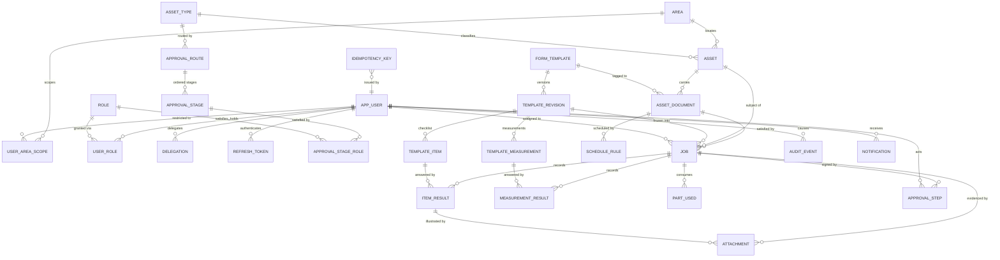

# Database Design Document
## BamForm — Preventive Maintenance Record and Approval System

---

## Document Control

| Field | Value |
|---|---|
| Document title | Database Design Document — BamForm |
| Document number | BAMFORM-DBD-001 |
| Revision | 0.1 |
| Status | **Draft — for client review** |
| Date issued | 24 July 2026 |
| Prepared by | Lead Engineer, BamForm project |
| Approved by | _(to be completed)_ |
| Classification | Internal |
| Parent documents | BAMFORM-URD-001 Rev 1.0 (Approved) · BAMFORM-PRD-001 Rev 0.2 |

### Revision History

| Revision | Date | Details of revision | Revised by | Approved by |
|---|---|---|---|---|
| 0.1 | 24 Jul 2026 | Initial draft derived from BAMFORM-PRD-001 §4 | Lead Engineer | _(pending)_ |
| 0.2 | 29 Jul 2026 | Slice 27-ASSETDOC — §6.8a `asset_document` added; §6.7 `asset_type.form_template_id` removed; §6.14 `schedule_rule` re-keyed to `asset_document_id`; §6.15 `job` gains `asset_document_id` and a composite FK; ERD and §8 index inventory updated | Lead Engineer | _(pending)_ |

---

## Table of Contents

1. Purpose and Scope
2. Design Principles
3. Classification and Encryption Notation
4. Entity Relationship Diagram
5. Enumerations
6. Data Dictionary
7. Constraints and Invariants
8. Indexing Strategy
9. Growth, Partitioning and Retention
10. Migration Approach
11. Reference and Seed Data
12. Backup and Recovery Considerations

---

# 1. Purpose and Scope

This document defines the physical data design for BamForm on PostgreSQL 16. It is the
authoritative reference for schema structure, data classification, encryption marking,
indexing and migration.

It covers the application schema only. Object storage layout (MinIO) is defined in
BAMFORM-ENV-001. Redis key structure is defined in §6.20 for completeness but Redis holds no
durable record.

---

# 2. Design Principles

| # | Principle | Consequence |
|---|---|---|
| DP-1 | **Records are immutable once approved.** | No `UPDATE` path exists to an archived job. Corrections are made by voiding and re-raising, never by editing. |
| DP-2 | **Nothing is ever hard-deleted.** | Every entity carries deactivation or void semantics. `DELETE` is not granted to the application role on any table holding a record, template revision or user. |
| DP-3 | **A record is bound to the template revision in force when the job was raised.** | `job.template_revision_id` is set at generation and never changed. Results reference the frozen revision's item rows. |
| DP-4 | **Template content is normalised, not JSONB.** | Checklist items and measurements are rows so they can be filtered, aggregated and trended (UR-070). Only standing content — PPE, tools, safety and procedure text — is JSONB. |
| DP-5 | **Business invariants are enforced in the database, not only in code.** | Self-approval, revision-sequence gaps, inverted specification limits and multiple current revisions are prevented by constraints and indexes, so an application defect cannot corrupt the archive. |
| DP-6 | **Encryption is applied where it protects personal data, not uniformly.** | Only `app_user` personal columns are application-layer encrypted (PRD PR-106, PR-109). Maintenance readings are cleartext so they remain queryable. |
| DP-7 | **Every mutation is auditable and the audit chain is tamper-evident.** | `audit_event` is append-only and hash-chained; the application role has no `UPDATE`/`DELETE` on it. |
| DP-8 | **Time is stored as `timestamptz`, always UTC.** | Presentation timezone is a display concern. Both client-recorded and server-recorded times are kept where they differ (offline capture). |
| DP-9 | **Identifiers are UUIDv7.** | Time-ordered, index-friendly, safe to generate on a disconnected client for the offline outbox. |

---

# 3. Classification and Encryption Notation

Every column in §6 carries a classification and, where relevant, a protection marking.

### Classification

| Code | Class | Definition |
|---|---|---|
| `PUB` | Public | No harm on disclosure |
| `INT` | Internal | Ordinary business data |
| `CON` | Confidential | Commercially sensitive — equipment procedures, specifications, maintenance history |
| `PER` | **Personal Data** | Identifies a living individual. PDPA applies (UR-100) |
| `SEC` | Secret | Credential or key material |

### Protection marking

| Marking | Meaning |
|---|---|
| `ENC` | Application-layer AES-256-GCM, unique 96-bit nonce per operation, row primary key bound as AAD |
| `BIDX` | A blind index column exists for equality lookup — HMAC-SHA-256 under a key distinct from the DEK |
| `HASH` | Stored one-way; original not recoverable |
| `CHAIN` | Participates in the tamper-evident hash chain |
| — | Cleartext at column level; protected by volume encryption, network isolation and authorisation |

**Note on scope.** Columns marked `CON` are deliberately *not* `ENC`. PRD §12.3 (PR-109)
records the reasoning: field-encrypting maintenance readings would make UR-070 measurement
trending and UR-067 compliance aggregation undeliverable, while protecting data whose breach
consequence is disclosure of internal equipment procedures rather than personal data. Those
columns are protected by storage-layer encryption (PR-105), by the database publishing no host
port (PR-002), and by service-layer authorisation (PR-090).

---

# 4. Entity Relationship Diagram



---

# 5. Enumerations

All enumerations are PostgreSQL native `ENUM` types. Adding a value is a forward-only
migration; no value is ever removed.

| Type | Values | Notes |
|---|---|---|
| `frequency_t` | `M1`, `M3`, `M6`, `Y` | Interval months 1, 3, 6, 12. Extensible. |
| `asset_status_t` | `active`, `under_repair`, `decommissioned` | UR-005 |
| `revision_status_t` | `draft`, `pending_approval`, `current`, `superseded`, `rejected` | PRD §5.2 |
| `job_status_t` | `scheduled`, `assigned`, `in_progress`, `submitted`, `verified`, `archived`, `voided` | PRD §5.1. Overdue is derived, not stored. |
| `item_status_t` | `done`, `not_applicable`, `not_done` | UR-032 |
| `spec_type_t` | `range`, `tolerance`, `pass_fail`, `text` | UR-016 |
| `judgement_t` | `pass`, `fail`, `not_evaluated` | Defaults to `not_evaluated` under AS-02 |
| `approval_action_t` | `submitted`, `verified`, `returned`, `recalled`, `voided`, `revision_approved`, `revision_rejected` | UR-048 |
| `user_status_t` | `active`, `suspended`, `deactivated` | UR-075 |
| `notification_channel_t` | `email`, `in_app` | UR-065 |
| `notification_state_t` | `queued`, `sent`, `failed`, `read` | |
| `audit_action_t` | `create`, `update`, `state_change`, `approve`, `reject`, `void`, `login`, `login_failed`, `permission_change`, `key_rotation`, `export` | UR-101 |

---

# 6. Data Dictionary

Conventions: every table has `id uuid PRIMARY KEY DEFAULT uuidv7()`, `created_at timestamptz
NOT NULL DEFAULT now()`, and — except on append-only tables — `updated_at timestamptz NOT NULL
DEFAULT now()`. These are omitted from the tables below except where behaviour differs.

---

## 6.1 `area`

Physical or organisational area used to scope visibility and reporting.

| Column | Type | Null | Class | Prot. | Description |
|---|---|---|---|---|---|
| `id` | uuid | N | INT | — | PK |
| `code` | text | N | INT | — | Short code, unique |
| `name` | text | N | INT | — | Display name |
| `parent_id` | uuid | Y | INT | — | Self-reference for hierarchy |
| `active` | boolean | N | INT | — | Default `true` |

---

## 6.2 `app_user`

The only table holding personal data. All personal columns are application-layer encrypted
(PR-106).

| Column | Type | Null | Class | Prot. | Description |
|---|---|---|---|---|---|
| `id` | uuid | N | INT | — | PK |
| `employee_id_ct` | bytea | Y | **PER** | `ENC` | Employee number, ciphertext |
| `employee_id_bidx` | bytea | Y | PER | `BIDX` | HMAC-SHA-256 for lookup |
| `full_name_ct` | bytea | N | **PER** | `ENC` | Full name as it appears on signatures |
| `email_ct` | bytea | N | **PER** | `ENC` | Email, ciphertext |
| `email_bidx` | bytea | N | PER | `BIDX` | HMAC-SHA-256 over normalised email; **unique**; login lookup |
| `password_hash` | text | Y | **SEC** | `HASH` | Argon2id, m=64MiB t=3 p=4 |
| `password_changed_at` | timestamptz | Y | INT | — | Drives expiry policy |
| `failed_login_count` | integer | N | INT | — | Default 0; lockout counter |
| `locked_until` | timestamptz | Y | INT | — | UR-096 |
| `last_login_at` | timestamptz | Y | INT | — | |
| `last_authenticated_at` | timestamptz | Y | INT | — | Drives step-up window (PR-091) |
| `status` | user_status_t | N | INT | — | Default `active` |
| `deactivated_at` | timestamptz | Y | INT | — | UR-075 — never deleted |
| `dek_version` | smallint | N | SEC | — | Which DEK generation encrypted this row |

**Note.** `full_name` is encrypted but must be *displayed* on every rendered record and every
audit entry. Decryption therefore occurs on virtually every read path. This is accepted: the
volume is small (one row per user, cached in memory for the request lifetime) and it keeps
the PDPA obligation satisfiable without a second store.

---

## 6.3 `role` and `user_role`

`role`

| Column | Type | Null | Class | Description |
|---|---|---|---|---|
| `id` | uuid | N | INT | PK |
| `code` | text | N | INT | `MAINTAINER`, `TEAM_LEADER`, `ENGINEER`, `DOC_CONTROLLER`, `ADMIN`, `AUDITOR` |
| `name` | text | N | INT | Display name |
| `description` | text | Y | INT | |

`user_role`

| Column | Type | Null | Class | Description |
|---|---|---|---|---|
| `user_id` | uuid | N | INT | FK → `app_user` |
| `role_id` | uuid | N | INT | FK → `role` |
| `granted_by` | uuid | N | INT | FK → `app_user` |
| `granted_at` | timestamptz | N | INT | |

Composite PK `(user_id, role_id)`. A user may hold multiple roles (UR-073).

---

## 6.4 `user_area_scope`

Restricts a user's visibility to named areas. Absence of any row means unrestricted.

| Column | Type | Null | Class | Description |
|---|---|---|---|---|
| `user_id` | uuid | N | INT | FK → `app_user` |
| `area_id` | uuid | N | INT | FK → `area` |

---

## 6.5 `delegation`

| Column | Type | Null | Class | Description |
|---|---|---|---|---|
| `id` | uuid | N | INT | PK |
| `delegator_id` | uuid | N | INT | FK → `app_user` — the absent approver |
| `delegate_id` | uuid | N | INT | FK → `app_user` — the person covering |
| `valid_from` | timestamptz | N | INT | |
| `valid_to` | timestamptz | N | INT | |
| `reason` | text | Y | INT | |
| `created_by` | uuid | N | INT | FK → `app_user` |
| `revoked_at` | timestamptz | Y | INT | Early termination |

UR-052. Evaluated at request time (PR-076); never pre-materialised.

---

## 6.6 `refresh_token`

| Column | Type | Null | Class | Prot. | Description |
|---|---|---|---|---|---|
| `id` | uuid | N | INT | — | PK |
| `user_id` | uuid | N | INT | — | FK → `app_user` |
| `token_hash` | bytea | N | **SEC** | `HASH` | SHA-256 of the opaque token. Plaintext never stored |
| `family_id` | uuid | N | INT | — | Rotation family; reuse revokes the whole family |
| `issued_at` | timestamptz | N | INT | — | |
| `expires_at` | timestamptz | N | INT | — | |
| `used_at` | timestamptz | Y | INT | — | Single-use; set on rotation |
| `revoked_at` | timestamptz | Y | INT | — | |
| `revoked_reason` | text | Y | INT | — | e.g. `reuse_detected` |
| `user_agent` | text | Y | INT | — | |
| `source_ip` | inet | Y | PER | — | Personal data under PDPA when tied to an individual |

PR-084.

---

## 6.7 `asset_type`

| Column | Type | Null | Class | Description |
|---|---|---|---|---|
| `id` | uuid | N | INT | PK |
| `code` | text | N | INT | Unique, e.g. `ASM_WIRE_BOND` |
| `name` | text | N | INT | e.g. "ASM Wire Bond" |
| `description` | text | Y | INT | |
| `approval_route_id` | uuid | N | INT | FK → `approval_route` |
| `lead_time_days` | integer | N | INT | Default 30 (PR-057) |
| `active` | boolean | N | INT | Default `true` |

**Slice 27-ASSETDOC removed `form_template_id`.** It was NOT NULL and **UNIQUE**, which
made the machine→form relation one-to-one in *both* directions: a machine family could
hold exactly one document, and a document could serve exactly one machine family. Both are
contradicted by the owner's 2026 schedule workbook — TE7 needs a monthly pH-meter check
*and* its monthly preventive maintenance, and CM02/CM03 share `CE 95 030 00 01`.

An `asset_type` is now purely the **machine-family grouping**: the approval route and the
lead time, which genuinely are family-wide properties. The route from a machine to a form
is §6.8a `asset_document`.

---

## 6.8 `asset`

| Column | Type | Null | Class | Description |
|---|---|---|---|---|
| `id` | uuid | N | INT | PK |
| `code` | text | N | **CON** | Machine identifier, **unique** — `AW01`, `BD01`, `EP01`, `IMOS 01` (UR-003) |
| `asset_type_id` | uuid | N | INT | FK → `asset_type` |
| `description` | text | Y | CON | |
| `manufacturer` | text | Y | CON | |
| `model` | text | Y | CON | |
| `serial_number` | text | Y | CON | |
| `area_id` | uuid | Y | INT | FK → `area` |
| `location_detail` | text | Y | INT | Free text within the area |
| `commissioned_on` | date | Y | INT | |
| `schedule_anchor_date` | date | N | INT | Basis for first due date (UR-025) |
| `status` | asset_status_t | N | INT | Default `active` |
| `decommissioned_on` | date | Y | INT | |
| `active` | boolean | N | INT | Deactivation, not deletion (UR-006) |

---

## 6.8a `asset_document`

*Added by slice 27-ASSETDOC.* The route from a machine to a form, replacing
`asset_type.form_template_id`.

| Column | Type | Null | Class | Description |
|---|---|---|---|---|
| `id` | uuid | N | INT | PK |
| `asset_id` | uuid | N | INT | FK → `asset` |
| `form_template_id` | uuid | N | INT | FK → `form_template` |
| `machine_number` | text | Y | CON | Fills the blank in the template title — "…Record KW___" + "13" → "…Record KW13" |
| `active` | boolean | N | INT | Deactivation, not deletion (INV-16) |

Unique on `(asset_id, form_template_id)` — the same document is tagged to one machine
once. Also unique on `(id, asset_id)`, which backs §6.15 `job`'s composite FK.

**Why it exists.** The owner's process step 2 is *"Admin will log in to setup the machine
tagged with which preventive Maintenance document"*, and step 4 is *"he will go to his
assigned machine and select the form to start"*. Neither was possible: `asset.asset_type_id
→ asset_type.form_template_id UNIQUE` gave a machine exactly one form and a form exactly
one machine family. Measured from the owner's 2026 schedule workbook, **12 machines carry
more than one document**, and CM02/CM03 — and T8/T69/ST01 — share one.

**Cardinality.** A machine may carry any number of documents; a document may be tagged to
any number of machines. Both directions were previously forbidden.

**`machine_number` is optional in every case and is never a validation error** (owner,
2026-07-29: *"Is ok some forms are already pre updated just allow user to choose"*). Left
NULL, the title renders with its blank intact, exactly as the paper form reads before
someone writes on it. Supplied for a title with no blank, it is stored and simply has
nothing to substitute into. Substitution happens **at render, never stored resolved**, so a
revision that changes the title stays correct; slice 23-PDFA freezes the rendered result at
archive, so an archived record keeps the title it was signed under.

**Superseded as the primary source by slice 31-TITLEBLANK.** The owner ruled that the blank
is the *technician's* to fill, per record, as it is on paper — so `job.title_machine_number`
is what the render now prefers. `asset_document.machine_number` is **kept** and is the
fallback: every record signed before that column existed, and every document an admin has
already labelled, keeps printing exactly as it does today. The admin UI for it is unchanged.

**Deactivation, never deletion.** INV-16 forbids DELETE on record tables, and a document
that has generated jobs must remain resolvable. `active = false` stops future job
generation (`schedule-rule-bootstrap` and `job-generation` both filter on it) and leaves
every historical record intact.

---

## 6.9 `form_template`

| Column | Type | Null | Class | Description |
|---|---|---|---|---|
| `id` | uuid | N | INT | PK |
| `document_number` | text | N | CON | **Unique** — `CE 95 020 00 01` (UR-009) |
| `title` | text | N | CON | e.g. "ASM Wire Bond Preventive Maintenance Record" |
| `active` | boolean | N | INT | |

`asset_type_id` is **not implemented**: as slice 1 recorded, DBD §6.9's NOT NULL
`form_template.asset_type_id` together with §6.7's NOT NULL `asset_type.form_template_id`
would have been a circular FK with no satisfiable insert order, so `asset_type` was made
the owning side. Slice 27-ASSETDOC then removed that side too — a document belongs to no
machine family at all. Which machines carry it is §6.8a `asset_document`.

The `title` may carry a **fillable run** — two or more consecutive underscores, e.g.
"…Record KW___" — into which the captured form number is substituted **at render**. 8 of
the 12 controlled documents carry one; `EP01` and `PM01` have the number printed already,
and two have no machine designation at all. Never stored resolved, so a revision that
changes the title stays correct; slice 23-PDFA freezes the rendered result at archive.

Since slice 31-TITLEBLANK the substituted value is `job.title_machine_number` — the
technician's own per-record entry — falling back to `asset_document.machine_number` where
the record has none. `titleHasFillableRun()` (`shared/src/template-title.ts`) is the single
implementation of "is there a blank"; it is derived per response onto both `AssetDocument`
and `Job` so no client ever re-derives it.

---

## 6.10 `template_revision`

| Column | Type | Null | Class | Description |
|---|---|---|---|---|
| `id` | uuid | N | INT | PK |
| `form_template_id` | uuid | N | INT | FK → `form_template` |
| `revision_code` | text | N | CON | `0`, `A`, `B`, `C`… as used today |
| `sequence_ordinal` | integer | N | INT | 0,1,2,3… Enforces contiguity (UR-010, defect B-02) |
| `status` | revision_status_t | N | INT | |
| `change_description` | text | N | CON | "Details of Revisions" from the source sheet |
| `standing_content` | jsonb | N | CON | PPE list, tools, parts table, safety, procedure, remarks, `cascade_override` |
| `authored_by` | uuid | N | INT | FK → `app_user` (UR-011) |
| `authored_at` | timestamptz | N | INT | |
| `submitted_at` | timestamptz | Y | INT | |
| `approved_by` | uuid | Y | INT | FK → `app_user`; must differ from `authored_by` |
| `approved_at` | timestamptz | Y | INT | |
| `rejected_reason` | text | Y | INT | |
| `effective_from` | timestamptz | Y | INT | Set when it becomes `current` |
| `superseded_at` | timestamptz | Y | INT | |

`standing_content` JSONB shape:

```json
{
  "special_tools": "________________________",
  "parts_required": [{"part_no": "", "description": "", "qty": "", "remarks": ""}],
  "ppe": ["Safety Shoes", "Ear Plugs (If required)", "Safety Glass (If Required)", "Hand Gloves (If Required)"],
  "safety": "Please switch off the main power and put the lock out/tag on the power disconnect. (if required)",
  "procedure": "A thorough inspection on the machine must be done at least one month prior…",
  "remarks": "For Y maintenance, 3M and 6M must be performed at the same time.",
  "cascade_override": null
}
```

---

## 6.11 `template_item`

| Column | Type | Null | Class | Description |
|---|---|---|---|---|
| `id` | uuid | N | INT | PK |
| `template_revision_id` | uuid | N | INT | FK → `template_revision` |
| `item_no` | integer | N | CON | The printed number, 1…n |
| `frequency` | frequency_t | N | CON | UR-015 |
| `instruction` | text | N | **CON** | The maintenance instruction verbatim |
| `mandatory` | boolean | N | INT | Default `true`; drives the submission gate (PR-045) |
| `stable_key` | text | N | INT | Identity carried across revisions for trending (PR-028) |
| `display_order` | integer | N | INT | |

---

## 6.12 `template_measurement`

| Column | Type | Null | Class | Description |
|---|---|---|---|---|
| `id` | uuid | N | INT | PK |
| `template_revision_id` | uuid | N | INT | FK → `template_revision` |
| `section` | text | Y | CON | e.g. "Bond Force Calibration" |
| `description` | text | N | **CON** | e.g. "Heater Block Temperature Measurement" |
| `unit` | text | Y | CON | `°C`, `ohm`, `um`, `g`, `mmHg`, `mbar` |
| `spec_type` | spec_type_t | N | CON | |
| `lower_limit` | numeric(18,6) | Y | CON | LCL |
| `upper_limit` | numeric(18,6) | Y | CON | UCL |
| `nominal` | numeric(18,6) | Y | CON | For tolerance specs |
| `tolerance` | numeric(18,6) | Y | CON | ± value |
| `spec_display` | text | N | CON | Verbatim printed text, e.g. `150°C ± 5°C`, `5 – 24 ohm` |
| `stable_key` | text | N | INT | Trending identity (UR-070) |
| `display_order` | integer | N | INT | |

`spec_display` is retained alongside the parsed limits so the rendered record reproduces the
source document exactly, even where the printed text is ambiguous.

---

## 6.13 `approval_route`, `approval_stage`, `approval_stage_role`

The approval route is data, which is what makes OI-04 a configuration change (PR-072).

`approval_route`

| Column | Type | Null | Class | Description |
|---|---|---|---|---|
| `id` | uuid | N | INT | PK |
| `code` | text | N | INT | e.g. `TWO_STAGE_TL_THEN_ENG` |
| `name` | text | N | INT | |
| `active` | boolean | N | INT | |

`approval_stage`

| Column | Type | Null | Class | Description |
|---|---|---|---|---|
| `id` | uuid | N | INT | PK |
| `approval_route_id` | uuid | N | INT | FK |
| `stage_ordinal` | integer | N | INT | 1, 2, 3… |
| `label` | text | N | INT | e.g. "Verified By (Workshop Team Leader)" |
| `escalation_hours` | integer | Y | INT | Null = no escalation (UR-050) |
| `escalate_to_role_id` | uuid | Y | INT | FK → `role` |

`approval_stage_role`

| Column | Type | Null | Class | Description |
|---|---|---|---|---|
| `approval_stage_id` | uuid | N | INT | FK |
| `role_id` | uuid | N | INT | FK — any one of these roles satisfies the stage |

Delivered configuration (PR-071): one route, one stage, satisfied by `TEAM_LEADER` **or**
`ENGINEER`. Reinstating the two-signature route on the source documents means inserting a
second `approval_stage` row.

---

## 6.14 `schedule_rule`

| Column | Type | Null | Class | Description |
|---|---|---|---|---|
| `id` | uuid | N | INT | PK |
| `asset_document_id` | uuid | N | INT | FK → `asset_document` (slice 27; was `asset_id`) |
| `frequency` | frequency_t | N | INT | |
| `interval_months` | integer | N | INT | 1, 3, 6, 12 |
| `anchor_date` | date | N | INT | From the MACHINE's `schedule_anchor_date` — several documents on one machine share it |
| `last_completed_on` | date | Y | INT | Updated by PR-055 cascade |
| `next_due_on` | date | N | INT | Computed by PR-056 |
| `adjusted_reason` | text | Y | INT | Mandatory when manually moved (UR-025) |
| `active` | boolean | N | INT | |

Unique on `(asset_document_id, frequency)`.

**Slice 27-ASSETDOC re-keyed this table** from `asset_id` and `(asset_id, frequency)`. The
old key meant one schedule per MACHINE per frequency, which was a second, independent
blocker on the owner's process: even once a machine could carry several documents, TE7's
monthly pH check and its monthly PM could not both exist. Measured from the 2026 workbook,
**9 machine+frequency combinations need two or more documents at the same interval**.

Frequencies still derive from each document's own current revision's distinct active
`template_item` rows, so each document naturally brings its own set.

---

## 6.15 `job`

| Column | Type | Null | Class | Description |
|---|---|---|---|---|
| `id` | uuid | N | INT | PK |
| `job_number` | text | N | INT | Human-readable, **unique**, e.g. `PM-2026-000431` |
| `asset_id` | uuid | N | INT | FK → `asset` (UR-041) |
| `asset_document_id` | uuid | N | INT | FK → `asset_document` (slice 27) — WHICH document this job satisfies |
| `template_revision_id` | uuid | N | INT | FK → `template_revision`; frozen (DP-3, UR-040) |
| `approval_route_id` | uuid | N | INT | Frozen at generation, as the route may change later |
| `frequency` | frequency_t | N | INT | The job's own frequency |
| `frequency_scope` | frequency_t[] | N | INT | Cascade result (PR-053) |
| `due_on` | date | N | INT | |
| `generated_at` | timestamptz | N | INT | |
| `is_adhoc` | boolean | N | INT | Default `false` (UR-028) |
| `adhoc_reason` | text | Y | INT | |
| `assigned_to` | uuid | Y | INT | FK → `app_user` |
| `assigned_at` | timestamptz | Y | INT | |
| `status` | job_status_t | N | INT | PRD §5.1 |
| `current_stage_ordinal` | integer | Y | INT | Which approval stage is outstanding |
| `started_at` | timestamptz | Y | INT | First result recorded |
| `submitted_at` | timestamptz | Y | INT | |
| `submitted_by` | uuid | Y | INT | FK → `app_user` (UR-037) |
| `verified_at` | timestamptz | Y | INT | |
| `archived_at` | timestamptz | Y | INT | |
| `void_reason` | text | Y | INT | Min 10 chars (PR-046) |
| `voided_by` | uuid | Y | INT | |
| `draft_version` | integer | N | INT | Optimistic concurrency for offline sync (PR-064) |
| `title_machine_number` | text | Y | CON | Slice 31-TITLEBLANK — the technician's entry for the blank in this record's title |

**`title_machine_number` (slice 31-TITLEBLANK).** What the technician writes into the blank
in the form's title (`…Record ED____` + `01` → `…Record ED01`), captured per record like any
other field on the form. NULL until filled, and **never pre-filled from the machine code** —
deciding which part of `AVS35-01` belongs in `AVS 35-____` is unverifiable and wrong on two
of the eight real shapes. Required at **submit**, and only where the title actually carries a
fillable run (§6.9); optional throughout drafting so a whole shift can be worked offline.
Bounds mirror `asset_document.machine_number` exactly (trimmed, 1..50), backed by
`job_title_machine_number_chk`. Substituted **at render**, never stored resolved, and
preferred over `asset_document.machine_number`.

Captured through `PUT /jobs/{id}/title-machine-number`, which is **unversioned** (no
`If-Match`, no `draft_version` bump, no status transition) — the `PUT /jobs/{id}/parts/{partId}`
shape, not the item/measurement shape. Immutable from submit onwards: `assertJobWritable`
closes the API, and INV-09's `prevent_archived_job_update()` covers the column with no
trigger change, because it compares `to_jsonb(OLD)` minus the annotation columns.

**`asset_document_id` (slice 27-ASSETDOC).** `asset_id` alone was sufficient while a machine
carried one document. With several it is not: `CompletionCascadeService` and
`VoidScheduleRecomputeService` both walk backwards from a completed job to the schedule
rules it satisfies, and resolving those by machine advances (or reverses) **sibling
documents'** schedules from one completion — a machine's PM completion would silently mark
its pH check as done, with no error and nothing to see until an audit. Both services
therefore resolve by `asset_document_id`, never by `asset_id`.

A **composite foreign key** `(asset_document_id, asset_id)` → `asset_document (id, asset_id)`
ties the two together, so a job can never point at another machine's document. This is
defence in depth — every write path was reviewed and is safe — but it forecloses the class.

---

## 6.16 `item_result`

| Column | Type | Null | Class | Description |
|---|---|---|---|---|
| `id` | uuid | N | INT | PK; **client-generated UUIDv7** when captured offline |
| `job_id` | uuid | N | INT | FK → `job` |
| `template_item_id` | uuid | N | INT | FK → `template_item` of the frozen revision |
| `status` | item_status_t | N | **CON** | UR-032 |
| `remark` | text | Y | CON | UR-035 |
| `recorded_by` | uuid | N | INT | FK → `app_user` |
| `client_recorded_at` | timestamptz | N | INT | When the technician entered it (PR-063) |
| `recorded_at` | timestamptz | N | INT | When the server received it |

Unique on `(job_id, template_item_id)`.

---

## 6.17 `measurement_result`

| Column | Type | Null | Class | Description |
|---|---|---|---|---|
| `id` | uuid | N | INT | PK |
| `job_id` | uuid | N | INT | FK → `job` |
| `template_measurement_id` | uuid | N | INT | FK |
| `reading_numeric` | numeric(18,6) | Y | **CON** | Cleartext by design — see DP-6 and PR-109 |
| `reading_text` | text | Y | CON | For `spec_type = text` |
| `judgement` | judgement_t | N | CON | Default `not_evaluated` under AS-02 |
| `remark` | text | Y | CON | |
| `recorded_by` | uuid | N | INT | |
| `client_recorded_at` | timestamptz | N | INT | |
| `recorded_at` | timestamptz | N | INT | |

Unique on `(job_id, template_measurement_id)`. This table is the source for UR-070 trending
and is the specific reason field-level encryption is not applied to it.

---

## 6.18 `part_used`

| Column | Type | Null | Class | Description |
|---|---|---|---|---|
| `id` | uuid | N | INT | PK |
| `job_id` | uuid | N | INT | FK |
| `part_no` | text | Y | CON | Matches the Parts Required table on the form |
| `description` | text | N | CON | |
| `quantity` | numeric(12,3) | N | CON | |
| `remarks` | text | Y | CON | |
| `recorded_by` | uuid | N | INT | |

UR-034. Records consumption only; stock is out of scope (OS-02).

---

## 6.19 `attachment`

| Column | Type | Null | Class | Description |
|---|---|---|---|---|
| `id` | uuid | N | INT | PK |
| `job_id` | uuid | N | INT | FK |
| `item_result_id` | uuid | Y | INT | Optional link to a specific item |
| `object_key` | text | N | INT | MinIO key — `records/{yyyy}/{job_id}/{attachment_id}` |
| `original_filename` | text | Y | INT | |
| `content_type` | text | N | INT | Restricted to `image/jpeg`, `image/png`, `image/webp` |
| `byte_size` | bigint | N | INT | Bounded — see ENV document |
| `sha256` | bytea | N | CON | Integrity; included in signed content hash (PR-012) |
| `uploaded_by` | uuid | N | INT | |
| `uploaded_at` | timestamptz | N | INT | |
| `upload_state` | text | N | INT | `pending` / `received` (PR-067) |

---

## 6.20 `approval_step`

**Append-only.** The application role holds `INSERT` and `SELECT` only (PR-099).

| Column | Type | Null | Class | Prot. | Description |
|---|---|---|---|---|---|
| `id` | uuid | N | INT | — | PK |
| `job_id` | uuid | N | INT | — | FK → `job` |
| `stage_ordinal` | integer | N | INT | — | Which approval stage this satisfies |
| `action` | approval_action_t | N | INT | — | UR-048 |
| `actor_id` | uuid | N | INT | — | FK → `app_user` — who pressed the button |
| `on_behalf_of_id` | uuid | Y | INT | — | Set when acting under delegation (UR-052) |
| `actor_role_code` | text | N | INT | — | Role exercised, frozen at the time |
| `reason` | text | Y | INT | — | Mandatory for `returned` and `voided` |
| `acted_at` | timestamptz | N | INT | — | |
| `source_ip` | inet | Y | PER | — | |
| `content_hash` | bytea | N | CON | `CHAIN` | SHA-256 of canonical record serialisation (PR-093) |
| `signature` | bytea | N | CON | — | Ed25519 signature over `content_hash` (PR-094) |
| `signing_key_id` | text | N | INT | — | `kid` of the key used, for later verification |
| `step_up_verified_at` | timestamptz | Y | INT | — | Evidence of re-authentication (PR-091) |

---

## 6.21 `audit_event`

**Append-only and hash-chained.** No `UPDATE`, no `DELETE` (PR-097, PR-099).

| Column | Type | Null | Class | Prot. | Description |
|---|---|---|---|---|---|
| `id` | uuid | N | INT | — | PK |
| `sequence` | bigserial | N | INT | `CHAIN` | Strictly increasing chain position |
| `occurred_at` | timestamptz | N | INT | — | |
| `actor_id` | uuid | Y | INT | — | Null for system actions |
| `on_behalf_of_id` | uuid | Y | INT | — | |
| `action` | audit_action_t | N | INT | — | |
| `entity_type` | text | N | INT | — | `job`, `template_revision`, `asset`, `app_user`… |
| `entity_id` | uuid | Y | INT | — | |
| `before` | jsonb | Y | CON | — | Prior state; personal fields redacted to identifiers |
| `after` | jsonb | Y | CON | — | New state |
| `source_ip` | inet | Y | PER | — | |
| `request_id` | text | Y | INT | — | Correlates to application logs |
| `prev_hash` | bytea | Y | CON | `CHAIN` | Hash of the preceding event; null only for genesis |
| `hash` | bytea | N | CON | `CHAIN` | SHA-256 over canonical event content ‖ `prev_hash` |

**Redaction note.** `before`/`after` never contain decrypted personal data. Where a change
affects an encrypted column, the diff records that the field changed and its ciphertext
digest, not the value. This keeps the audit trail useful without creating a second,
unencrypted store of personal data.

---

## 6.22 `notification`

| Column | Type | Null | Class | Description |
|---|---|---|---|---|
| `id` | uuid | N | INT | PK |
| `recipient_id` | uuid | N | INT | FK → `app_user` |
| `channel` | notification_channel_t | N | INT | |
| `template_code` | text | N | INT | `JOB_ASSIGNED`, `JOB_DUE_SOON`, `JOB_OVERDUE`, `RECORD_PENDING_VERIFICATION`, `RECORD_VERIFIED`, `RECORD_RETURNED`, `VERIFICATION_ESCALATED` |
| `entity_type` | text | Y | INT | |
| `entity_id` | uuid | Y | INT | |
| `payload` | jsonb | N | INT | Merge fields — identifiers only, no personal data |
| `state` | notification_state_t | N | INT | |
| `queued_at` | timestamptz | N | INT | |
| `sent_at` | timestamptz | Y | INT | |
| `failed_reason` | text | Y | INT | |
| `attempts` | integer | N | INT | |

---

## 6.23 `idempotency_key`

Supports offline outbox replay (PR-062).

| Column | Type | Null | Class | Description |
|---|---|---|---|---|
| `key` | uuid | N | INT | PK — client-generated mutation UUID |
| `user_id` | uuid | N | INT | FK — key scope is per user |
| `endpoint` | text | N | INT | |
| `request_fingerprint` | bytea | N | INT | SHA-256 of the canonical request body |
| `response_status` | integer | N | INT | |
| `response_body` | jsonb | Y | INT | Replayed verbatim on retry |
| `created_at` | timestamptz | N | INT | |
| `expires_at` | timestamptz | N | INT | 30 days (PR-062) |

A replay with the same key but a **different** fingerprint returns HTTP 422, not the cached
response — that indicates a client defect, not a retry.

---

## 6.24 Redis key structure (non-durable)

| Pattern | Purpose | TTL |
|---|---|---|
| `bf:jti:{jti}` | Access token denylist (PR-088) | Remaining token lifetime |
| `bf:rl:login:{bidx}` | Login rate-limit counter (PR-092) | Sliding window |
| `bf:rl:ip:{ip}` | Per-IP rate limit | Sliding window |
| `bf:lock:scheduler` | Scheduler distributed lock (PR-051) | 5 min, renewed |
| `bull:notifications:*` | BullMQ queue | Managed by BullMQ |
| `bull:escalation:*` | Delayed escalation jobs (PR-077) | Managed by BullMQ |

Nothing in Redis is a record. A total Redis loss costs queued notifications and forces
re-login; it does not lose a maintenance record.

---

# 7. Constraints and Invariants

Each invariant below is enforced in the database so that an application defect cannot corrupt
the archive (DP-5).

| # | Invariant | Mechanism | Traces to |
|---|---|---|---|
| INV-01 | One current revision per template | Partial unique index on `(form_template_id) WHERE status='current'` | UR-012, PR-023 |
| INV-02 | Revision sequence has no gaps | Trigger on insert: `sequence_ordinal = max(existing)+1` or reject | UR-010, PR-024, defect B-02 |
| INV-03 | Approver differs from author | `CHECK (approved_by IS NULL OR approved_by <> authored_by)` | UR-014, PR-047 |
| INV-04 | Specification limits are ordered | `CHECK (lower_limit IS NULL OR upper_limit IS NULL OR lower_limit <= upper_limit)` | UR-019, PR-027, defect B-04 |
| INV-05 | Verifier differs from submitter | `CHECK` on `approval_step` joined to `job.submitted_by` via trigger | UR-045, PR-044 |
| INV-06 | Asset code unique | `UNIQUE (code)` | UR-003, defect B-09 |
| INV-07 | Document number unique | `UNIQUE (document_number)` | UR-009 |
| INV-08 | One result per item per job | `UNIQUE (job_id, template_item_id)` | Data integrity |
| INV-09 | Archived jobs immutable | Trigger raising an exception on `UPDATE` where `OLD.status='archived'` | UR-055, PR-041 |
| INV-10 | Audit chain unbroken | `hash` computed by trigger from `prev_hash`; `UPDATE`/`DELETE` revoked | UR-077, PR-097 |
| INV-11 | Approval steps append-only | `UPDATE`/`DELETE` revoked from application role | UR-048, PR-099 |
| INV-12 | Void requires a reason | `CHECK (status <> 'voided' OR length(void_reason) >= 10)` | UR-054, PR-046 |
| INV-13 | Return requires a reason | `CHECK (action <> 'returned' OR length(reason) >= 10)` | UR-047, PR-074 |
| INV-14 | Delegation window valid | `CHECK (valid_to > valid_from)` | UR-052 |
| INV-15 | Blind index unique per email | `UNIQUE (email_bidx)` | PR-108 |
| INV-16 | No hard delete anywhere | `DELETE` revoked from application role on all record tables | DP-2, UR-054, UR-075 |

## 7.1 Database roles and grants

| Role | Grants |
|---|---|
| `bamform_migrate` | Full DDL. Used only by the one-shot `migrate` service. Credentials distinct from the application. |
| `bamform_app` | `SELECT`, `INSERT`, `UPDATE` on mutable tables; `SELECT`, `INSERT` **only** on `audit_event` and `approval_step`; **no `DELETE` on any table**; **no `UPDATE` on archived jobs** (trigger-enforced) |
| `bamform_readonly` | `SELECT` only. Used for reporting and by the Auditor-facing query path. |
| `bamform_backup` | `SELECT` only, used by the backup job. |

This is the control that means an application-layer compromise still cannot silently rewrite
history (PR-115).

---

# 8. Indexing Strategy

Indexes are specified against the actual query shapes, not added speculatively.

| Table | Index | Type | Serves |
|---|---|---|---|
| `job` | `(assigned_to, status) WHERE status IN ('assigned','in_progress')` | Partial B-tree | Technician's job list — the hottest query |
| `job` | `(status, due_on) WHERE status NOT IN ('archived','voided')` | Partial B-tree | Overdue and due-soon queries (UR-026, UR-030) |
| `job` | `(asset_id, due_on DESC)` | B-tree | Asset maintenance history (UR-007) |
| `job` | `(current_stage_ordinal, submitted_at) WHERE status='submitted'` | Partial B-tree | Verifier queue (UR-049) |
| `job` | `(archived_at DESC) WHERE status='archived'` | Partial B-tree | Archive browsing |
| `job` | `job_number` | Unique | Lookup by reference |
| `job` | `(asset_document_id, frequency_scope, due_on) WHERE status <> 'voided' AND is_adhoc = false` | **Partial unique** | I-INV-14 generation idempotency (PR-052). Slice 27 re-keyed it from `asset_id`: two documents on one machine due the same day at the same frequency collided, and job generation reports the resulting P2002 as an "already exists" no-op — so the second document was **silently never raised** |
| `item_result` | `(job_id)` | B-tree | Record assembly |
| `measurement_result` | `(template_measurement_id, recorded_at)` | B-tree | **Measurement trending (UR-070)** |
| `measurement_result` | `(job_id)` | B-tree | Record assembly |
| `template_item` | `(template_revision_id, display_order)` | B-tree | Checklist rendering |
| `template_item` | `(template_revision_id, frequency)` | B-tree | Cascade item selection (PR-053) |
| `template_measurement` | `(template_revision_id, display_order)` | B-tree | Measurement table rendering |
| `template_measurement` | `(stable_key)` | B-tree | Cross-revision trending join |
| `template_revision` | `(form_template_id) WHERE status='current'` | **Partial unique** | INV-01 |
| `template_revision` | `(form_template_id, sequence_ordinal)` | Unique | INV-02 |
| `schedule_rule` | `(next_due_on) WHERE active` | Partial B-tree | Scheduler sweep (PR-050) |
| `schedule_rule` | `(asset_document_id, frequency)` | Unique | Slice 27 — one schedule per DOCUMENT per frequency (was `(asset_id, frequency)`) |
| `asset_document` | `(asset_id, form_template_id)` | Unique | A document is tagged to a machine once |
| `asset_document` | `(asset_id) WHERE active` | Partial B-tree | The machine's form picker; the scheduler bootstrap sweep |
| `asset_document` | `(id, asset_id)` | Unique | Backs job's composite FK (slice 27, m-2) |
| `asset` | `code` | Unique | INV-06 |
| `asset` | `(asset_type_id, status)` | B-tree | Asset listing and filtering |
| `asset` | `(area_id) WHERE active` | Partial | Area-scoped access (PR-073) |
| `approval_step` | `(job_id, acted_at)` | B-tree | Record signature block assembly |
| `approval_step` | `(actor_id, acted_at DESC)` | B-tree | "What has this person approved" |
| `audit_event` | `(entity_type, entity_id, sequence)` | B-tree | Per-record audit view (UR-078) |
| `audit_event` | `(occurred_at DESC)` | BRIN | Time-range scans over a large append-only table |
| `audit_event` | `sequence` | Unique | Chain traversal |
| `app_user` | `email_bidx` | Unique | Login lookup (PR-108) |
| `refresh_token` | `token_hash` | Unique | Token validation |
| `refresh_token` | `(family_id) WHERE revoked_at IS NULL` | Partial | Family revocation on reuse |
| `attachment` | `(job_id)` | B-tree | |
| `notification` | `(recipient_id, state, queued_at DESC)` | B-tree | In-app notification list |
| `idempotency_key` | `(expires_at)` | BRIN | Expiry sweep |
| `delegation` | `(delegate_id, valid_from, valid_to) WHERE revoked_at IS NULL` | Partial | Request-time delegation resolution |

**BRIN choice.** `audit_event` and `idempotency_key` are append-only and physically correlated
with time, which is precisely the case BRIN is designed for. A B-tree on `occurred_at` over
seven years of audit data would be substantially larger for no query benefit.

---

# 9. Growth, Partitioning and Retention

## 9.1 Projected volume — PROVISIONAL pending OI-02

Assuming 200 assets, an average of 12 checklist items and 4 measurements per record, and the
cascade producing roughly 6 jobs per asset per year:

| Table | Rows/year | Rows at 7 years | Est. size at 7 years |
|---|---|---|---|
| `job` | ~1,200 | ~8,400 | < 10 MB |
| `item_result` | ~14,400 | ~101,000 | ~30 MB |
| `measurement_result` | ~4,800 | ~34,000 | ~10 MB |
| `attachment` (rows) | ~3,000 | ~21,000 | ~5 MB |
| `attachment` (objects in MinIO) | ~3,000 | ~21,000 | **~40 GB** at 2 MB/photo |
| `audit_event` | ~60,000 | ~420,000 | ~400 MB |
| **Postgres total** | | | **< 1 GB** |

**Conclusion: this database does not need partitioning.** Under 500 MB of record data at full
retention is comfortably within a single unpartitioned instance. Object storage dominates and
is handled by MinIO lifecycle policy, not by the database.

**PR-DBD-01** Partitioning shall not be implemented in Release 1. It shall be reconsidered only
if `audit_event` exceeds 50 million rows, which the projection puts beyond the system's design
life.

## 9.2 Retention

**PR-DBD-02** No automatic purge job shall exist (UR-060, UR-107). Retention is enforced by
*not deleting*. Any future purge of data past the seven-year period shall be a documented,
manually authorised operation with its own audit event, not a scheduled task.

**PR-DBD-03** Superseded template revisions shall be retained for as long as the last job
referencing them (UR-108). Since jobs are never deleted, this means indefinitely under the
current design.

---

# 10. Migration Approach

**PR-DBD-04** Migrations shall be versioned, forward-only, and stored in the repository under
`api/prisma/migrations/`. Each is timestamped, immutable once merged, and reviewed as code.

**PR-DBD-05** Migrations shall run in a one-shot `migrate` Compose service that completes
before `api` restarts (PR-017). The deploy script blocks on its exit code.

**PR-DBD-06** No auto-synchronising schema tool shall ever run against staging or production.

## 10.1 Rules for safe migrations on a live system

| Rule | Reason |
|---|---|
| Additive first: add nullable column → backfill → add constraint → drop old | Avoids table rewrites and long locks |
| Never rename a column in one step; add, dual-write, migrate readers, drop | A rename breaks the running old version during the restart window |
| Create indexes `CONCURRENTLY` on tables over 100k rows | Avoids blocking writes |
| Every migration must be idempotent on re-run | The deploy script may retry |
| Enum values may be added, never removed or reordered | Existing rows reference them |
| Data migrations that touch records must write `audit_event` rows | UR-076 has no exemption for migrations |

**PR-DBD-07** Every migration shall carry a documented reversal procedure in its header
comment, even though rollback is not automated (PR-018). For a forward-only scheme the
reversal is usually "restore from backup taken by the deploy script"; where a cleaner reversal
exists, it is stated.

**PR-DBD-08** The deploy script shall take a `pg_dump` immediately before applying migrations,
retained for 7 days, so that a failed migration on a live system has a defined recovery path
(see BAMFORM-RUN-001 §7).

## 10.2 Migration testing gate

Per the CI pipeline, every pull request runs migrations against (a) an empty database and
(b) a restored copy of the previous release's schema populated with representative data. Both
must succeed.

---

# 11. Reference and Seed Data

**PR-DBD-09** The following are seeded by migration, not by manual insertion:

| Data | Content |
|---|---|
| `role` | The six roles in §6.3 |
| `approval_route` | `TWO_STAGE_TL_THEN_ENG` — stage 1 satisfied by `TEAM_LEADER`, stage 2 by `ENGINEER` (PR-071 as revised by Samuel's confirmed two-stage decision; the seed migration 20260723180100 delivers one `TEAM_LEADER`-or-`ENGINEER` stage under the old code `SINGLE_STAGE_TL_OR_ENG`, 20260725000000 splits it into the two stages, and 20260729000000 renames the code to match) |
| Enumerations | All values in §5 |

**PR-DBD-10** The twelve source templates are **not** seeded by migration. They are loaded by a
separate, auditable, verified process defined in BAMFORM-TLP-001 (Template Load Plan), because
their content must be verified against the source documents by the client before go-live
(AC-01, RK-05) and because the load itself must produce audit events attributable to a named
person.

---

# 12. Backup and Recovery Considerations

Full procedures are in BAMFORM-ENV-001 §7 and BAMFORM-RUN-001 §8. Design-level points:

**PR-DBD-11** Backups shall be logical (`pg_dump --format=custom`) nightly plus WAL archiving,
giving RPO well inside the 24 hours required by UR-110.

**PR-DBD-12** The Key Encryption Key shall be backed up **separately** from the database, under
a distinct custody procedure. A database backup restored without the KEK yields unreadable
personal data (RK-12). The restore test (AC-14, AC-15) must therefore exercise decryption, not
merely row counts.

**PR-DBD-13** MinIO object storage shall be backed up on the same schedule as the database and
restored to the same point in time, so that `attachment.sha256` integrity checks pass after a
restore.

**PR-DBD-14** The restore test shall verify the audit chain end to end after restore
(PR-097), proving the backup preserved chain integrity.

---

*End of document — BAMFORM-DBD-001 Revision 0.1*
