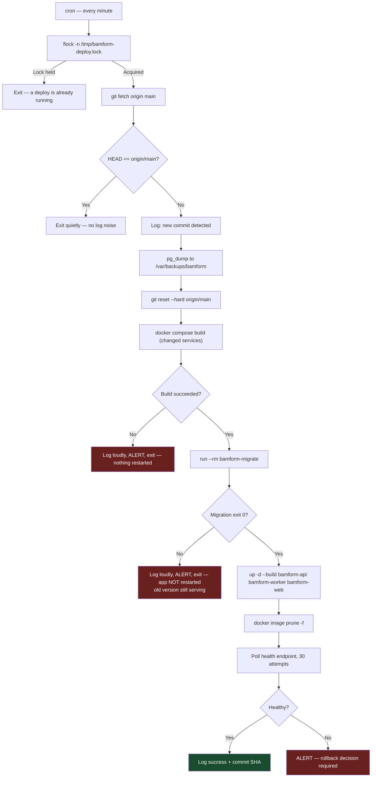
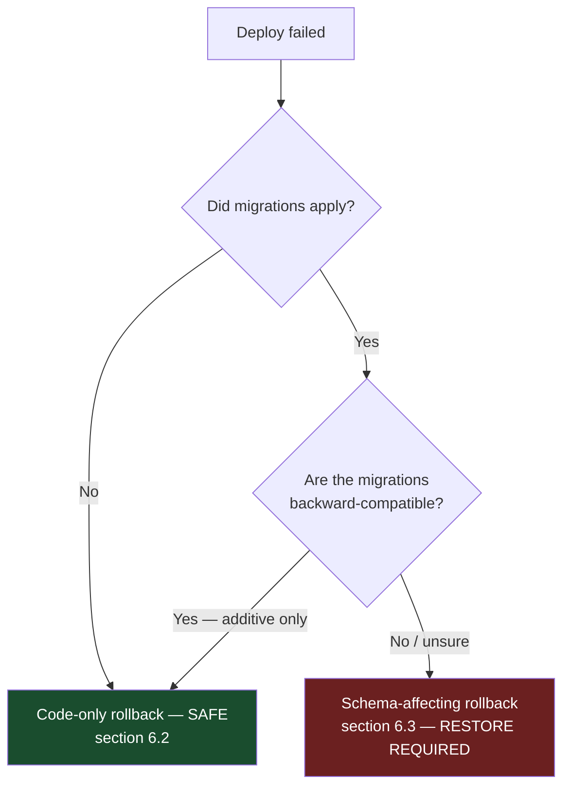

# Deployment and Operations Runbook
## BamForm — Preventive Maintenance Record and Approval System

---

## Document Control

| Field | Value |
|---|---|
| Document title | Deployment and Operations Runbook — BamForm |
| Document number | BAMFORM-RUN-001 |
| Revision | 0.2 |
| Status | **Draft — sections 2, 3 and 5 PROVISIONAL pending Phase 0 recon (OI-07)** |
| Date issued | 24 July 2026 |
| Prepared by | Lead Engineer, BamForm project |
| Approved by | _(to be completed)_ |
| Classification | Internal — operational |
| Parent documents | BAMFORM-PRD-001 Rev 0.2 · BAMFORM-ENV-001 Rev 0.1 · BAMFORM-SEC-001 Rev 0.1 |

### Revision History

| Revision | Date | Details of revision | Revised by | Approved by |
|---|---|---|---|---|
| 0.1 | 24 Jul 2026 | Initial draft | Lead Engineer | _(pending)_ |
| 0.2 | 1 Aug 2026 | §3.4 added — create the first ADMIN account via the `bootstrap-admin` entrypoint (PR-RUN-21, PR-RUN-22); §11 gains the no-account-yet failure mode | Lead Engineer | _(pending)_ |

---

## Table of Contents

1. Prohibited Commands
2. Topology and Inventory
3. First-Time Installation
4. The Deploy Mechanism
5. Routine Deploy
6. Rollback
7. Migration Failure
8. Backup and Restore
9. Health Checks
10. Log Locations
11. Common Failure Modes
12. Emergency Procedures
13. Routine Maintenance Calendar
14. Escalation

---

# 1. Prohibited Commands

**Read this section before anything else.** The `165` server is live and shared with other
applications (CN-01). The following commands are prohibited in every script, every procedure
and every ad-hoc session.

| Command | Consequence |
|---|---|
| `docker compose down -v` | **Destroys named volumes. All records lost.** |
| `docker volume rm bamform_*` | As above |
| `docker compose down` without a service name | Stops every service in the project; if run from the wrong directory, another application's project |
| `docker system prune -a` | Removes images other applications depend on |
| `docker stop $(docker ps -q)` | Stops every container on the host, including unrelated applications |
| `docker compose up -d` without service names in the deploy path | May recreate services unnecessarily; use explicit names |
| `DROP`, `TRUNCATE`, `DELETE` against the application database | No deletion path exists by design (DP-2). If you feel you need one, stop and escalate |
| Editing `audit_event` or `approval_step` by any means | Breaks the integrity chain. There is no legitimate reason |
| `git clean -fdx` in the repository directory | Removes the server-managed `.env` |
| `git checkout` / `git reset` while a deploy is running | Corrupts the working tree mid-deploy; the lock exists to prevent this |

**PR-RUN-01** `docker image prune -f` (dangling only) is permitted and is part of the deploy
script. `docker image prune -a` is not.

**PR-RUN-02** Every destructive operation requires a backup taken immediately beforehand and a
second person's acknowledgement. There are no exceptions for "quick fixes".

---

# 2. Topology and Inventory — PROVISIONAL

**To be completed from Phase 0 recon output.**

## 2.1 Host

| Item | Value |
|---|---|
| Hostname / IP | _(pending OI-07)_ |
| SSH user | _(pending)_ |
| Authentication | _(pending — key to be installed at first access)_ |
| Environment | _(pending — production or staging)_ |
| Repository path | `/opt/bamform` _(proposed, to be confirmed)_ |
| Compose file | `/opt/bamform/docker-compose.yml` _(proposed)_ |
| Other applications on this host | _(pending recon)_ |

## 2.2 Port allocation

**To be produced from the recon port table.** Until then, no ports are claimed. See
BAMFORM-ENV-001 §5.

## 2.3 Service inventory

| Service | Purpose | Safe to restart alone? | Restart impact |
|---|---|---|---|
| `bamform-web` | Static PWA bundle | Yes | Brief 502 on page load; running clients unaffected (offline-capable) |
| `bamform-api` | Application | Yes | In-flight requests fail; clients retry from the outbox |
| `bamform-worker` | Scheduler, notifications, PDF | Yes | Delayed jobs resume from Redis; scheduler catches up on next tick |
| `bamform-migrate` | One-shot | N/A | Runs to completion and exits |
| `bamform-postgres` | Database | **Caution** | API errors until healthy. Never restart without a reason |
| `bamform-redis` | Queue, rate limits, denylist | **Caution** | Queued notifications lost; users must re-login. **No records lost** |
| `bamform-minio` | Attachments | Yes | Attachment upload and view fail; record capture unaffected |

**PR-RUN-03** No BamForm service restart may touch a service outside the `bamform-*` prefix.
Every command in this runbook names services explicitly.

## 2.4 Volume inventory — **NEVER DELETE**

| Volume | Contains | Loss consequence |
|---|---|---|
| `bamform_pgdata` | All records, templates, audit chain | **Total loss of the archive.** Restore from backup |
| `bamform_miniodata` | Attachment objects | Photographic evidence lost; record content survives |
| `bamform_redisdata` | Queue state, rate counters | Queued notifications lost. Acceptable |

---

# 3. First-Time Installation — PROVISIONAL

Prerequisites: Phase 0 recon complete, port allocation agreed, DNS pointing at the host,
proxy decision made (PR-016).

```bash
# 1. Create the application directory
sudo mkdir -p /opt/bamform
sudo chown "$USER":"$USER" /opt/bamform

# 2. Deploy key — generate ON THE SERVER, never transported
ssh-keygen -t ed25519 -f ~/.ssh/bamform_deploy -N "" -C "bamform-deploy@165"
cat ~/.ssh/bamform_deploy.pub    # public half only — add to GitHub deploy keys, read-only

# 3. Prove the server can fetch BEFORE going further
GIT_SSH_COMMAND="ssh -i ~/.ssh/bamform_deploy" \
  git clone git@github.com:Mavrone81/bamform.git /opt/bamform

# 4. Create directories for state that is NOT in git
sudo mkdir -p /var/backups/bamform /var/log
sudo touch /var/log/bamform-deploy.log
```

## 3.1 Secrets — generated on the server, never printed

```bash
cd /opt/bamform
mkdir -p secrets && chmod 700 secrets

# Symmetric keys
openssl rand -base64 32 > secrets/kek
openssl rand -base64 32 > secrets/blind_index_key
openssl rand -base64 32 > secrets/minio_sse_key
openssl rand -base64 32 > secrets/postgres_password
openssl rand -base64 32 > secrets/redis_password

# Ed25519 keys — DISTINCT keys for tokens and record signing (PR-SEC-07)
openssl genpkey -algorithm ed25519 -out secrets/jwt_signing_key.pem
openssl genpkey -algorithm ed25519 -out secrets/record_signing_key.pem

chmod 400 secrets/*
```

**PR-RUN-04** Do not `cat` any file in `secrets/`. Do not paste one into a message, a ticket or
a chat. To verify a key exists, check its size and permissions:

```bash
ls -l secrets/    # confirms presence and mode without disclosing content
```

**PR-RUN-05** Back up `secrets/` **immediately**, to a location separate from database backups
(PR-ENV-15, PR-SEC-22). A database backup without these files is unreadable.

## 3.2 Configuration and first start

```bash
cp .env.example .env
# Edit .env — non-secret configuration only (BAMFORM-ENV-001 §4)
chmod 600 .env

# Build and start
docker compose -f /opt/bamform/docker-compose.yml build
docker compose -f /opt/bamform/docker-compose.yml run --rm bamform-migrate
docker compose -f /opt/bamform/docker-compose.yml up -d

# Verify
docker compose -f /opt/bamform/docker-compose.yml ps
curl -fsS http://127.0.0.1:${API_PORT}/api/v1/health
```

## 3.3 Verify nothing else was disturbed

```bash
docker ps --format '{{.Names}}\t{{.Status}}'   # every pre-existing container still Up
ss -tulpn | sort -k5                            # compare to the recon baseline
```

**PR-RUN-06** This check is mandatory after every first install and every deploy. It is the
evidence required by acceptance criterion AC-16.

## 3.4 Create the first ADMIN account

Migrations seed roles and reference data but **no user accounts**. Until this step runs the
sign-in page rejects every credential and there is no way into the application. This is the
final step of a first install.

The `bootstrap-admin` entrypoint creates one ADMIN, self-granting the role — no actor exists
to grant it — and writes the matching audit event. It is **one-time and fail-closed**: it
counts `app_user` inside the same transaction as the insert and refuses unless the count is
zero, so it cannot mint a second admin or be used to escalate later.

```bash
docker compose -f /opt/bamform/docker-compose.yml exec bamform-api \
  node dist/bootstrap-admin.js
```

It takes all four values **only** from the interactive prompt — never from argv, the
environment or a file — so they cannot leak into shell history, `docker inspect` or the
deploy log:

| Prompt | Rule |
|---|---|
| `Full name:` | 1–200 characters |
| `Email:` | Must be a valid address. This becomes the sign-in identity |
| `Password (min 12 chars, hidden):` | At least 12 characters. Terminal echo is muted while typing |
| `Confirm password:` | Must match, or the command exits 1 without touching the database |

On success it prints the new account's email and id. The account is `active` and
`mustChangePassword` is **not** set — the password typed here is the permanent one. Choose it
accordingly and record it in the password manager, never in a ticket or a chat.

**PR-RUN-21** Use `docker compose exec`, never `run`, and never `-T`. The command requires an
interactive terminal: it checks `stdin.isTTY` and exits 1 with `this command must be run
interactively from a terminal` before it opens a database connection. It cannot be driven from
cron, a script, or a piped `echo`. That is deliberate — it keeps the credentials off every
non-interactive surface — and is not a limitation to work around.

**PR-RUN-22** On the server, invoke it as `node dist/bootstrap-admin.js`. The
`npm run bootstrap:admin` shortcut in `api/package.json` works **only in a developer
checkout**: the runtime stage of `api/Dockerfile` deletes `npm`, `npx` and `corepack` outright
to strip their vulnerable transitive dependencies from the image, so the npm form fails on the
server with `npm: not found`.

Verify, then sign in:

```bash
# Expect exactly one user
docker compose -f /opt/bamform/docker-compose.yml exec -T bamform-postgres \
  psql -U bamform -d bamform -c "SELECT count(*) FROM app_user;"
```

Sign in at the application URL with the address just entered, then create the remaining users
through the admin screens. Re-running the command afterwards is harmless — it refuses with
`Bootstrap refused: 1 user(s) already exist.`

---

# 4. The Deploy Mechanism

Server-side pull via cron. No GitHub secrets, no inbound access to the server.



**PR-RUN-07** Migration failure aborts the deploy **without restarting the application**. The
previous version continues serving against the unchanged schema. This is the single most
important safety property of the deploy script — a half-migrated database serving a new
application version is far worse than a delayed release.

**PR-RUN-08** Only `bamform-*` services are named in the `up` command (PR-006). Postgres, Redis
and MinIO are not restarted by a routine deploy — they are only rebuilt when their pinned image
digest changes, which is a deliberate, separately reviewed action.

## 4.1 `/root/auto-deploy-bamform.sh`

```bash
#!/usr/bin/env bash
set -Eeuo pipefail

# cron's PATH is minimal — set it explicitly
export PATH=/usr/local/sbin:/usr/local/bin:/usr/sbin:/usr/bin:/sbin:/bin

REPO=/opt/bamform
COMPOSE_FILE=$REPO/docker-compose.yml
SERVICES="bamform-api bamform-worker bamform-web"
BACKUP_DIR=/var/backups/bamform
HEALTH_URL="http://127.0.0.1:${API_PORT:-3000}/api/v1/health"

log() { printf '%s  %s\n' "$(date -u +'%Y-%m-%dT%H:%M:%SZ')" "$*"; }
fail() { log "ERROR: $*"; exit 1; }
trap 'log "ERROR: line $LINENO failed"' ERR

cd "$REPO" || fail "repo not found at $REPO"

git fetch origin main --quiet || fail "git fetch failed"

LOCAL=$(git rev-parse HEAD)
REMOTE=$(git rev-parse origin/main)
[ "$LOCAL" = "$REMOTE" ] && exit 0     # no change — exit silently

log "=== Deploy start: $LOCAL -> $REMOTE ==="

# Pre-migration backup (PR-DBD-08)
mkdir -p "$BACKUP_DIR"
STAMP=$(date -u +'%Y%m%dT%H%M%SZ')
log "Backing up database before migration"
docker compose -f "$COMPOSE_FILE" exec -T bamform-postgres \
  pg_dump -U bamform --format=custom bamform \
  > "$BACKUP_DIR/predeploy-$STAMP.dump" || fail "pre-deploy backup failed"
find "$BACKUP_DIR" -name 'predeploy-*.dump' -mtime +7 -delete

# Code only. Volumes and .env are git-ignored and untouched.
git reset --hard origin/main --quiet
log "Working tree at $(git rev-parse --short HEAD)"

log "Building"
docker compose -f "$COMPOSE_FILE" build $SERVICES || fail "build failed — nothing restarted"

log "Running migrations"
docker compose -f "$COMPOSE_FILE" run --rm bamform-migrate \
  || fail "MIGRATION FAILED — application NOT restarted, previous version still serving"

log "Restarting BamForm services only"
docker compose -f "$COMPOSE_FILE" up -d --build $SERVICES || fail "service restart failed"

docker image prune -f >/dev/null 2>&1 || true

log "Health check"
for i in $(seq 1 30); do
  if curl -fsS --max-time 5 "$HEALTH_URL" >/dev/null 2>&1; then
    log "Healthy after ${i} attempt(s)"
    log "=== Deploy OK: $(git rev-parse --short HEAD) ==="
    exit 0
  fi
  sleep 2
done

fail "HEALTH CHECK FAILED after 60s — MANUAL INTERVENTION REQUIRED. See section 6 (Rollback)."
```

**PR-RUN-09** Automatic rollback is **not** implemented by default. A failed health check
alerts and stops; a human decides. Automatic rollback after a migration has already applied
can leave schema and code mismatched in the opposite direction. This can be enabled if the
client explicitly approves the behaviour (master prompt §6).

## 4.2 Crontab

```cron
* * * * * flock -n /tmp/bamform-deploy.lock /root/auto-deploy-bamform.sh >> /var/log/bamform-deploy.log 2>&1
```

## 4.3 logrotate — `/etc/logrotate.d/bamform`

```
/var/log/bamform-deploy.log {
    daily
    rotate 30
    compress
    delaycompress
    missingok
    notifempty
    copytruncate
}
```

**PR-RUN-10** `copytruncate` is used because the cron job appends without reopening the file.

## 4.4 Verify the mechanism is live

```bash
systemctl status cron
crontab -l | grep bamform
ls -l /tmp/bamform-deploy.lock 2>/dev/null || echo "no deploy currently running"
tail -50 /var/log/bamform-deploy.log
```

---

# 5. Routine Deploy

Normal path: merge to `main`, then wait. The server pulls within 60 seconds.

```bash
# Watch it happen
tail -f /var/log/bamform-deploy.log

# Confirm the server is on the expected commit
cd /opt/bamform && git rev-parse --short HEAD

# Confirm services healthy
docker compose -f /opt/bamform/docker-compose.yml ps
curl -fsS http://127.0.0.1:${API_PORT}/api/v1/health

# MANDATORY — confirm no other application was disturbed
docker ps --format '{{.Names}}\t{{.Status}}'
```

**PR-RUN-11** The last check is not optional and not a formality. It is the evidence for AC-17
and the mitigation for RK-08.

## 5.1 Manual deploy (when cron is disabled or urgent)

```bash
sudo flock -n /tmp/bamform-deploy.lock /root/auto-deploy-bamform.sh
```

Always via `flock`, never by running the steps by hand — running them by hand is how two
deploys end up interleaved.

---

# 6. Rollback

## 6.1 Decide first: code-only or schema-affecting?



## 6.2 Code-only rollback

```bash
cd /opt/bamform
git log --oneline -5                       # identify the last good commit
git reset --hard <last-good-sha>
docker compose -f docker-compose.yml up -d --build bamform-api bamform-worker bamform-web
curl -fsS http://127.0.0.1:${API_PORT}/api/v1/health
```

**PR-RUN-12** Then **push the revert to `main`**. Otherwise the cron job re-deploys the broken
commit within 60 seconds.

```bash
# On the developer machine
git revert <bad-sha> && git push origin main
```

## 6.3 Schema-affecting rollback

**Stop. Escalate before acting.** This path loses data written since the backup.

1. Disable the deploy loop: `crontab -l > /tmp/cron.bak && crontab -r`
2. Stop the application (not the database): `docker compose stop bamform-api bamform-worker`
3. Take a **current** backup — the broken state is evidence and may contain recoverable data.
4. Restore the pre-deploy dump: `/var/backups/bamform/predeploy-<stamp>.dump`
5. Reset code to the last good commit.
6. Run the restore verification battery (§8.4).
7. Restart, verify, then re-enable cron: `crontab /tmp/cron.bak`
8. Record an incident; determine why the migration gate in CI did not catch it.

---

# 7. Migration Failure

The deploy script leaves the previous application version running (PR-RUN-07). There is no
outage. Do not rush.

```bash
# What failed
docker compose -f /opt/bamform/docker-compose.yml run --rm bamform-migrate 2>&1 | tail -50

# Current schema state
docker compose -f /opt/bamform/docker-compose.yml exec -T bamform-postgres \
  psql -U bamform -d bamform -c "SELECT * FROM _prisma_migrations ORDER BY finished_at DESC LIMIT 10;"
```

| Symptom | Likely cause | Action |
|---|---|---|
| Migration partially applied, marked failed | Statement failed mid-transaction | Restore pre-deploy dump; fix the migration; re-test in CI against a schema copy |
| Lock timeout | Long-running query holding a lock | Identify with `pg_stat_activity`; retry off-peak; use `CONCURRENTLY` for index creation |
| Constraint violation on existing data | Migration assumed clean data | Fix data in a preceding migration step, then apply the constraint |
| Migration already applied | Deploy retried after a partial success | Usually self-resolving; verify `_prisma_migrations` and re-run |

**PR-RUN-13** Never mark a migration as applied by editing `_prisma_migrations` to make an
error go away. Fix the migration, restore, re-apply.

---

# 8. Backup and Restore

## 8.1 Scheduled backup — `/etc/cron.d/bamform-backup`

```cron
30 1 * * * root /root/bamform-backup.sh >> /var/log/bamform-backup.log 2>&1
```

Backs up: Postgres (`pg_dump --format=custom`), MinIO (`mc mirror`), and `.env`. **Not**
`secrets/` — those are under separate custody and are backed up on change, not nightly
(PR-SEC-22).

## 8.2 Verify backups are actually happening

```bash
ls -lh /var/backups/bamform/ | tail -10
find /var/backups/bamform -name '*.dump' -mtime -1 | head   # must return today's
tail -20 /var/log/bamform-backup.log
```

**PR-RUN-14** Check this weekly. An unmonitored backup job that has been failing for a month is
the most common cause of unrecoverable data loss, and it fails silently by nature.

## 8.3 Restore procedure

**Never restore over a running production instance as the first action.** Restore to a scratch
project, verify, then cut over.

```bash
# 1. Scratch environment
export COMPOSE_PROJECT_NAME=bamform_restore
docker compose -f /opt/bamform/docker-compose.yml up -d bamform-postgres bamform-minio

# 2. Restore secrets from key custody FIRST — without them the data is unreadable
#    Confirm DEK_VERSION matches the backup era (PR-SEC-10)

# 3. Restore the database
docker compose exec -T bamform-postgres \
  pg_restore -U bamform -d bamform --clean --if-exists < /var/backups/bamform/<file>.dump

# 4. Restore objects to the same point in time
mc mirror /var/backups/bamform/minio/ local/bamform-attachments/

# 5. Start the API and run the verification battery
docker compose up -d bamform-api
```

## 8.4 Restore verification battery — MANDATORY

A restore is not proven by containers starting. Full detail in BAMFORM-ENV-001 §7.4.

| # | Check | Command / endpoint |
|---|---|---|
| RV-1 | Row counts match source | `SELECT count(*) FROM job, item_result, approval_step, audit_event` |
| RV-2 | **Decrypt a known user and match the expected name** | `GET /api/v1/users/{knownId}` |
| RV-3 | Blind-index lookup returns the right user | `POST /api/v1/auth/login` with a known account |
| RV-4 | **Audit chain intact end to end** | `GET /api/v1/audit-events/chain-status` |
| RV-5 | Signatures verify on 10 sampled records | `GET /api/v1/records/{id}/integrity` |
| RV-6 | Attachment hashes match restored objects | Integrity job |
| RV-7 | A record renders to PDF correctly | `GET /api/v1/records/{id}/pdf` |

**PR-RUN-15** RV-2, RV-4 and RV-5 distinguish a real restore test from a theatrical one. Correct
row counts with unreadable personal data or a broken audit chain means nothing of evidentiary
value was restored.

---

# 9. Health Checks

| Endpoint | Purpose | Expected |
|---|---|---|
| `GET /api/v1/health` | Liveness | 200, version, commit SHA |
| `GET /api/v1/health/ready` | Readiness — Postgres, Redis, MinIO | 200, all `ok` |
| `GET /api/v1/audit-events/chain-status` | Audit integrity | `intact: true` |
| `docker compose ps` | Container health | All `healthy` |

## 9.1 Daily operational check

```bash
curl -fsS http://127.0.0.1:${API_PORT}/api/v1/health/ready | jq .
docker compose -f /opt/bamform/docker-compose.yml ps
df -h | grep -E 'docker|/$'
tail -20 /var/log/bamform-deploy.log
```

## 9.2 The check that matters most

```sql
-- Scheduler liveness. A stalled scheduler produces SILENCE, not errors.
SELECT max(generated_at) AS last_job_generated FROM job;
```

**PR-RUN-16** A stopped scheduler is the most dangerous failure in this system because nobody
complains. Users see no jobs and assume none are due. The compliance gap surfaces at the next
ISO audit, months later. Alert if `last_job_generated` exceeds 26 hours during a period when
jobs were expected.

---

# 10. Log Locations

| Log | Location | Retention |
|---|---|---|
| Deploy | `/var/log/bamform-deploy.log` | 30 days, logrotate |
| Backup | `/var/log/bamform-backup.log` | 30 days |
| API | `docker compose logs bamform-api` | 50 MB rolling |
| Worker | `docker compose logs bamform-worker` | 50 MB rolling |
| Postgres | `docker compose logs bamform-postgres` | 50 MB rolling |
| Proxy | _(pending recon)_ | Host policy |
| **Audit trail** | **`audit_event` table — NOT a log file** | **7 years, never rotated** |

**PR-RUN-17** Log rotation must never be capable of destroying audit evidence. The separation
between operational logs (rotated) and the audit trail (a table, retained) is deliberate
(PR-ENV-20).

Useful queries:

```bash
docker compose logs --since 1h bamform-api | grep -i error
docker compose logs --tail 200 -f bamform-worker
grep -E 'ERROR|FAILED' /var/log/bamform-deploy.log | tail -20
```

---

# 11. Common Failure Modes

| Symptom | Likely cause | Diagnosis | Action |
|---|---|---|---|
| Site returns 502 | `bamform-api` down or unhealthy | `docker compose ps`; `logs bamform-api` | Restart `bamform-api`. If it crash-loops, check `.env` and database reachability |
| Site returns 404 for app routes | Proxy vhost misconfigured or `bamform-web` down | Check proxy config; `curl` the web container directly | Fix vhost; restart `bamform-web` |
| Login fails for everyone | Blind index key missing/changed, or database unreachable | `logs bamform-api`; verify `secrets/blind_index_key` present | **Do not regenerate the key** — that orphans every account. Restore the correct key |
| Login fails for everyone **on a brand-new install** | No account exists yet — §3.4 was never run | `SELECT count(*) FROM app_user` returns 0 | Run §3.4. If the count is non-zero the bootstrap will refuse; this is the wrong diagnosis |
| Login fails for one user | Account locked after failed attempts | Query `app_user.locked_until` | Wait, or clear the lockout as ADMIN |
| **No new jobs appearing** | Scheduler stalled or `SCHEDULER_ENABLED=false` | §9.2 query; `logs bamform-worker`; check `.env` | Restart `bamform-worker`; verify the Redis lock is not stuck |
| Redis lock stuck after a crash | Lock TTL not yet expired | `docker compose exec bamform-redis redis-cli TTL bf:lock:scheduler` | Wait for TTL, or delete the key deliberately after confirming no worker is running |
| Notifications not sending | SMTP failure or worker down | `SELECT state, count(*) FROM notification GROUP BY state` | Check SMTP credentials and relay reachability. **In-app notifications still work** (PR-WFD-19) |
| Technicians report lost records | Outbox not draining | Check client sync state; `logs bamform-api` for 409s | **Highest priority — RK-01.** Do not clear any client cache until diagnosed |
| Records stuck in SUBMITTED | No eligible verifier, or all verifiers deactivated | Check `approval_stage_role` and active users with those roles | Assign the role, or configure a delegation |
| PDF generation fails or hangs | Chromium memory exhaustion | `logs bamform-worker`; `docker stats` | Restart `bamform-worker`; verify concurrency limit is 2 (PR-ENV-13) |
| Disk full | MinIO attachment growth, or backups not pruned | `df -h`; `du -sh /var/backups/bamform` | Prune old backups; `docker image prune -f`. **Never delete attachment objects** |
| **Audit chain reports a break** | Corruption, inconsistent restore, or tampering | `GET /audit-events/chain-status` | **S1 incident.** Stop, back up, follow BAMFORM-SEC-001 §12.3 playbook P2 |
| Certificate expired | ACME renewal failed | `curl -vI https://form.bevorasg.com` | Check proxy logs; renew manually; investigate why the 21-day alert did not fire |
| Deploy log silent for hours | cron stopped, or lock file stale | `systemctl status cron`; `ls -l /tmp/bamform-deploy.lock` | Restart cron; remove a stale lock only after confirming no deploy is running |
| Another application on the host went down | BamForm resource exhaustion | `docker stats`; check memory limits are set | **S1 for the client.** Escalate immediately. Verify PR-ENV-12 limits are applied |

---

# 12. Emergency Procedures

## 12.1 Stop BamForm without touching other applications

```bash
docker compose -f /opt/bamform/docker-compose.yml stop bamform-api bamform-worker bamform-web
docker ps --format '{{.Names}}\t{{.Status}}'   # confirm others still Up
```

Data services are left running so nothing depends on their restart order.

## 12.2 Disable auto-deploy

```bash
crontab -l > /tmp/cron.bak
crontab -l | grep -v bamform | crontab -
crontab -l   # verify only the BamForm line was removed
```

Restore with `crontab /tmp/cron.bak`.

## 12.3 Emergency read-only mode

Set `MAINTENANCE_READONLY=true` in `.env` and restart `bamform-api`. Record capture continues
offline on devices; submissions queue. Nothing is lost.

## 12.4 Disk full

```bash
df -h
find /var/backups/bamform -name '*.dump' -mtime +30 -delete
docker image prune -f
docker builder prune -f
du -sh /var/lib/docker/volumes/bamform_miniodata
```

**PR-RUN-18** Never resolve a disk-full condition by deleting attachment objects or database
files. Attachments are record evidence. Free space elsewhere or extend the volume.

## 12.5 Suspected compromise

Do not restart or clean up. Snapshot first (PR-SEC-26), then follow BAMFORM-SEC-001 §12.
Because the host is shared, the incident scope is the whole host — escalate to the client's IT
function immediately.

---

# 13. Routine Maintenance Calendar

| Frequency | Task | Section |
|---|---|---|
| Daily | Health check, deploy log review | §9.1 |
| Weekly | Verify backups ran; check disk trend | §8.2 |
| Weekly | Review failed notifications | §11 |
| Monthly | Review audit chain status; review Dependabot PRs | §9 |
| Quarterly | **Restore drill to a scratch environment** with the full RV battery | §8.3–8.4 |
| Quarterly | Review user accounts; deactivate leavers | — |
| 90 days | Rotate JWT signing key | SEC §7.1 |
| Annually | Rotate KEK, DEK, MinIO SSE key, database passwords | SEC §7.2–7.3 |
| Annually | Review and re-approve this runbook | — |
| 24 months | Rotate record signing key (old generations retained) | SEC §7.4 |

**PR-RUN-19** The quarterly restore drill is the only thing that proves the backups work. A
backup that has never been restored is a hypothesis, not a control.

---

# 14. Escalation

| Situation | Escalate to | Timeframe |
|---|---|---|
| Another application on the host affected | Client IT + sign-off authority | Immediate |
| Audit chain break | Client Quality/Document Control + sign-off authority | Immediate |
| Suspected data breach | Client sign-off authority + PDPA determination | Immediate |
| Records lost or unrecoverable | Client Quality + sign-off authority | Immediate |
| Deploy failure requiring schema rollback | Lead Engineer, then client if downtime expected | Before acting |
| Extended outage over 4 hours | Client sign-off authority | At 4 hours |

| Role | Contact |
|---|---|
| Lead Engineer | _(to be completed)_ |
| Client sign-off authority | _(to be completed)_ |
| Client IT / `165` host owner | _(to be completed)_ |
| Quality / Document Control | _(to be completed)_ |

**PR-RUN-20** This table must be completed before go-live, matching PR-SEC-27.

---

*End of document — BAMFORM-RUN-001 Revision 0.1*
