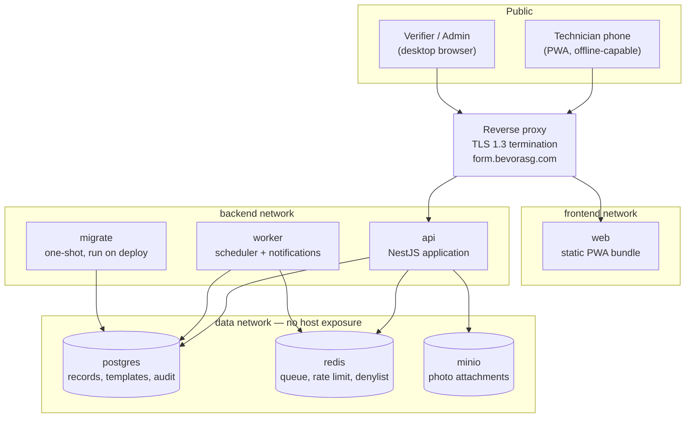
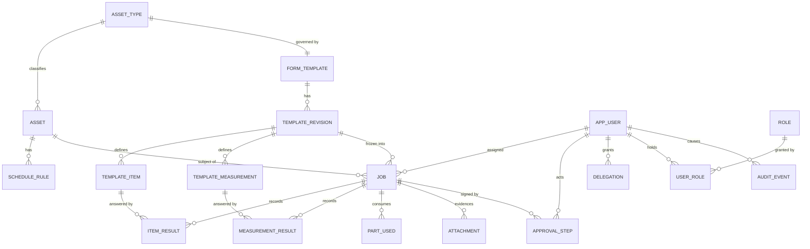
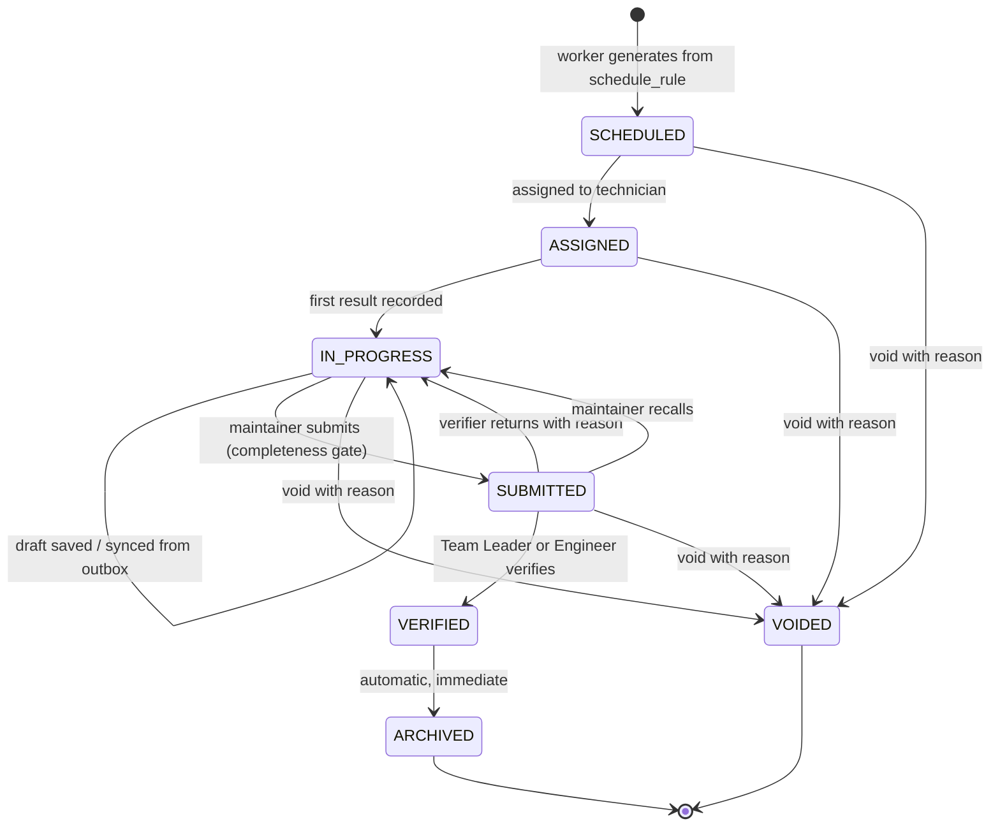
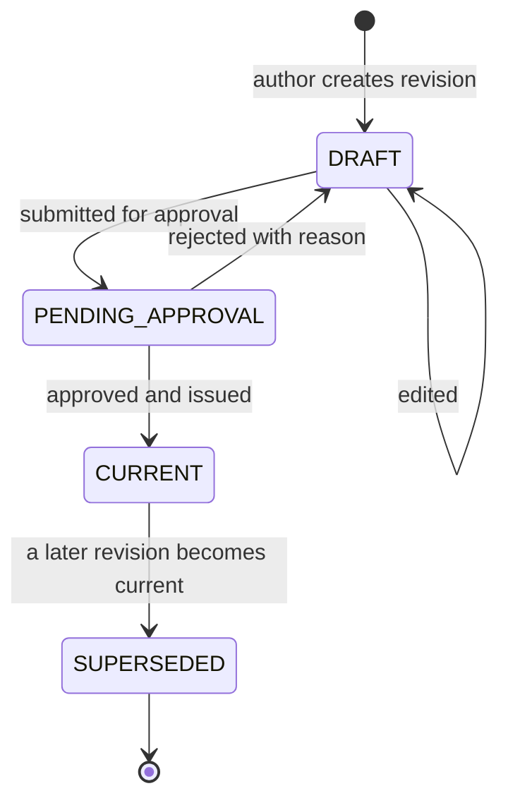

# Product Requirement Document
## BamForm — Preventive Maintenance Record and Approval System

---

## Document Control

| Field | Value |
|---|---|
| Document title | Product Requirement Document — BamForm |
| Document number | BAMFORM-PRD-001 |
| Revision | 0.2 |
| Status | **Draft — for client review** |
| Date issued | 23 July 2026 |
| Prepared by | Lead Engineer, BamForm project |
| Approved by | _(to be completed)_ |
| Classification | Internal |
| Supersedes | — |
| Parent document | BAMFORM-URD-001 Rev 1.0 (Approved, 23 Jul 2026) |

### Revision History

| Revision | Date | Details of revision | Revised by | Approved by |
|---|---|---|---|---|
| 0.1 | 23 Jul 2026 | Initial draft derived from BAMFORM-URD-001 Rev 1.0 | Lead Engineer | _(pending)_ |
| 0.2 | 24 Jul 2026 | Added Section 0 document set index. Cross-referenced the technical document set (DBD, ENV, API, WFD, SEC, RUN, TST, TLP, ADR), now issued at Rev 0.1. No product requirement was changed, added or removed. | Lead Engineer | _(pending)_ |

### Provisional Content Notice

The following sections are **provisional** and will change:

| Section | Provisional because | Resolves when |
|---|---|---|
| 3.7 Reverse proxy selection | Depends on whether nginx, Caddy or Traefik already terminates TLS on the `165` server | Phase 0 recon completes (OI-07) |
| 14.3 Infrastructure sizing | Depends on machine count | OI-02 answered |
| 11.4 Electronic signature strength | Depends on regulatory regime | OI-01 answered |
| 8.3 Approval stage configuration | Configured for one stage per client answer; forms show two | OI-04 answered |
| 6.5 Measurement evaluation | Readings captured but not acted upon per client answer | OI-05 answered |

Every other section is complete and ready for review.

---

---

# 0. Document Set

This PRD sits within the following set. All are issued and available for review.

| Document | Number | Rev | Covers |
|---|---|---|---|
| User Requirement Document | BAMFORM-URD-001 | **1.0 Approved** | 116 user requirements, personas, journeys, acceptance criteria |
| **Product Requirement Document** | **BAMFORM-PRD-001** | **0.2** | **This document — 121 product requirements, architecture, technology selection** |
| Database Design Document | BAMFORM-DBD-001 | 0.1 | ERD, data dictionary, classification and encryption marking, invariants, indexing, migration |
| Environment Requirements | BAMFORM-ENV-001 | 0.1 | Environment matrices, full configuration catalogue, sizing, backup and restore with RTO/RPO |
| API Specification | BAMFORM-API-001 | 0.1 | Conventions, error catalogue, permission matrix, sync protocol. Contract at `api/openapi.yaml` |
| Workflow Diagrams | BAMFORM-WFD-001 | 0.1 | Every workflow: generation, cascade, capture, sync, approval, rework, delegation, escalation, recall, void, revision control, audit, notification |
| Security Architecture | BAMFORM-SEC-001 | 0.1 | Data classification, STRIDE model, key hierarchy and rotation, incident response, residual risk |
| Deployment and Runbook | BAMFORM-RUN-001 | 0.1 | Deploy flow, rollback, failure modes, restore, prohibited commands |
| Test Plan | BAMFORM-TST-001 | 0.1 | All test levels, coverage targets, offline gate, security cases, UAT |
| Template Load Plan | BAMFORM-TLP-001 | 0.1 | Verified load of the twelve source documents, defect disposition |
| Architecture Decision Records | BAMFORM-ADR-001 | 0.1 | Thirteen recorded decisions with alternatives and reversal conditions |

The last two were proposed beyond the master build prompt's list. Justifications are in their
respective "why this document exists" sections: the load plan because RK-05 makes verified
template loading a condition of acceptance, and the ADR log because RK-10 identifies
single-point knowledge concentration as a project risk.

# 1. Purpose and Approach

This document translates the approved user requirements (`UR-xxx`) into technical product
requirements (`PR-xxx`). It states what will be built, how it is structured, which
technologies are selected and why, which alternatives were rejected, and how the work is
sequenced, estimated and tested.

Section 18 contains the full traceability matrix. Every `UR-xxx` in the approved URD maps
to at least one `PR-xxx` here. Every `PR-xxx` maps forward to at least one test case in the
Test Plan.

---

# 2. System Architecture Overview

## 2.1 Shape of the system

BamForm is a single-tenant, self-hosted web application deployed as a set of Docker Compose
services on the client's existing `165` server, reachable only through the host's reverse
proxy.

**PR-001** All application containers shall bind to `127.0.0.1` only. The host reverse proxy
shall be the sole public entry point.

**PR-002** Three Compose networks shall be defined — `frontend`, `backend`, `data`. Postgres,
Redis and MinIO shall be attached to `data` only and shall publish no host port.

**PR-003** Every service shall define a healthcheck. Dependent services shall use
`depends_on: condition: service_healthy`.

**PR-004** All application images shall run as a non-root user, use multi-stage builds, and
pin base images by digest.

**PR-005** Persistent state (Postgres data, Redis data, MinIO data, `.env`) shall live in
named volumes or server-managed files, git-ignored, and shall never be touched by a deploy.

**PR-006** Compose service names shall be prefixed `bamform-` so that no deploy command can
address a service belonging to another application on the shared host.

## 2.2 Component responsibilities

| Component | Responsibility | Explicitly not responsible for |
|---|---|---|
| `web` | PWA shell, offline record capture, local outbox, all rendering | Authorisation decisions; validation of record on server |
| `api` | Authentication, authorisation, all business rules, validation, signature generation, audit writes, PDF rendering | Scheduling; sending notifications |
| `worker` | Schedule evaluation and job generation, notification dispatch, escalation timers, retention jobs | Serving HTTP requests |
| `migrate` | Forward-only schema migration, run once per deploy before `api` restarts | Seeding production data |
| `postgres` | All records, templates, assets, audit chain | File storage |
| `redis` | Job queue, rate-limit counters, refresh-token denylist, scheduler advisory lock | Any data that must survive a restart |
| `minio` | Photo attachment object storage | Access control (enforced by `api`) |

**PR-007** No business rule shall be enforced only in `web`. Every rule enforced in the
client for user experience shall be enforced again in `api` (UR-074).

---

# 3. Technology Selection

## 3.1 Summary

| Layer | Selected | Rejected alternatives |
|---|---|---|
| Database | PostgreSQL 16 | MySQL, MongoDB, SQLite |
| Cache / queue | Redis 7 | pg-boss (Postgres-backed queue), RabbitMQ |
| Object storage | MinIO | Bind-mounted filesystem, Postgres large objects, external S3 |
| Backend | NestJS (Node.js 22, TypeScript strict) | FastAPI, Django, Laravel |
| ORM / query | Prisma + raw SQL for reporting | TypeORM, Drizzle, Knex |
| Frontend | **React 19 + Vite + Tailwind, delivered as a PWA** | **Next.js (rejected — see 3.5)**, Vue, HTMX |
| Offline store | IndexedDB via Dexie, outbox pattern | localStorage, WatermelonDB, PouchDB/CouchDB |
| PDF rendering | Server-side via Playwright/Chromium from an HTML template | wkhtmltopdf, pdfmake, LaTeX |
| Reverse proxy | **Provisional** — reuse existing host proxy if present, else Caddy | Traefik |
| Migrations | Prisma Migrate, forward-only, one-shot service | Auto-sync, hand-rolled SQL runner |

## 3.2 PostgreSQL 16 — accepted as recommended

**PR-008** PostgreSQL 16 shall be the system of record.

Justification: the domain is relational and transactional. A record must atomically bind an
asset, a template revision, a set of item results and a signature. `JSONB` carries the
standing template content (PPE, tools, safety statements) that varies in shape between
documents while the checklist and measurement items are properly normalised so they can be
queried and trended (UR-070). Generated columns and partial indexes cover the scheduling
queries. `pgcrypto` is available for the narrow field encryption in Section 12.

Rejected: **MongoDB** — the master prompt correctly identified this adds nothing. Approval
workflows are joins, not documents. **SQLite** — insufficient concurrency and no network
service model. **MySQL** — weaker JSONB, weaker partial index support, no advisory-lock
idiom as clean as Postgres for the scheduler.

## 3.3 Redis 7 — accepted, with the alternative stated

**PR-009** Redis 7 shall provide the notification job queue (BullMQ), authentication rate-limit
counters, the refresh-token reuse denylist, and the scheduler's distributed lock.

Justification: BullMQ gives retry, backoff and delayed jobs, which the escalation timers
(UR-050) and due-date reminders (UR-062) need directly. The refresh-token denylist wants TTL
semantics that Redis provides natively.

Rejected alternative worth recording: **pg-boss** would deliver the same queue on Postgres
and remove a container from a shared, live server. At 100 users this is genuinely viable and
would reduce the operational footprint. Redis is selected because the delayed-job and
rate-limit primitives are materially better and the container costs roughly 30 MB of RAM.
**If the client prefers a minimal footprint on the `165` server, this decision can be reversed
at no architectural cost** — it is confined to two modules.

## 3.4 MinIO — accepted

**PR-010** MinIO shall store photo attachments. Objects shall be encrypted at rest with SSE-S3
using an application-managed key.

**PR-011** Attachments shall be served **through** `api`, not by presigned URL, so that
authorisation is evaluated on every retrieval (UR-074, UR-099).

**PR-012** Every attachment shall store a SHA-256 content hash at upload, included in the
record's signed content hash (Section 11).

Justification: S3 semantics, lifecycle policies, server-side encryption, and a clean backup
story independent of the database. Rejected: **bind-mounted filesystem** — the master prompt
is right that this sprawls, and it makes the backup boundary ambiguous. **Postgres large
objects** — inflates database size and backup time for data that is never queried.
**External S3** — introduces an internet dependency for an internal tool and a data-residency
question under PDPA.

## 3.5 Frontend — Next.js is rejected; React + Vite PWA is selected

This is the one substantive departure from the master prompt's recommended stack, and it
follows directly from an approved requirement.

**PR-013** The frontend shall be a client-rendered React 19 single-page application, built by
Vite, styled with Tailwind, and installable as a Progressive Web App with a service worker.

**PR-014** The application shell, the assigned job list, the applicable template revision
content and any draft responses shall be cached on the device such that a technician can
complete a full record with no network connection (UR-038, UR-088).

Justification: UR-038 makes offline record completion a Must-have, and UR-088 requires queued
records to transmit within 60 seconds of reconnection. Offline-first means the client owns
the data and the rendering while disconnected. Server-side rendering is the opposite posture.
Next.js can be coerced into static export and made to work, but every SSR affordance it
provides — fast first paint for anonymous users, SEO, server components — is worthless for an
authenticated internal tool used by roughly a hundred named people, while its routing and data
conventions actively complicate service-worker cache control.

The secondary benefit matters on a shared live server: a Vite build is static files served by
the existing proxy. There is no Node SSR process to run, supervise, patch or restart. That is
one fewer long-running container on a host that already carries other applications (CN-01).

Rejected: **Next.js** for the reasons above. **HTMX / server-rendered forms** — cannot satisfy
UR-038 at all. **Vue** — no technical objection; React is selected for ecosystem depth in
offline sync and PDF tooling.

## 3.6 NestJS over FastAPI

**PR-015** The backend shall be NestJS on Node.js 22, TypeScript in strict mode.

Justification: the decisive factor is that validation logic must exist in two places. The
offline client has to validate a record before accepting a submission into its outbox, and the
server has to validate it again on arrival (PR-007). With TypeScript on both sides, a single
set of Zod schemas is the source of truth for both, generated from the template definition, and
shared as an internal package. A Python backend would require that logic to be written twice
in two languages and kept in step — a defect source in exactly the area where correctness
matters most.

Both candidates generate OpenAPI well; that criterion does not separate them. Rejected:
**FastAPI** for the reason above. **Django** — its admin is attractive for UR-072 but its
ORM and template conventions fight an API-first offline client. **Laravel** — no team or
ecosystem advantage here.

## 3.7 Reverse proxy — PROVISIONAL

**PR-016 (provisional)** If the `165` server already terminates TLS on ports 80/443, BamForm
shall add a virtual host to that proxy and shall **not** introduce a second proxy. If no proxy
exists, Caddy shall be deployed for automatic ACME certificate issuance for
`form.bevorasg.com`.

This cannot be settled until the Phase 0 recon runs (OI-07). Introducing a second listener on
:443 on a live shared host would take other applications down, which CN-01 forbids.

## 3.8 Migrations

**PR-017** Schema migrations shall be versioned, forward-only, and applied by a one-shot
`migrate` Compose service that runs to completion before `api` is restarted.

**PR-018** No auto-synchronising schema tool shall run against production. Each migration shall
have a documented reversal procedure even though rollback is not automated.

---

# 4. Data Model

## 4.1 Narrative

The model separates four concerns that the current Excel process conflates:

1. **What equipment exists** — `asset_type` and `asset`. An asset type owns one form template;
   an asset is a physical machine. This is what removes defect B-09.
2. **What must be done** — `form_template` and its `template_revision`s, each owning
   `template_item`s (checklist) and `template_measurement`s (readings with specifications).
   Only one revision is current at a time.
3. **What was done** — `job` and its result tables. A job is permanently bound to the
   `template_revision` that was current when it was raised (UR-040), which is what allows an
   auditor in 2028 to see revision C's checklist on a 2026 record.
4. **Who said so** — `approval_step` and `audit_event`. Signatures are content-bound; the
   audit chain is hash-linked.

Two design points are worth stating explicitly.

**Template content is normalised, not JSONB.** It would be quicker to store the whole checklist
as a JSON blob on the revision. It is rejected because UR-070 requires trending a specific
measurement for a specific asset over time — "show me heater block temperature on AW03 across
eight quarters". That is a query against normalised rows with a stable measurement identity
across revisions. JSONB would make it an application-side scan. Only the standing content
(PPE list, tools, safety statement, procedure note, remarks) is JSONB, because it is displayed
whole and never queried.

**Results reference template rows, not copies of them.** A result row points at the
`template_item` of the frozen revision. Because revisions are immutable once current, the text
the technician saw is recoverable exactly, without denormalising instruction text into every
result row.

## 4.2 Entity relationship diagram

## 4.3 Key tables

**PR-019** `asset_type` — id, code, name, description, form_template_id, active.

**PR-020** `asset` — id, code (unique, enforced by constraint per UR-003), asset_type_id,
description, manufacturer, model, location, area, commissioned_on, status enum
(`active` | `under_repair` | `decommissioned`), schedule_anchor_date, active.

**PR-021** `form_template` — id, document_number (e.g. `CE 95 020 00 01`), title, asset_type_id.

**PR-022** `template_revision` — id, form_template_id, revision_code, status enum
(`draft` | `pending_approval` | `current` | `superseded`), sequence_ordinal, effective_from,
superseded_at, authored_by, approved_by, approved_at, change_description, standing_content
(JSONB: ppe, tools, parts_required, safety, procedure, remarks).

**PR-023** `template_revision` shall carry a partial unique index enforcing at most one row with
`status = 'current'` per `form_template_id` (UR-012).

**PR-024** `template_revision.sequence_ordinal` shall be a monotonically increasing integer
per template, and creation of a revision shall be rejected if it would create a gap. This
implements UR-010 and prevents defect B-02.

**PR-025** `template_item` — id, template_revision_id, item_no, frequency enum
(`M1` | `M3` | `M6` | `Y`), instruction, mandatory (bool), stable_key.

**PR-026** `template_measurement` — id, template_revision_id, section, description, unit,
spec_type enum (`range` | `tolerance` | `pass_fail` | `text`), lower_limit, upper_limit,
nominal, tolerance, display_order, stable_key.

**PR-027** A `CHECK` constraint shall enforce `lower_limit <= upper_limit` where both are
present, implementing UR-019 and preventing defect B-04.

**PR-028** `stable_key` on items and measurements shall carry forward across revisions where
the item is unchanged in identity, enabling cross-revision trending (UR-070).

**PR-029** `schedule_rule` — id, asset_id, frequency, interval_months, anchor_date,
last_completed_on, next_due_on, active.

**PR-030** `job` — id, job_number, asset_id, template_revision_id, frequency_scope (array of
frequencies included after cascade), due_on, generated_at, assigned_to, status enum (Section 5),
submitted_at, submitted_by, closed_at, void_reason.

**PR-031** `item_result` — id, job_id, template_item_id, status enum
(`done` | `not_applicable` | `not_done`), remark, recorded_at, client_recorded_at.

**PR-032** `measurement_result` — id, job_id, template_measurement_id, reading_numeric,
reading_text, judgement enum (`pass` | `fail` | `not_evaluated`), remark, recorded_at.

**PR-033** `part_used` — id, job_id, part_no, description, quantity, remarks.

**PR-034** `attachment` — id, job_id, item_result_id (nullable), object_key, content_type,
byte_size, sha256, uploaded_by, uploaded_at.

**PR-035** `approval_step` — id, job_id, stage_ordinal, action enum
(`submitted` | `verified` | `returned` | `recalled` | `voided`), actor_id, on_behalf_of_id
(nullable, for delegation per UR-052), reason, acted_at, content_hash, signature.

**PR-036** `audit_event` — id, sequence, occurred_at, actor_id, action, entity_type, entity_id,
before (JSONB), after (JSONB), source_ip, request_id, prev_hash, hash.

**PR-037** `app_user` — id, employee_id (encrypted + blind index), full_name (encrypted),
email (encrypted + blind index), password_hash, status, mfa_enrolled, deactivated_at.

**PR-038** `delegation` — id, delegator_id, delegate_id, valid_from, valid_to, created_by.

**PR-039** No table shall support hard deletion of a record, template revision or user.
Deactivation and voiding are the only removal mechanisms (UR-006, UR-054, UR-075).

**PR-040** Since the system is single-tenant (AS-05), row-level security is **not** used for
tenant isolation. Access is enforced at the service layer with mandatory query scoping by area
and role. If AS-05 is ever reversed, RLS is added at that point.

---

# 5. State Machines

## 5.1 Job lifecycle

**PR-041** `ARCHIVED` shall be terminal and immutable. No transition out of it exists in code.

**PR-042** `VERIFIED → ARCHIVED` shall occur in the same database transaction as verification,
so no record can rest in a verified-but-unarchived state (UR-046).

**PR-043** "Overdue" shall be a derived condition (`due_on < today AND status NOT IN (VERIFIED,
ARCHIVED, VOIDED)`), not a state. A job does not change state by the passage of time.

**PR-044** The transition `SUBMITTED → VERIFIED` shall be rejected if the acting user is the
same as `submitted_by` (UR-045), enforced in the service layer and additionally by a database
constraint on `approval_step`.

**PR-045** `IN_PROGRESS → SUBMITTED` shall be rejected unless every `mandatory` item on the
frozen revision has an `item_result` (UR-039). The API shall return the list of outstanding
items in the error payload.

**PR-046** Voiding shall require a reason of at least 10 characters and shall leave the record
visible and queryable (UR-054).

## 5.2 Template revision lifecycle

**PR-047** `PENDING_APPROVAL → CURRENT` shall be rejected if the approver is the revision's
author (UR-014).

**PR-048** Issuing a new `CURRENT` revision shall set the previous one to `SUPERSEDED` in the
same transaction, and shall not alter any `job` already bound to it (UR-012, UR-040).

**PR-049** Jobs already in `SCHEDULED` or `ASSIGNED` state at the moment a new revision is
issued shall remain on the revision they were raised against. Only jobs generated after the
issue date use the new revision. This is deliberate: rebinding an in-flight job would change
the checklist under a technician mid-task.

---

# 6. Scheduling Engine

**PR-050** A `worker` process shall evaluate schedules on a fixed cadence (default hourly) and
generate jobs due within the lead-time window.

**PR-051** The scheduler shall hold a Redis lock for the duration of an evaluation run so that
duplicate jobs cannot be generated if more than one worker instance runs.

**PR-052** Job generation shall be idempotent, keyed on `(asset_id, frequency_scope, due_on)`,
so that a repeated run cannot create a duplicate.

**PR-053 — Frequency cascade.** The set of items included in a job shall be computed as the
union of all frequencies whose interval divides the interval of the job's own frequency:

| Job frequency | Items included |
|---|---|
| 1M | 1M |
| 3M | 1M + 3M |
| 6M | 1M + 3M + 6M |
| Y | 1M + 3M + 6M + Y |

This implements UR-024. Note it is expressed as a general divisibility rule rather than a
hardcoded table, so a template introducing a new frequency does not require code change.

**PR-054 (provisional, OI-08)** The rule above is applied uniformly. `CE 95 043 00 01` states
"For 6M and Y maintenance, 1M and 6M must be performed at the same time", which omits 3M and
appears to be a transcription error in the source document. The uniform rule is applied
pending the client's answer. If the client confirms a per-template override is genuinely
required, `template_revision.standing_content` carries a `cascade_override` key and the
engine honours it — the design already accommodates this.

**PR-055** When a job of frequency F is verified, `last_completed_on` shall be updated for F
**and for every frequency subsumed by F** under PR-053, and each `next_due_on` recomputed.
Completing the annual PM therefore resets the 3M and 6M clocks, matching the intent of the
Remarks statement on all twelve source documents.

**PR-056** `next_due_on` shall be computed from `last_completed_on` (anniversary drift
absorbed) rather than from the original anchor, unless the client specifies fixed-calendar
scheduling. Rationale: fixed-calendar scheduling causes a job completed one week late to
generate a second job almost immediately.

**PR-057** Lead time (UR-027) shall default to 30 days, matching the templates' instruction
that inspection occurs one month prior, and shall be configurable per asset type.

**PR-058** An authorised user shall be able to raise an ad-hoc job (UR-028) and to adjust
`next_due_on` with a mandatory reason recorded to the audit trail (UR-025).

---

# 7. Offline Record Capture

This is the highest-risk component and is specified in detail.

**PR-059** On login and on each subsequent sync, the client shall download and cache: the
user's assigned jobs, the full frozen template revision content for each, and any draft
results already recorded.

**PR-060** All record entry shall write first to IndexedDB, synchronously from the user's
point of view, and only then be queued for transmission. No entry action shall await a
network round trip.

**PR-061 — Outbox pattern.** Each mutation shall be appended to a local outbox with a
client-generated UUIDv7, a monotonic client sequence number, and a client timestamp. The
outbox shall be drained in sequence order when connectivity returns.

**PR-062** Every mutating API endpoint shall accept an `Idempotency-Key` header carrying the
mutation UUID. The server shall record processed keys for 30 days and return the original
response on replay, so that a retried transmission cannot double-apply.

**PR-063** The client shall record both `client_recorded_at` (when the technician entered it)
and the server's `recorded_at` (when it arrived). The rendered record and the audit trail
shall show both where they differ by more than five minutes, so an auditor can see that work
recorded offline at 09:14 was transmitted at 11:40.

**PR-064** Conflict handling: a job draft has exactly one owner (`assigned_to`), so concurrent
edit is not an expected condition. Where the server holds a newer draft than the client's
base version, the server shall reject the mutation with HTTP 409 and a Problem Details body
naming the conflicting fields; the client shall present both values and require the technician
to choose. Silent last-write-wins is rejected as unsafe for a quality record.

**PR-065** Submission shall be a single atomic operation carrying the complete record. A
partially transmitted record shall never enter `SUBMITTED`.

**PR-066** The client shall display an unambiguous per-job sync state: *held on device*,
*sending*, *received by server*. UR-038 requires the technician can see whether their work has
been transmitted; ambiguity here destroys trust in the system faster than any other defect.

**PR-067** Attachments shall be queued separately from record data and shall not block
submission. A record may be submitted with attachments still uploading; the record shall show
attachments as pending until all have arrived, and shall not become verifiable until they have.

**PR-068** The service worker shall cache the application shell with a stale-while-revalidate
strategy and shall version the cache against the build hash so a deploy cannot leave a client
running mismatched code against a newer API.

**PR-069** The client shall hold no more than the current user's assigned jobs plus 90 days of
their own history, to bound device storage.

---

# 8. Approval Workflow

**PR-070** The approval route shall be defined as an ordered list of stages, stored per asset
type, each stage naming the set of roles that may satisfy it.

**PR-071 (per client answer, OI-04)** The delivered configuration shall be a single stage,
satisfiable by role `TEAM_LEADER` **or** role `ENGINEER`, followed by automatic archiving
(UR-044).

**PR-072** Because the route is data, restoring the two-signature route shown on the source
documents (Team Leader **then** Supervisor/Engineer) is a configuration change requiring no
code modification and no migration. This directly de-risks OI-04.

**PR-073** A record shall appear in a verifier's queue if the verifier holds a role satisfying
the current stage, is not the submitter, and either the record's area is within their scope or
they hold an unrestricted verification role.

**PR-074** Return (UR-047) shall require a reason of at least 10 characters, shall move the job
to `IN_PROGRESS`, shall preserve all previously entered results, and shall record an
`approval_step` of action `returned`.

**PR-075** Recall (UR-051) shall be available to the submitter only, only while `SUBMITTED`,
and shall be recorded as an `approval_step`.

**PR-076** Delegation (UR-052) shall be evaluated at request time: a user's effective queue is
their own plus that of any delegator whose delegation window contains the current instant.
Every action taken under delegation shall persist both `actor_id` and `on_behalf_of_id`, and
both names shall appear on the rendered record.

**PR-077** Escalation (UR-050) shall be implemented as a delayed BullMQ job scheduled at
submission time, cancelled on verification, firing a notification to a configured recipient if
it matures.

---

# 9. API Surface

**PR-078** All endpoints shall be versioned under `/api/v1`.

**PR-079** The OpenAPI 3.1 document shall be generated from the implementation, committed to
the repository, linted with Spectral in CI, and served behind authentication via Swagger UI.

**PR-080** All errors shall use RFC 9457 Problem Details, with a stable `type` URI per error
class and a machine-readable `errors` array for field-level validation failures.

**PR-081** All collection endpoints shall be cursor-paginated with a bounded page size.

| Resource group | Principal endpoints |
|---|---|
| Auth | `POST /auth/login`, `POST /auth/refresh`, `POST /auth/logout`, `POST /auth/step-up` |
| Assets | `GET|POST /asset-types`, `GET|POST|PATCH /assets`, `GET /assets/{id}/history` |
| Templates | `GET /templates`, `GET|POST /templates/{id}/revisions`, `PATCH /revisions/{id}`, `POST /revisions/{id}/submit`, `POST /revisions/{id}/approve`, `POST /revisions/{id}/reject` |
| Schedules | `GET|PUT /assets/{id}/schedule`, `POST /jobs/adhoc` |
| Jobs | `GET /jobs`, `GET /jobs/{id}`, `POST /jobs/{id}/assign`, `PUT /jobs/{id}/items/{itemId}`, `PUT /jobs/{id}/measurements/{mId}`, `POST /jobs/{id}/parts`, `POST /jobs/{id}/attachments`, `POST /jobs/{id}/submit` |
| Approval | `POST /jobs/{id}/verify`, `POST /jobs/{id}/return`, `POST /jobs/{id}/recall`, `POST /jobs/{id}/void`, `GET /queue` |
| Sync | `GET /sync/bootstrap`, `POST /sync/outbox` |
| Archive | `GET /records`, `GET /records/{id}`, `GET /records/{id}/pdf`, `POST /records/export` |
| Reports | `GET /reports/compliance`, `GET /reports/overdue`, `GET /reports/pending`, `GET /reports/measurements` |
| Audit | `GET /audit-events`, `GET /records/{id}/integrity` |
| Admin | `GET|POST|PATCH /users`, `GET /roles`, `POST /delegations` |

**PR-082** `POST /sync/outbox` shall accept a batch of mutations, apply them in sequence within
a transaction per job, and return a per-mutation result so a single failure does not block the
batch.

---

# 10. Authentication and Authorisation

**PR-083** Access tokens shall be JWTs signed with **EdDSA (Ed25519)**, TTL 15 minutes.

**PR-084** Refresh tokens shall be opaque, 256-bit random, stored only as a SHA-256 hash,
single-use with rotation and reuse detection. Detected reuse shall revoke the entire token
family and raise a security audit event.

**PR-085** Refresh tokens shall be delivered in an `HttpOnly; Secure; SameSite=Strict` cookie.
Access tokens shall be held in memory only, never in `localStorage`.

**PR-086** Token claims shall carry only `sub`, `roles`, `jti`, `iat`, `exp`, `aud`, `iss`. No
personal data shall appear in a token. Because no sensitive claim is required, **JWE is not
used** — the master prompt permits it only where sensitive claims become unavoidable, and they
do not.

**PR-087** Signing keys shall be published via JWKS with `kid`, rotated every 90 days with a
30-day overlap window.

**PR-088** Revocation shall use a `jti` denylist in Redis with TTL equal to remaining token
lifetime.

**PR-089** `HS256` and `alg: none` shall be explicitly rejected by the verifier configuration,
and a test case shall assert this (Section 17).

**PR-090** RBAC shall be enforced by a service-layer guard on every handler. No authorisation
decision shall depend on the client hiding a control (UR-074).

**PR-091 — Step-up authentication for signing.** Verification and template approval shall
require the actor to have authenticated within the preceding 15 minutes, or to re-enter their
password at the point of approval (UR-098). This is the mechanism that makes an electronic
signature attributable to a person rather than to a browser session left open on a shop-floor
terminal.

**PR-092** Authentication endpoints shall be rate-limited with exponential backoff and account
lockout after a configurable failure count (UR-096).

---

# 11. Electronic Signature and Audit Integrity

This section is the compliance core of the system and satisfies UR-048, UR-077, UR-104 and
UR-105.

**PR-093 — Canonical content hash.** On every approval action the server shall construct a
canonical, deterministic serialisation of: job identity, asset identity, template revision
identity, every item result, every measurement result, every part used, every attachment hash,
the submitter identity and timestamp, and all prior approval steps. It shall compute a SHA-256
digest of this serialisation and store it as `approval_step.content_hash`.

**PR-094** The digest shall be signed with the server's Ed25519 signing key and the signature
stored as `approval_step.signature`. The public key shall be published so a third party can
verify independently.

**PR-095** `GET /records/{id}/integrity` shall recompute the canonical serialisation from
current data, re-derive the digest, compare it to the stored value and verify the signature,
returning a pass/fail result with the detail of any mismatch. This is the mechanism behind
acceptance criterion AC-11 and the auditor journey in URD 5.7.

**PR-096 — Signature manifestation.** The rendered record shall display, for each signature:
printed full name, role, the meaning of the signature (*Performed by* / *Verified by*), and
the date and time with timezone. This mirrors the requirement of the paper form and satisfies
UR-057.

**PR-097 — Hash-chained audit log.** Each `audit_event` shall store `prev_hash` (the hash of
the preceding event) and `hash` (a digest over its own content plus `prev_hash`), forming a
tamper-evident chain. A scheduled worker job shall verify the chain daily and alert on break.

**PR-098** Audit writes shall occur in the same transaction as the change they describe. An
action that fails to write its audit event shall roll back.

**PR-099** The database role used by the application shall hold `INSERT` and `SELECT` on
`audit_event` and `approval_step` but **not** `UPDATE` or `DELETE`, enforced by Postgres
grants. This means an application-layer compromise still cannot silently rewrite history.

**PR-100 (provisional, OI-01)** The above satisfies ISO 9001 clause 7.5. If the client confirms
ISO 13485 or 21 CFR Part 11 applies, additional controls are required — signature linking to
the record such that it cannot be excised and reused, a documented signature-meaning statement
accepted by each user, and periodic re-verification of identity. These are additive, not
structural, but they must be scoped before build if the regime applies.

---

# 12. Encryption — Revision to the Master Specification

The master prompt specifies a uniform encryption posture: AES-256-GCM field-level encryption
throughout, per-tenant envelope encryption with DEK/KEK hierarchy, blind indexes, JWE, and
Postgres RLS. Applied to this data, parts of that specification cost effort without adding
protection, and one part would break an approved requirement. The recommendation below states
what is kept, what is narrowed, and why.

## 12.1 What this system actually holds

| Data class | Examples | Sensitivity |
|---|---|---|
| Personal data | Employee name, employee ID, email address | **Sensitive** — PDPA applies (UR-100) |
| Authentication material | Password hashes, refresh token hashes, signing keys | **Sensitive** |
| Maintenance content | Checklist results, torque readings, temperatures, part numbers, machine identifiers | Commercially confidential, not personal data |
| Template content | Instructions, specification limits | Commercially confidential |

## 12.2 Kept, without change

**PR-101** TLS 1.3 at the proxy, HSTS, OCSP stapling, strict CSP, `X-Content-Type-Options`,
`Referrer-Policy`, `Permissions-Policy`.

**PR-102** Argon2id for password hashing. Parameters: memory 64 MiB, iterations 3, parallelism
4, 32-byte output, 16-byte random salt — documented in the Environment Requirements document
and re-benchmarked on the target host before go-live.

**PR-103** Hash-chained, append-only audit log (PR-097 to PR-099). This is retained in full;
it is the single most valuable control in the master specification for this domain.

**PR-104** EdDSA tokens, refresh rotation with reuse detection, JWKS rotation, `jti` denylist
(PR-083 to PR-089).

**PR-105** Encryption of the Postgres and MinIO volumes at rest, at the storage layer.

## 12.3 Narrowed — field-level encryption confined to personal data

**PR-106** AES-256-GCM field-level encryption shall be applied to `app_user.full_name`,
`app_user.email`, `app_user.employee_id` and any stored contact detail. A unique 96-bit nonce
per operation, with the row's primary key bound in as AAD so ciphertext cannot be relocated
between rows.

**PR-107** Envelope encryption shall use a single application Data Encryption Key wrapped by a
Key Encryption Key held in a Docker secret on the server, never in git and never in an image.
The per-tenant key hierarchy in the master specification is **not** implemented, because
AS-05 establishes the system is single-tenant. It becomes necessary only if AS-05 is reversed.

**PR-108** One blind index shall exist: HMAC-SHA-256 over the normalised email address, with a
key distinct from the DEK, supporting login lookup. No other equality lookup over encrypted
data is required.

**PR-109 — Maintenance data shall not be field-encrypted.** This is the substantive
recommendation and the reasoning is a direct requirement conflict rather than a preference:

- **It would break UR-070.** Trending a measurement for an asset over time requires the
  database to aggregate, filter and order numeric readings. Encrypted at field level, those
  readings become opaque bytes; the query becomes a full scan with application-side decryption
  of every historical row. The approved requirement to see specification drift on a heater
  block across eight quarters would not be deliverable at acceptable performance.
- **It would degrade UR-067 and UR-069** for the same reason — compliance reporting aggregates
  across records.
- **The threat model does not support it.** Field-level encryption protects against an attacker
  who reaches the database but not the application's key material. For maintenance checklist
  content, the realistic consequence of that disclosure is exposure of internal equipment
  procedures — commercially unwelcome, not a personal-data breach, and already mitigated by
  volume encryption, network isolation (PR-002) and the fact that the database publishes no
  host port.
- **The cost lands on the wrong risk.** The effort is better spent on the offline sync
  correctness in Section 7, where a defect loses a technician's completed record — an actual
  compliance failure.

**PR-110** Attachments shall use MinIO SSE-S3 with an application-held key, plus per-object
SHA-256 integrity hashing (PR-012), rather than per-object application-layer encryption.
Application-layer encryption would force every image through the backend for decryption and
prevent any future use of presigned URLs, for photographs of machine parts. If the client
prefers the stronger posture, PR-011 already routes retrieval through `api`, so the change is
confined to one module.

## 12.4 Dropped, with reasons

**PR-111** **JWE is not implemented** (see PR-086) — no sensitive claim exists to protect.

**PR-112** **Postgres RLS is not implemented for tenant isolation** (see PR-040) — there is one
tenant. Service-layer authorisation with mandatory query scoping is the enforcement mechanism.
The database grant restriction in PR-099 is retained and is the more valuable database-level
control here.

## 12.5 Added — not in the master specification

**PR-113** Content-bound electronic signatures (PR-093 to PR-096). The master prompt specifies
a hash-chained audit log but not signature manifestation or content binding. For an ISO
records system, "prove this record has not changed since it was signed" is the question that
gets asked in an audit, and it requires the signature to commit to the content, not merely to
the event.

**PR-114** Step-up authentication at the point of signing (PR-091).

**PR-115** Application database role denied `UPDATE`/`DELETE` on audit and approval tables
(PR-099).

---

# 13. Document Rendering

**PR-116** The system shall render any record to PDF reproducing the layout of the source
controlled document: header block with document title, document number, revision and page;
frequency banner; tools, parts, PPE and safety blocks; the numbered checklist with recorded
status; the measurement table with specification and reading; the signature block; and the
Remarks footer (UR-056).

**PR-117** Rendering shall be server-side from an HTML template via headless Chromium, so the
same layout engine serves screen and print.

**PR-118** The PDF shall carry the record identifier and integrity digest in the footer, so a
printed copy can be traced back and verified.

**PR-119** Export (UR-059) shall produce a ZIP of PDFs plus a CSV manifest for filing into the
client's existing document management system. Direct DMS integration is out of scope (OS-04)
pending OI-06.

---

# 14. Release Plan

## 14.1 Phasing

| Release | Content | UR coverage |
|---|---|---|
| **R1 — Core records** | Asset register, template load of all 12 documents, template revision control, scheduling with cascade, offline record capture, single-stage approval, archive, PDF render, audit chain, admin, notifications | All Must-have UR |
| **R1.5 — Hardening** | Delegation, recall, ad-hoc jobs, measurement trending, spreadsheet export, notification preferences | Should-have UR |
| **R2 — Extensions** | Configurable multi-stage routes exposed in UI, DMS integration, out-of-spec workflow if OI-05 reverses, per-user notification control | Could-have UR and deferred open issues |

## 14.2 Indicative effort

Estimates are engineer-weeks for the build only, excluding client review cycles and UAT
scheduling. They assume one senior full-stack engineer; a second engineer compresses elapsed
time by roughly 40 %, not 50 %, because of coordination overhead.

| Workstream | Weeks |
|---|---|
| Remaining Phase 1 documentation (DB design, environment, OpenAPI, workflows, security architecture, runbook, test plan) | 3 |
| Infrastructure, Compose, CI pipeline, CD mechanism | 2.5 |
| Data model, migrations, core API, authn/authz | 4 |
| Template authoring and revision control | 3 |
| Scheduling engine | 2 |
| Offline PWA record capture and sync | 5 |
| Approval workflow, signatures, audit chain | 3 |
| Archive, PDF rendering, export | 2 |
| Reporting and notifications | 2 |
| Administration UI | 2 |
| Test build-out to CI gates, security test cases | 3 |
| Responsiveness verification, UAT support, defect fixing | 2.5 |
| **Total** | **34 engineer-weeks** |

Indicative elapsed time: **7–8 months** with one engineer, **4–5 months** with two, excluding
client sign-off latency between phases. The largest single item is offline sync, and that is
the correct place for it to be.

## 14.3 Infrastructure sizing — PROVISIONAL

**PR-120 (provisional, OI-02)** Sizing assumes 100 named users, 50 concurrent, 200 assets and
1,500 records per year, producing roughly 40 GB of database and object storage over the
seven-year retention period. This will be restated once the machine count is confirmed.

---

# 15. Risk Register

| ID | Risk | Likelihood | Impact | Mitigation |
|---|---|---|---|---|
| RK-01 | Offline sync loses a technician's completed record | Medium | **Critical** — a lost quality record is a compliance failure and destroys user trust permanently | Outbox with durable IndexedDB writes; idempotency keys; explicit per-job sync state (PR-066); no destructive local clear until server acknowledgement; dedicated E2E test suite for interrupted sync |
| RK-02 | Phase 0 recon reveals a port or proxy conflict on the shared `165` server | Medium | High — could take an unrelated production application down | Read-only recon before any change; full port table; bind to `127.0.0.1` only; reuse existing proxy rather than introduce a second (PR-016) |
| RK-03 | Technicians reject the system and revert to paper | Medium | High — the system delivers nothing | Involve technicians in Release 1 UAT; 44 px targets and glove-usable UI; measure "time to complete a 14-item record" against the five-minute target (UR-082); deliver measurement trending early so there is a visible benefit beyond compliance |
| RK-04 | Regulatory regime is broader than ISO 9001 (OI-01) | Medium | High — signature requirements tighten, rework of Section 11 | Answer sought before build; PR-093 to PR-096 designed to be additive rather than replaced |
| RK-05 | Template content loaded incorrectly from the source documents | Medium | High — the archive is compromised from day one | Client verification of every template against source before go-live (DP-05, AC-01); defects B-01 to B-08 corrected explicitly and recorded, not silently |
| RK-06 | The second verification signature is reinstated late (OI-04) | Medium | Low — because the route is data | PR-070 to PR-072 make it configuration |
| RK-07 | Out-of-spec readings turn out to require action (OI-05) | Medium | Medium | Readings are captured with limits from R1 (PR-026, PR-032); adding evaluation and a non-conformance branch is additive |
| RK-08 | Auto-deploy on a shared host restarts an unrelated service | Low | **Critical** | Service name prefixing (PR-006); deploy script names BamForm services explicitly; `down -v` and `volume rm` prohibited in the deploy path; post-deploy verification that other services remain up |
| RK-09 | Cleanroom device policy prohibits phones | Low | High — invalidates the mobile design | Confirm with client before build; mitigated by the PWA also running on a fixed tablet or terminal |
| RK-10 | Single engineer, single point of knowledge | Medium | Medium | Documentation set is the deliverable, not an afterthought; runbook and ADRs committed |
| RK-11 | Scheduler generates duplicate or missed jobs across restarts | Low | High | Idempotent generation keyed on `(asset, scope, due date)` (PR-052); distributed lock (PR-051); reconciliation report of expected vs generated |
| RK-12 | Key material lost, rendering encrypted personal data unrecoverable | Low | High | KEK backed up separately from the database backup, in a documented custody procedure; restore test includes decryption (AC-14, AC-15) |

---

# 16. Non-Functional Design Response

| UR | Design response |
|---|---|
| UR-079–081 Responsiveness | Tailwind mobile-first, base styles target 375 px; `clamp()` fluid type; tables become card lists below `md`; Playwright screenshot verification at all three widths in CI |
| UR-082 Five-minute completion | Single-scroll checklist, no modal per item, status set by one tap, keyboard type hints on numeric readings |
| UR-084 WCAG 2.1 AA | Contrast tokens fixed at design time; axe-core assertions in the E2E suite |
| UR-086 Availability 99.5 % | Healthchecks on all services; restart policies; deploy restarts only changed services |
| UR-087 Page load 2 s / 5 s | Static bundle served by proxy with long-lived cache headers; API responses paginated and indexed |
| UR-088 60-second sync | Outbox drains on `online` event and on service worker background sync |
| UR-109–111 Backup and restore | Nightly `pg_dump` plus MinIO mirror to a separate path; documented and rehearsed restore; RTO 4 h, RPO 24 h evidenced before acceptance |
| UR-112 No lock-in | PDF plus CSV manifest export (PR-119); documented schema; plain SQL dump |

---

# 17. Test Strategy

Feeds directly into the CI pipeline defined in the master prompt Section 5.

| Stage | Scope for BamForm | Gate |
|---|---|---|
| Static analysis | ESLint, Prettier, `tsc --strict` on api, web and shared schema package | Zero warnings |
| Secret scan | Gitleaks, full history on first run | Zero findings |
| Unit | Frequency cascade (PR-053), next-due computation (PR-055/056), canonical serialisation determinism (PR-093), state machine transition legality, Argon2 params | ≥80 % lines, ≥70 % branches |
| Integration | Real Postgres, Redis, MinIO. Repository and service layers. Includes: partial unique index on current revision, revision gap rejection, spec-limit CHECK constraint, self-approval rejection, audit transaction rollback | All pass |
| Contract | Running API validated against committed OpenAPI 3.1; Spectral lint | Build fails on divergence |
| Security | `npm audit`, CodeQL, Trivy (fail HIGH/CRITICAL), plus explicit cases: `alg: none` rejected, wrong-key token rejected, expired token rejected, refresh reuse detected and family revoked, authorisation bypass on each role, encryption round-trip on personal data, blind index lookup correctness, audit chain tamper detection, `UPDATE` on audit table denied at database level | All pass |
| E2E (Playwright) | Every journey in URD Section 5, at 375/768/1280 px. **Plus the offline suite**: complete a record fully offline, kill the connection mid-submission, resume, verify exactly one record exists and no data lost | All pass, screenshots attached |
| Build | `docker compose build`, images tagged with commit SHA | — |
| Migration check | Apply to fresh database and to a copy of the previous schema | Both succeed |

**PR-121** The offline E2E suite is a release gate in its own right, reflecting RK-01. A green
pipeline without it passing is not a releasable build.

---

# 18. Requirement Traceability Matrix

| UR | Requirement (abbreviated) | Traces to PR |
|---|---|---|
| UR-001 | Asset type register | PR-019 |
| UR-002 | Asset register | PR-020 |
| UR-003 | Unique asset identifier | PR-020 |
| UR-004 | User-creatable assets and types | PR-019, PR-020, PR-081 |
| UR-005 | Asset attributes | PR-020 |
| UR-006 | Deactivate, not delete | PR-039 |
| UR-007 | Asset maintenance history | PR-030, PR-081 |
| UR-008 | Assets added without redeployment | PR-019, PR-020 |
| UR-009 | Templates with document number | PR-021 |
| UR-010 | Revision control, contiguous sequence | PR-022, PR-024 |
| UR-011 | Revision history content | PR-022 |
| UR-012 | One current revision | PR-023, PR-048 |
| UR-013 | Structured template editor | PR-022, PR-025, PR-026, PR-081 |
| UR-014 | Approval required, not self-approved | PR-047 |
| UR-015 | Checklist items with frequency | PR-025 |
| UR-016 | Measurement items with specification | PR-026 |
| UR-017 | Standing content (PPE, tools, safety) | PR-022 |
| UR-018 | Multi-machine template, separate records | PR-020, PR-030 |
| UR-019 | Specification limit validation | PR-027 |
| UR-020 | New asset types creatable | PR-019, PR-021 |
| UR-021 | Twelve documents loaded | PR-021, PR-022, RK-05 |
| UR-022 | Automatic job generation | PR-050, PR-052 |
| UR-023 | Schedule from template frequencies | PR-029, PR-050 |
| UR-024 | Cumulative frequency rule | PR-053, PR-054 |
| UR-025 | Adjustable due date with reason | PR-058 |
| UR-026 | Calendar and due list | PR-081 |
| UR-027 | Lead-time job generation | PR-057 |
| UR-028 | Ad-hoc jobs | PR-058 |
| UR-029 | Assignment and reassignment | PR-030, PR-081 |
| UR-030 | Overdue marking and notification | PR-043, PR-077 |
| UR-031 | Mobile job view with safety and PPE | PR-013, PR-059 |
| UR-032 | Record item status | PR-031 |
| UR-033 | Record readings with specification shown | PR-026, PR-032 |
| UR-034 | Record parts consumed | PR-033 |
| UR-035 | Remarks per item and per job | PR-031, PR-032 |
| UR-036 | Photograph attachments | PR-034, PR-067 |
| UR-037 | Automatic identity and timestamp | PR-030, PR-063 |
| UR-038 | Offline completion | PR-013, PR-014, PR-059 to PR-066 |
| UR-039 | Completeness gate on submission | PR-045 |
| UR-040 | Record bound to template revision | PR-030, PR-048, PR-049 |
| UR-041 | Record bound to asset | PR-030 |
| UR-042 | Resumable draft | PR-060, PR-064 |
| UR-043 | Automatic routing on submission | PR-070, PR-073 |
| UR-044 | Team Leader or Engineer verifies | PR-071 |
| UR-045 | No self-verification | PR-044 |
| UR-046 | Automatic archiving on verification | PR-042 |
| UR-047 | Return with mandatory reason | PR-074 |
| UR-048 | Approval captures identity, time, content | PR-093, PR-094 |
| UR-049 | Verifier queue | PR-073, PR-081 |
| UR-050 | Escalation on delay | PR-077 |
| UR-051 | Recall before verification | PR-075 |
| UR-052 | Delegation | PR-038, PR-076 |
| UR-053 | Configurable approval route | PR-070, PR-072 |
| UR-054 | No deletion; void with reason | PR-039, PR-046 |
| UR-055 | Immutable archive | PR-041, PR-099 |
| UR-056 | Render in controlled form layout | PR-116, PR-117 |
| UR-057 | Signature manifestation | PR-096 |
| UR-058 | Archive search and filter | PR-081 |
| UR-059 | Export for DMS | PR-119 |
| UR-060 | Retention, no auto-purge | PR-039 |
| UR-061 | Assignment notification | PR-077 |
| UR-062 | Due and overdue notification | PR-077 |
| UR-063 | Verifier queue notification | PR-077 |
| UR-064 | Verified and returned notification | PR-077 |
| UR-065 | Configurable notification | PR-077 |
| UR-066 | Per-user notification control | R2 |
| UR-067 | PM compliance report | PR-081, PR-109 |
| UR-068 | Overdue and pending report | PR-043, PR-081 |
| UR-069 | Asset history for audit | PR-081, PR-109 |
| UR-070 | Measurement trending | PR-026, PR-028, PR-032, PR-109 |
| UR-071 | Spreadsheet export | PR-119 |
| UR-072 | User administration | PR-037, PR-081 |
| UR-073 | Role set | PR-037, PR-090 |
| UR-074 | Server-side permission enforcement | PR-007, PR-011, PR-090 |
| UR-075 | Deactivate users, retain attribution | PR-039 |
| UR-076 | Audit trail of every action | PR-036, PR-098 |
| UR-077 | Tamper-evident audit trail | PR-097, PR-099, PR-103 |
| UR-078 | Auditor access to audit trail | PR-081, PR-090 |
| UR-079 | No horizontal scroll at 375 px | PR-013, §16 |
| UR-080 | 44 px touch targets | §16 |
| UR-081 | Three viewport support | PR-013, §16 |
| UR-082 | Five-minute completion | §16 |
| UR-083 | English interface | PR-013 |
| UR-084 | WCAG 2.1 AA | §16, §17 |
| UR-085 | 30-minute training | PR-066, §16 |
| UR-086 | 99.5 % availability | PR-003, §16 |
| UR-087 | Page load targets | PR-013, §16 |
| UR-088 | 60-second sync | PR-061, PR-068 |
| UR-089 | 100 users, 50 concurrent | PR-120 |
| UR-090 | No shift-hour downtime | §16, CD design |
| UR-091 | Individual authentication | PR-083, PR-091 |
| UR-092 | Encryption in transit | PR-101 |
| UR-093 | Personal data encrypted at rest | PR-106, PR-107 |
| UR-094 | Storage-layer encryption | PR-105 |
| UR-095 | Irrecoverable credential storage | PR-102 |
| UR-096 | Rate limiting and lockout | PR-092 |
| UR-097 | Session expiry | PR-083, PR-085 |
| UR-098 | Authenticated at moment of approval | PR-091, PR-114 |
| UR-099 | Scoped access to records | PR-040, PR-073, PR-090 |
| UR-100 | PDPA compliance | PR-106 to PR-108 |
| UR-101 | Security event logging | PR-036, PR-084 |
| UR-102 | ISO 9001 clause 7.5 | PR-093 to PR-100 |
| UR-103 | ISO 9001 clause 7.1.3 | PR-030, PR-116 |
| UR-104 | Objective audit evidence | PR-093 to PR-096, PR-116 |
| UR-105 | Revision in force demonstrable | PR-048, PR-049, PR-116 |
| UR-106 | Additional regime if confirmed | PR-100 |
| UR-107 | Seven-year retention | PR-039, PR-120 |
| UR-108 | Superseded revisions retained | PR-022, PR-048 |
| UR-109 | Daily backup | §16 |
| UR-110 | RTO 4 h / RPO 24 h | §16 |
| UR-111 | Tested restore | §16, AC-14 |
| UR-112 | Format-independent export | PR-119 |
| UR-113 | Coexist on `165` server | PR-001, PR-002, PR-006, PR-016 |
| UR-114 | Reachable at form.bevorasg.com | PR-016 |
| UR-115 | Automatic deployment | PR-017, RK-08 |
| UR-116 | Health indication | PR-003 |

**Coverage: 116 of 116 user requirements traced.** UR-066 is the only requirement deferred to
a later release, consistent with its Could-have priority.

---

# 19. Open Issues Carried Forward

| ID | Issue | Now blocking |
|---|---|---|
| OI-01 | Regulatory regime confirmation | §11.4 signature strength — blocks build of approval module |
| OI-02 | Machine count | §14.3 sizing — blocks infrastructure provisioning |
| OI-03 | Retention period | Storage sizing only — does not block build |
| OI-04 | One or two verification signatures | Configuration only (PR-072) — does not block build |
| OI-05 | Out-of-spec handling | Does not block R1; determines R2 scope |
| OI-06 | DMS identity and integration expectation | Does not block R1 (PR-119 covers export) |
| OI-07 | **Server access** | **Blocks Phase 0 recon, §3.7 proxy decision, and all deployment work** |
| OI-08 | 1M cascade rule for `CE 95 043 00 01` | Accommodated by PR-054 — does not block build |

Of the eight, only **OI-01, OI-02 and OI-07** materially block progress. The remaining five are
absorbed by design decisions that make them configuration changes rather than rework.

---

# 20. Sign-Off

Approval of this document authorises production of the Technical Document Set (database
design, environment requirements, OpenAPI specification, workflow diagrams, security
architecture, deployment runbook, test plan). Implementation begins only after that set is
approved in turn.

| Role | Name | Signature | Date |
|---|---|---|---|
| Client sign-off authority | ____________________ | ____________________ | ____________ |
| Lead Engineer, BamForm | ____________________ | ____________________ | ____________ |

**Decisions specifically requiring client acknowledgement:**

- [ ] Next.js rejected in favour of a React + Vite PWA (§3.5)
- [ ] Field-level encryption narrowed to personal data only (§12.3, PR-109)
- [ ] Postgres RLS and JWE not implemented (§12.4)
- [ ] Content-bound electronic signatures added beyond the master specification (§12.5)
- [ ] Indicative effort of 34 engineer-weeks accepted as a planning basis (§14.2)

---

*End of document — BAMFORM-PRD-001 Revision 0.1*
