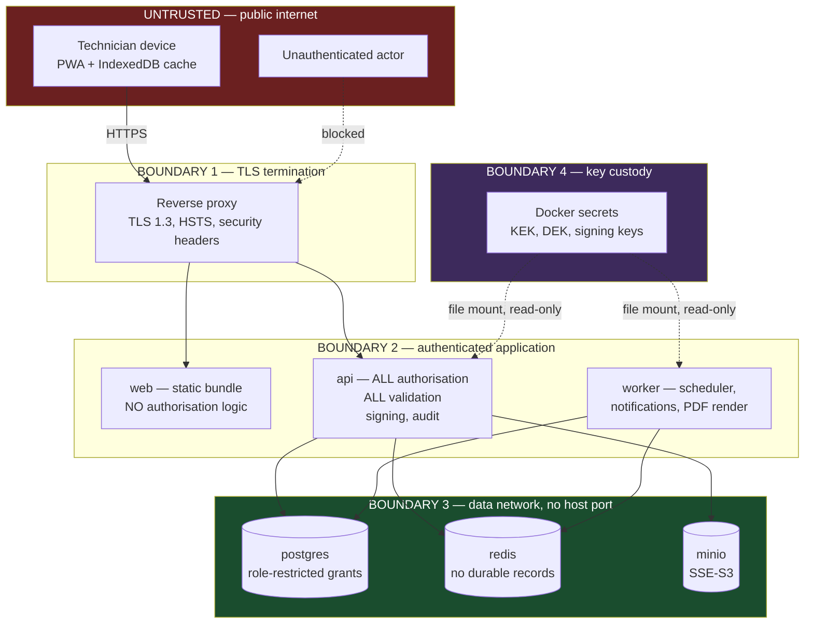
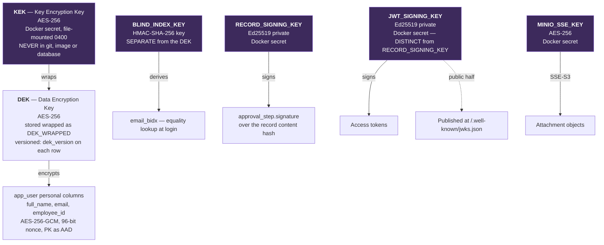
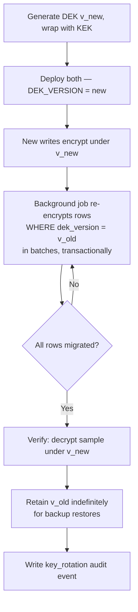
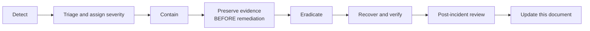

# Security Architecture Document
## BamForm — Preventive Maintenance Record and Approval System

---

## Document Control

| Field | Value |
|---|---|
| Document title | Security Architecture Document — BamForm |
| Document number | BAMFORM-SEC-001 |
| Revision | 0.1 |
| Status | **Draft — for client review** |
| Date issued | 24 July 2026 |
| Prepared by | Lead Engineer, BamForm project |
| Approved by | _(to be completed)_ |
| Classification | **Internal — restricted distribution.** Contains threat analysis. Contains no secret values |
| Parent documents | BAMFORM-PRD-001 Rev 0.2 · BAMFORM-DBD-001 Rev 0.1 · BAMFORM-ENV-001 Rev 0.1 |

### Revision History

| Revision | Date | Details of revision | Revised by | Approved by |
|---|---|---|---|---|
| 0.1 | 24 Jul 2026 | Initial draft | Lead Engineer | _(pending)_ |

---

## Table of Contents

1. Security Objectives
2. Data Classification
3. Trust Boundaries
4. STRIDE Threat Model
5. Identity and Access
6. Key Hierarchy
7. Key Rotation Procedures
8. Cryptographic Inventory
9. Secrets Management
10. Application Security Controls
11. Security Logging and Detection
12. Incident Response
13. Compliance Mapping
14. Residual Risk

---

# 1. Security Objectives

Stated in priority order. Where controls conflict, the higher objective wins.

| # | Objective | Why it ranks here |
|---|---|---|
| **SO-1** | **Record integrity.** An approved record cannot be altered, and any alteration is detectable. | This is what the system exists to provide. A confidentiality breach is embarrassing; a record that silently changed after signature destroys the evidentiary value of the entire archive and the ISO certification that rests on it. |
| **SO-2** | **Attribution.** Every action is provably attributable to a named individual. | A signature that could have been anyone's is not a signature. |
| **SO-3** | **Availability of capture.** A technician can always record work. | An unavailable system sends people back to paper, and paper records never reach the archive. |
| **SO-4** | **Confidentiality of personal data.** | PDPA obligation (UR-100). Bounded scope — names, emails, employee IDs, source IPs. |
| **SO-5** | **Confidentiality of maintenance content.** | Commercially sensitive but not personal. Protected by isolation and storage encryption rather than field encryption — see PRD §12.3. |

**SO-1 above SO-4 is a deliberate ordering.** It is why the audit chain, the append-only
grants and the content-bound signatures receive more engineering than field-level encryption
of checklist data.

---

# 2. Data Classification

| Class | Definition | Examples | Controls |
|---|---|---|---|
| `SEC` Secret | Key or credential material | KEK, DEK, blind index key, Ed25519 signing keys, SMTP password, database passwords | Docker secrets, file-mounted, mode 0400, never in git, never logged, separate backup custody |
| `PER` Personal | Identifies a living individual | Full name, email, employee ID, source IP | AES-256-GCM field encryption, blind index for lookup, redacted from logs and audit diffs |
| `CON` Confidential | Commercially sensitive | Checklist instructions, specification limits, readings, asset codes, maintenance history | Storage-layer encryption, network isolation, service-layer authorisation, no host port on the database |
| `INT` Internal | Ordinary business data | Job numbers, dates, statuses, area names | Authentication required |
| `PUB` Public | No harm on disclosure | JWKS public keys, health status, application version | None |

**PR-SEC-01** The classification of a column is recorded in BAMFORM-DBD-001 §6 and is
authoritative. A new column may not be merged without a classification.

**PR-SEC-02** No `PER` data appears in: application logs, `notification.payload`, Redis, JWT
claims, error messages, or `audit_event.before`/`after` diffs. Where an audit diff concerns an
encrypted column, it records that the field changed and its ciphertext digest, not the value.

---

# 3. Trust Boundaries

**PR-SEC-03** The device cache is **outside the trust boundary**. Data on a technician's phone
is protected by the device's own OS encryption and by scope limitation (PR-069: only the user's
own assigned jobs and 90 days of their own history), not by anything BamForm can enforce.

**PR-SEC-04** `web` performs no authorisation. Every control it hides is also refused by `api`
(PR-007, UR-074). A modified client is assumed.

---

# 4. STRIDE Threat Model

Scored as Likelihood × Impact, each Low/Medium/High.

## 4.1 Spoofing

| ID | Threat | L | I | Mitigation | Traces to |
|---|---|---|---|---|---|
| S-1 | Attacker forges an access token | L | **H** | EdDSA Ed25519; `alg: none` and `HS256` explicitly rejected in verifier config; asserted by test | PR-083, PR-089 |
| S-2 | Stolen refresh token replayed | M | **H** | Opaque, 256-bit, stored as SHA-256 only; single-use rotation; **reuse revokes the whole family** and raises a security audit event | PR-084 |
| S-3 | Shared account used, so a signature is unattributable | **M** | **H** | Individual authentication mandated (UR-091); no generic accounts provisioned; detection by concurrent-session monitoring | UR-091, SO-2 |
| S-4 | **Unattended shop-floor session used to sign a record** | **M** | **H** | **Step-up re-authentication required at the moment of signing** — password re-entry if last authentication is older than 15 min | PR-091, PR-114 |
| S-5 | Credential stuffing | M | M | Argon2id; rate limiting; lockout with exponential backoff | PR-092, PR-102 |
| S-6 | Phishing an approver | L | H | No approval action possible by email link alone; step-up required; approvals visible in the audit trail to the submitter | PR-091 |

**S-4 is the most realistic spoofing threat in this deployment.** A tablet mounted near a
machine, logged in, is the normal working condition. Step-up authentication is the specific
control for it, and it is why PR-091 exists beyond the master specification.

## 4.2 Tampering

| ID | Threat | L | I | Mitigation | Traces to |
|---|---|---|---|---|---|
| T-1 | **Approved record altered after signing** | L | **H** | Content-bound signature — canonical serialisation, SHA-256, Ed25519; `GET /records/{id}/integrity` recomputes on demand; no `UPDATE` path to archived rows (trigger) | PR-093 to PR-096, INV-09 |
| T-2 | Audit trail rewritten to conceal an action | L | **H** | Hash chain; application role holds **no `UPDATE`/`DELETE`** on `audit_event`; daily chain verification with alerting | PR-097, PR-099, PR-115 |
| T-3 | Template revision altered after issue | L | **H** | `CURRENT` revisions immutable; changes require a new revision through the approval workflow; records bind to the frozen revision | PR-048, PR-049 |
| T-4 | Modified client submits invalid data | M | M | All validation repeated server-side; shared Zod schemas mean the server rule is the same rule, not a reimplementation | PR-007, PR-015 |
| T-5 | Ciphertext relocated between rows | L | M | Row primary key bound as AAD in AES-256-GCM | PR-106 |
| T-6 | Attachment substituted after upload | L | M | SHA-256 per object, included in the signed record content hash | PR-012, PR-093 |
| T-7 | SQL injection | L | **H** | Parameterised queries only; ORM; no string-built SQL; CodeQL in CI | §10 |
| T-8 | Migration used to alter historical records | L | **H** | Migrations reviewed as code; data migrations touching records must write audit events; pre-migration backup retained | PR-DBD-08, §10 |

**T-2 deserves emphasis.** The application database role cannot update or delete audit rows.
This means a full application-layer compromise — remote code execution in `api` — still cannot
silently rewrite history. It could write *new* misleading events, which the chain will show as
appended, but it cannot erase.

## 4.3 Repudiation

| ID | Threat | L | I | Mitigation | Traces to |
|---|---|---|---|---|---|
| R-1 | "I did not approve that record" | M | **H** | Signed `approval_step` with content hash, signer identity, role, timestamp, source IP, step-up evidence | PR-093 to PR-096 |
| R-2 | "The checklist said something different then" | M | **H** | Record permanently bound to its template revision; superseded revisions retained and viewable | PR-040, PR-048, UR-105 |
| R-3 | "I never received the job" | L | M | `JOB_ASSIGNED` notification recorded with state and timestamp; assignment audited | PR-077, §17 WFD |
| R-4 | Offline timestamps disputed | M | M | **Both `client_recorded_at` and server `recorded_at` stored**; divergence over 5 minutes displayed on the record; clock skew computed at bootstrap and flagged | PR-063, PR-API-23 |
| R-5 | Delegated approval disowned by both parties | L | M | Both `actor_id` and `on_behalf_of_id` persisted and both names rendered | PR-076, PR-WFD-12 |

## 4.4 Information Disclosure

| ID | Threat | L | I | Mitigation | Traces to |
|---|---|---|---|---|---|
| I-1 | Database exfiltration exposes personal data | L | **H** | AES-256-GCM field encryption on `app_user` personal columns; KEK in Docker secret, not in the database | PR-106, PR-107 |
| I-2 | Database exfiltration exposes maintenance content | L | M | Storage-layer encryption; no published host port; data network isolation. **Accepted residual — see §14** | PR-002, PR-105, PR-109 |
| I-3 | Personal data leaked in logs | **M** | M | Serialiser-level redaction so it cannot be forgotten at a call site; CI test asserts a known password never appears in log output | PR-ENV-21, PR-ENV-22 |
| I-4 | Personal data leaked in JWT claims | L | M | Claims restricted to `sub`, `roles`, `jti`, `iat`, `exp`, `aud`, `iss` — no names, no email | PR-086 |
| I-5 | Personal data persisted into Redis via notification payloads | M | M | Payloads carry identifiers only; email decrypted in memory at dispatch, never queued | PR-WFD-20 |
| I-6 | Cross-area record access | M | M | Mandatory query scoping in the repository layer, applied centrally so a new endpoint cannot omit it | PR-API-10 |
| I-7 | Attachment retrieved without authorisation | M | M | **No presigned URLs** — every fetch streams through `api` and is authorised per request | PR-011 |
| I-8 | Production data copied to a laptop for testing | **M** | **H** | Prohibited; anonymised or synthetic data only for non-production | PR-ENV-25 |
| I-9 | Verbose errors leak internals | M | L | RFC 9457 `detail` is user-safe; no stack traces, SQL or hostnames; `requestId` correlates to server logs | PR-API-12 |
| I-10 | Swagger UI exposes the API surface publicly | M | L | Served behind authentication at `/api/v1/docs` | PR-API-03 |

**I-8 is rated the highest-likelihood disclosure threat**, because it is a process failure
rather than a technical one and it is what actually happens on projects. It is a PDPA incident,
not a convenience.

## 4.5 Denial of Service

| ID | Threat | L | I | Mitigation | Traces to |
|---|---|---|---|---|---|
| D-1 | Auth endpoint flooding | M | M | Per-IP and per-account rate limits, exponential backoff | PR-092 |
| D-2 | Large attachment upload exhausts disk | M | M | 10 MB per file, 30 per job, bounded by configuration | PR-ENV §4.4 |
| D-3 | **Bulk PDF export exhausts host memory** | M | **H** | Chromium runs in `worker`, concurrency-limited to 2; memory limits on every container | PR-ENV-13, PR-ENV-12 |
| D-4 | Expensive report query blocks the database | M | M | Statement timeout; `COUNT(*)` opt-in and separately rate-limited | PR-API-15 |
| D-5 | **BamForm exhausts host resources and takes down an unrelated application** | M | **H** | Memory and CPU limits on every service; this is the shared-host constraint CN-01 | PR-ENV-12, RK-08 |
| D-6 | Outbox flood from a malfunctioning client | L | M | Batch capped at 200 mutations; sync rate limit deliberately generous but present | PR-API-21 |
| D-7 | Technician cannot record work during an outage | **M** | **H** | **Offline capture is the mitigation** — this is why SO-3 ranks third | PR-059 to PR-069 |

**D-7 inverts the usual analysis.** In most systems availability is a service property. Here,
the offline design means a total server outage does not stop work being recorded; it only
delays transmission. That is a security control in the availability sense, not merely a
usability feature.

## 4.6 Elevation of Privilege

| ID | Threat | L | I | Mitigation | Traces to |
|---|---|---|---|---|---|
| E-1 | Client-side role manipulation | M | **H** | No authorisation decision in `web`; every handler guarded server-side | PR-007, PR-090 |
| E-2 | **Self-approval** — technician verifies own record | **M** | **H** | Rejected in the service layer **and** by database constraint | PR-044, INV-05 |
| E-3 | Self-approval of a template revision | M | **H** | `CHECK (approved_by <> authored_by)` | PR-047, INV-03 |
| E-4 | Auditor writes to the system | L | **H** | Auditor queries use the `bamform_readonly` database role — read-only is enforced at the connection, not only in guards | PR-API-09, DBD §7.1 |
| E-5 | Expired delegation still confers access | M | M | Evaluated at request time, never materialised; expiry takes effect on the next request | PR-076, PR-WFD-11 |
| E-6 | Missing guard on a newly added endpoint | **M** | **H** | CI test enumerates routes from the application router and fails if any is reachable unauthenticated or unscoped | PR-API-28 |
| E-7 | Container escape to the host | L | **H** | Non-root users in all images; no privileged containers; no Docker socket mounted | PR-004 |
| E-8 | Compromised `api` rewrites history | L | **H** | Database grants deny `UPDATE`/`DELETE` on audit and approval tables | PR-099, PR-115 |

**E-6 is the threat that scales with the project.** Guards are correct on day one and forgotten
on day ninety. Enumerating routes from the router rather than a maintained list is the control
that survives staff turnover.

---

# 5. Identity and Access

## 5.1 Authentication summary

| Property | Value |
|---|---|
| Primary factor | Password, Argon2id (m=64 MiB, t=3, p=4) |
| Minimum length | 12 characters |
| Access token | JWT, EdDSA Ed25519, 15 min TTL, memory-only on the client |
| Refresh token | Opaque 256-bit, SHA-256 stored, single-use rotation, reuse detection, `HttpOnly; Secure; SameSite=Strict` cookie |
| Session idle timeout | 60 minutes |
| Lockout | 5 failures, exponential backoff |
| **Step-up** | **Required before any signing action if last authentication > 15 min.** Password-only — TOTP is deliberately *not* required here, see MFA below |
| **MFA** | **TOTP (RFC 6238), delivered in Release 1** — HMAC-SHA1, 6 digits, 30 s period, ±1 step of clock-skew tolerance, 160-bit CSPRNG secret stored field-encrypted (`app_user.mfa_secret_ct`, AES-256-GCM, AAD `app_user:mfa_secret_ct:<row id>`). Challenged at **login**, as a second step after the password. **Mandatory for `ADMIN`, `TEAM_LEADER`, `ENGINEER`, `DOC_CONTROLLER`, `AUDITOR`** (`MFA_REQUIRED_ROLES`); **`MAINTAINER` is exempt** — see RS-3 below. Recovery: 10 single-use codes issued once at enrolment (stored as a keyed HMAC-SHA-256 blind index, never recoverable) plus an ADMIN-only reset that forces re-enrolment; both audited. An accepted code's time step is persisted (`mfa_last_used_step`) so a code cannot be replayed inside its own 30 s window (RFC 6238 §5.2). Failed codes feed the same 5-failure account lockout a failed password does. Master switch `MFA_ENABLED`, **default `false`** |

## 5.2 Authorisation model

Role-based, enforced at the service layer, with mandatory area scoping applied in the
repository layer. Full permission matrix in BAMFORM-API-001 §4.1.

**PR-SEC-05** Authorisation is deny-by-default. A handler without an explicit guard is
unreachable, not open.

**PR-SEC-06** Row-level security is not used, because the system is single-tenant (AS-05,
PR-040). If AS-05 is reversed — a second site, a second legal entity — RLS is introduced at
that point and this document is revised. That decision is recorded in ADR-005.

---

# 6. Key Hierarchy

**PR-SEC-07** `RECORD_SIGNING_KEY` is deliberately distinct from `JWT_SIGNING_KEY`. Compromise
of the session-token key must not confer the ability to forge historical approval signatures.
Their lifetimes, rotation schedules and blast radii are different.

**PR-SEC-08** `BLIND_INDEX_KEY` is distinct from the DEK. If they were the same, an attacker
with the index key could confirm the presence of a known email; separation means the blind
index alone reveals nothing about the plaintext without a second compromise.

## 6.1 Key inventory

| Key | Algorithm | Storage | Rotation | Backup custody | Loss consequence |
|---|---|---|---|---|---|
| `KEK` | AES-256 | Docker secret | 12 months | **Separate from data backups** | Personal data unrecoverable — RK-12 |
| `DEK` | AES-256 | Wrapped, Docker secret | 12 months, versioned | With KEK | Personal data unrecoverable |
| `BLIND_INDEX_KEY` | HMAC-SHA-256 | Docker secret | On compromise only | With KEK | Login lookup fails; recoverable by re-deriving all indexes |
| `RECORD_SIGNING_KEY` | Ed25519 | Docker secret | 24 months, all generations retained | Separate | **Historical signatures unverifiable** — see PR-SEC-10 |
| `JWT_SIGNING_KEY` | Ed25519 | Docker secret | 90 days, 30-day overlap | Not required | All sessions invalidated; users re-login |
| `MINIO_SSE_KEY` | AES-256 | Docker secret | 12 months | With KEK | Attachments unreadable |
| Database passwords | — | Docker secret | 12 months | With KEK | Recoverable by reset |
| SMTP password | — | Docker secret | Per provider policy | With KEK | Notifications fail; recoverable |

**PR-SEC-09** Every generation of `RECORD_SIGNING_KEY` is retained **indefinitely**, and every
`approval_step` stores the `kid` used. A record signed in 2026 must remain verifiable in 2033
(UR-107). Rotating this key does not invalidate old signatures; discarding an old key would.

**PR-SEC-10** Every generation of the DEK is retained indefinitely for the same reason
(PR-ENV-16). `app_user.dek_version` identifies which generation encrypted each row.

---

# 7. Key Rotation Procedures

## 7.1 JWT signing key — every 90 days

Zero downtime. No user impact.

## 7.2 DEK rotation — every 12 months

**PR-SEC-11** The old DEK is retained, not destroyed. A database backup taken before rotation
requires it. Destroying it makes historical backups unreadable.

## 7.3 KEK rotation — every 12 months

Re-wrap the DEK under the new KEK. The DEK itself does not change, so no data is re-encrypted.
This is the cheapest rotation in the hierarchy and is why the envelope structure exists.

## 7.4 Record signing key — every 24 months

New generation issued; new `kid` published. Old key retained forever (PR-SEC-09). No historical
record is re-signed — re-signing would replace the original evidentiary artefact, which is
precisely what must not happen.

## 7.5 Emergency rotation on compromise

**PR-SEC-12** On suspected compromise of any key, rotation is immediate and does not wait for
the scheduled window. The incident playbook is §12.3.

---

# 8. Cryptographic Inventory

Every algorithm in use, its purpose and its parameters. Nothing weaker is permitted; nothing
here may be substituted without revising this document.

| Purpose | Algorithm | Parameters | Notes |
|---|---|---|---|
| Transport | TLS 1.3 | Modern cipher suites only; TLS 1.2 only with written client approval | HSTS, OCSP stapling |
| Password hashing | Argon2id | m=65536 KiB, t=3, p=4, 32-byte output, 16-byte salt | Re-benchmarked on the target host before go-live |
| Field encryption | AES-256-GCM | 96-bit random nonce per operation, row PK as AAD | Personal data only |
| Blind index | HMAC-SHA-256 | Separate 256-bit key | Email equality lookup only |
| Key wrapping | AES-256-GCM | KEK wraps DEK | Envelope encryption |
| Access tokens | EdDSA / Ed25519 | — | `alg: none` and `HS256` rejected in verifier config |
| Record signatures | Ed25519 | Over SHA-256 of canonical serialisation | Distinct key from tokens |
| Content hashing | SHA-256 | Canonical, deterministic serialisation | Records and audit chain |
| Refresh tokens | CSPRNG | 256-bit, SHA-256 at rest | Opaque, never a JWT |
| Object storage | AES-256 (SSE-S3) | Application-held key | MinIO server-side |
| Identifiers | UUIDv7 | — | Time-ordered; client-generatable offline |
| Randomness | OS CSPRNG | `crypto.randomBytes` | `Math.random` prohibited; asserted by lint rule |

## 8.1 Canonical serialisation

**PR-SEC-13** The serialisation fed to SHA-256 for record signing must be **deterministic** —
identical input produces identical bytes on any host, any Node version, any time. Rules:

- Keys sorted lexicographically at every level
- No insignificant whitespace
- Numbers in a fixed decimal representation, not floating-point notation
- Timestamps as RFC 3339 UTC with fixed precision
- Nulls explicit, absent keys omitted — never interchangeable
- Character encoding UTF-8, normalised NFC

**PR-SEC-14** A determinism test runs in CI: serialise a fixture, hash it, compare to a
committed golden hash. If a library upgrade changes the output, the build fails. Without this,
`GET /records/{id}/integrity` would begin reporting false tampering after an unrelated
dependency bump — the most damaging possible false positive in this system.

---

# 9. Secrets Management

| Rule | Detail |
|---|---|
| **PR-SEC-15** | Secrets are Docker secrets, file-mounted read-only, mode 0400, owned by the container's non-root user |
| **PR-SEC-16** | Secrets are never passed as environment variables where a file mount is available — environment variables leak via `/proc`, `docker inspect` and crash dumps |
| **PR-SEC-17** | `.env` holds non-secret configuration only; it is git-ignored, with a committed `.env.example` |
| **PR-SEC-18** | Gitleaks runs on every commit and over full history on first run. A finding fails the build |
| **PR-SEC-19** | No secret is ever printed to a terminal, a log, a chat transcript or a document. Key generation occurs on the server; only public halves are displayed |
| **PR-SEC-20** | If a secret is exposed at any point, it is treated as compromised and rotated immediately — no assessment of whether the exposure was "probably fine" |
| **PR-SEC-21** | CI-generated secrets are ephemeral, per-run, and never match any real value |
| **PR-SEC-22** | Key backup custody is separate from data backup custody (PR-ENV-15). One compromised archive must not yield both ciphertext and key |

---

# 10. Application Security Controls

## 10.1 Input and output

| Control | Implementation |
|---|---|
| Boundary validation | Zod schema on every request body, query and param. Shared with the client so the rule is identical, not reimplemented |
| Type strictness | TypeScript strict mode; no `any` at boundaries |
| SQL | Parameterised only. String-built SQL fails lint |
| Output encoding | React escapes by default; `dangerouslySetInnerHTML` banned by lint rule |
| File upload | Magic-byte inspection, not extension. Allowlist `image/jpeg`, `image/png`, `image/webp`. Size and count bounded |
| PDF rendering | Chromium sandboxed, no network access, template variables escaped — a remark field must not be able to inject markup into a rendered record |

## 10.2 HTTP security headers

| Header | Value |
|---|---|
| `Strict-Transport-Security` | `max-age=31536000; includeSubDomains` — **only after renewal is proven once** (PR-ENV-18) |
| `Content-Security-Policy` | `default-src 'self'; script-src 'self'; style-src 'self'; img-src 'self' data: blob:; connect-src 'self'; frame-ancestors 'none'; base-uri 'none'; object-src 'none'` |
| `X-Content-Type-Options` | `nosniff` |
| `Referrer-Policy` | `strict-origin-when-cross-origin` |
| `Permissions-Policy` | `camera=(self), geolocation=(), microphone=(), payment=()` — camera permitted for attachment capture |
| `Cross-Origin-Opener-Policy` | `same-origin` |
| `X-Frame-Options` | `DENY` (belt and braces alongside `frame-ancestors`) |

**PR-SEC-23** No `unsafe-inline` and no `unsafe-eval` in CSP. The build produces no inline
scripts. A CI test asserts the deployed CSP contains neither string.

## 10.3 Cookies

| Cookie | Attributes |
|---|---|
| `bf_refresh` | `HttpOnly; Secure; SameSite=Strict; Path=/api/v1/auth` |

**PR-SEC-24** `SameSite=Strict` plus the fact that mutating endpoints require a bearer token
from memory means CSRF is structurally prevented — a cross-site request cannot obtain the
access token.

## 10.4 Dependencies

| Control | Gate |
|---|---|
| `npm audit` | Fails on high/critical |
| CodeQL SAST | Fails on high/critical |
| Trivy image scan | Fails on HIGH/CRITICAL |
| Dependabot | Enabled; updates go through the full pipeline |
| Base images | Pinned by digest, not tag (PR-ENV-24) |
| Lockfiles | Committed; `npm ci` in CI, never `npm install` |

---

# 11. Security Logging and Detection

## 11.1 Events logged

| Event | Destination | Retention |
|---|---|---|
| Login success/failure | `audit_event` | 7 years |
| Lockout triggered | `audit_event` | 7 years |
| **Refresh token reuse detected** | `audit_event`, severity high | 7 years |
| Step-up success/failure | `audit_event` | 7 years |
| Role or permission change | `audit_event` | 7 years |
| Delegation created/revoked | `audit_event` | 7 years |
| Approval, return, void | `approval_step` + `audit_event` | 7 years |
| Template revision approved | `audit_event` | 7 years |
| Export taken | `audit_event` | 7 years |
| Key rotation | `audit_event` | 7 years |
| **Audit chain verification failure** | Alert + `audit_event` | 7 years |

## 11.2 Detection signals

| Signal | Threshold | Severity |
|---|---|---|
| Audit chain break | any | **Critical** |
| Refresh token reuse | any | **High** |
| Failed logins | > 50 in 10 min | High |
| Self-approval attempts | > 3 by one user | Medium — indicates either misunderstanding or probing |
| Authorisation denials | > 20 in 10 min by one user | Medium |
| Scheduler stalled | last run > 2 h | High — silent compliance failure |
| Clock offset | > 2 s | High — undermines timestamp evidence |
| Certificate expiry | < 21 days | Medium |

**PR-SEC-25** Audit chain break is the highest severity signal in the system, above outage. An
outage is visible and recoverable; a broken chain calls the archive's integrity into question
and must be investigated before any further writes are trusted.

---

# 12. Incident Response

## 12.1 Severity and response times

| Severity | Definition | Acknowledge | Contain |
|---|---|---|---|
| **S1 Critical** | Record integrity compromised; audit chain broken; personal data breach; key compromise | 1 h | 4 h |
| **S2 High** | Authentication bypass; privilege escalation; unauthorised access without confirmed exfiltration | 4 h | 24 h |
| **S3 Medium** | Availability loss; failed backup; unpatched high-severity dependency | 1 business day | 5 business days |
| **S4 Low** | Low-severity finding; policy deviation | 5 business days | Next release |

## 12.2 General sequence

**PR-SEC-26** Evidence preservation precedes remediation. Restarting a container to fix a
problem destroys the logs that explain it. Snapshot first.

## 12.3 Playbooks

### P1 — Key compromise (S1)

1. Determine which key, from §6.1.
2. **Do not destroy the old key.** Rotate to a new generation and retain the old — it is needed
   to read existing data and verify existing signatures.
3. Rotate: KEK → re-wrap DEK. DEK → new generation, background re-encrypt. Signing key → new
   `kid`, old retained.
4. If `RECORD_SIGNING_KEY` is compromised: **every signature made after the compromise window
   opened is suspect.** Run `GET /records/{id}/integrity` across records signed in that window;
   identify any whose content hash does not match. Report to the Quality function — this is a
   records integrity event with ISO implications, not merely an IT incident.
5. If `JWT_SIGNING_KEY` is compromised: revoke all refresh families, forcing universal re-login.
6. Write a `key_rotation` audit event and record the incident.

### P2 — Audit chain break (S1)

1. **Stop and preserve.** Take an immediate backup before anything else.
2. Identify the first break sequence from `GET /audit-events/chain-status`.
3. Determine cause: storage corruption, restore from an inconsistent backup, or tampering.
4. If tampering is possible, treat as a security incident and preserve host-level evidence.
5. Verify record signatures independently — the chain and the signatures are separate
   mechanisms, so an intact signature set alongside a broken chain narrows the cause.
6. Report to the Quality function regardless of cause. The archive's integrity claim has been
   affected and the client must decide on disclosure to auditors.
7. Do not "repair" the chain by recomputing hashes. A repaired chain proves nothing.

### P3 — Personal data breach (S1)

1. Contain — revoke access, rotate credentials.
2. Scope: which individuals, which fields, how many records.
3. Assess PDPA notification obligation. This is a **legal determination**, not an engineering
   one — escalate to the client immediately with the scope assessment.
4. Preserve evidence; produce a timeline from `audit_event`.
5. Remediate, verify, review.

### P4 — Suspected unauthorised approval (S2)

1. Retrieve the `approval_step` — actor, timestamp, source IP, step-up evidence.
2. Cross-reference login events for that user around that time.
3. Verify record integrity — was the content also altered, or only the approval disputed?
4. If the account is compromised, revoke the token family, force password reset, review all
   approvals by that account in the window.
5. Records approved fraudulently cannot be un-approved. They are voided with a reason and the
   maintenance is re-performed. The original stays visible — that is the point of an immutable
   archive.

### P5 — Ransomware or host compromise (S1)

1. Isolate the host from the network.
2. **Do not restore over the compromised instance.** Rebuild on clean infrastructure.
3. Restore from the most recent backup predating compromise; run the full restore verification
   battery (BAMFORM-ENV-001 §7.4) including chain verification and signature checks.
4. Rotate every secret in §6.1.
5. Because the `165` host is shared, the incident scope is the whole host, not BamForm alone.
   Escalate to the client's IT function immediately.

## 12.4 Contacts

| Role | Holder | Escalation |
|---|---|---|
| Incident lead | Lead Engineer | Client sign-off authority |
| Client escalation | _(to be completed)_ | — |
| IT / infrastructure | _(to be completed — `165` host owner)_ | — |
| Quality / Document Control | _(to be completed)_ | For any records-integrity event |
| PDPA determination | _(to be completed)_ | Legal |

**PR-SEC-27** This table must be completed before go-live. An incident response plan with
unnamed contacts is a document, not a plan.

---

# 13. Compliance Mapping

## 13.1 ISO 9001:2015 clause 7.5 — Documented information

| Clause | Requirement | How BamForm satisfies it |
|---|---|---|
| 7.5.2 a) | Identification and description | Document number, title, revision, job number, asset code on every record |
| 7.5.2 b) | Format and media | Rendered PDF reproducing the controlled form; exportable |
| 7.5.2 c) | Review and approval | Template revisions approved by a party other than the author; records verified by a party other than the performer |
| 7.5.3.1 a) | Available and suitable for use | Archive searchable by asset, date, document, person |
| 7.5.3.1 b) | Adequately protected | Field encryption on personal data, storage encryption, access control, immutable archive |
| 7.5.3.2 a) | Distribution, access, retrieval | Role-based access; export for DMS filing |
| 7.5.3.2 b) | Storage and preservation | 7-year retention, no automatic purge, tested restore |
| 7.5.3.2 c) | **Control of changes / version control** | Contiguous revision sequence; one current revision; superseded revisions retained; records bound to the revision in force |
| 7.5.3.2 d) | Retention and disposition | Retention by non-deletion; disposition manual and audited |

## 13.2 ISO 9001:2015 clause 7.1.3 — Infrastructure

Compliance reporting (UR-067) provides objective evidence that infrastructure is maintained
to plan: jobs due against jobs completed on time, by period, area and asset type.

## 13.3 PDPA

| Obligation | How satisfied |
|---|---|
| Consent and purpose limitation | Personal data limited to what the signature and notification functions require |
| Protection | AES-256-GCM at field level, TLS in transit, access control, log redaction |
| Retention limitation | Personal data retained as long as the records that name it — 7 years — because a signature without a name is not a signature |
| Access and correction | Administrator can correct a user's details; historical records retain the name as signed, which is an evidentiary requirement that overrides correction for past records |
| Breach notification | Playbook P3 |

**PR-SEC-28** The tension between PDPA correction rights and records integrity is resolved in
favour of integrity for historical records: a name on a signed 2026 record is evidence of who
signed and cannot be retrospectively edited. Forward-looking records use the corrected value.
This position should be confirmed with the client's data protection officer.

## 13.4 If OI-01 resolves beyond ISO 9001

**PR-SEC-29** If ISO 13485 or 21 CFR Part 11 applies, the following are **additional** and must
be scoped before build:

- Signature manifestation must include the printed meaning of the signature, accepted by each
  user at enrolment
- Signatures must be linked to their records such that they cannot be excised, copied or
  transferred — the content-binding in PR-093 already achieves this technically, but must be
  formally validated
- Periodic re-verification of signatory identity
- System validation documentation (IQ/OQ/PQ)
- Controls on open-system data transfer if records leave the boundary

None of these is structural. All of them cost time. This is why OI-01 is the highest-priority
open issue.

---

# 14. Residual Risk

Risks knowingly accepted, with the reasoning. These require client acknowledgement.

| ID | Residual risk | Why accepted | Revisit when |
|---|---|---|---|
| **RS-1** | Maintenance content (readings, instructions, asset codes) is not field-encrypted. A database compromise discloses it. | Field encryption would make UR-070 trending and UR-067 aggregation undeliverable (PR-109). Breach consequence is disclosure of internal equipment procedures, not personal data. Mitigated by storage encryption, no published host port, network isolation. | If the client classifies maintenance content as trade secret requiring cryptographic protection at rest, or if a multi-tenant model is adopted |
| **RS-2** | Device-cached data is protected only by the device's own OS encryption. | BamForm cannot enforce device security. Scope is limited to the user's own jobs and 90 days of own history (PR-069). | If MDM is introduced, or if a device is lost with cached records |
| ~~**RS-3**~~ | ~~**No multi-factor authentication in Release 1.**~~ **WITHDRAWN** — BAMFORM-BUILD-HANDOFF §5: "MFA moves into Release 1 (SEC RS-3 is withdrawn)", once ISO 13485 was confirmed. TOTP MFA is **delivered** (slice 13-MFA; see §5.1). | The *original* rationale survives in one specific place and must not be quietly dropped: "Full MFA on gloved hands in a cleanroom is a usability problem that would push users back to paper — SO-3 outranks it." That is precisely why **`MAINTAINER` is exempt** from the MFA requirement — MFA is scoped to privileged, desk-based roles (`ADMIN`, `TEAM_LEADER`, `ENGINEER`, `DOC_CONTROLLER`, `AUDITOR`) and a shop-floor technician's login is unchanged. Step-up before signing also remains password-only for the same reason. | The MAINTAINER exemption itself is the live residual risk now. Revisit if OI-01 resolves to 21 CFR Part 11 (which would make MFA effectively mandatory for every signatory), or if gloves/hardware change so a code can be entered without removing PPE |
| **RS-4** | Shared host — a compromise of another application on `165` may reach BamForm. | Client constraint CN-01. Mitigated by container isolation, non-root users, no Docker socket, resource limits. | If a dedicated host becomes available |
| **RS-5** | A compromised `api` can write *new* misleading audit events, though it cannot erase existing ones. | Append-only is achievable; preventing an authenticated application from writing at all is not. The chain makes insertion visible in sequence. | If write-once storage or external log shipping is funded |
| **RS-6** | The server signs records on the user's behalf; there is no per-user private key. | Per-user key custody on shop-floor devices is impractical and would be worse — keys would be shared. Attribution rests on authentication plus step-up plus audit. | If a regulatory regime demands per-signatory keys |
| **RS-7** | Backups depend on correct key custody. Losing the KEK renders personal data unrecoverable. | Inherent to encryption at rest. Mitigated by separate custody and by the restore verification battery testing decryption (RV-2). | Never — this is managed, not eliminated |

**PR-SEC-30** RS-1, RS-3 and RS-6 require explicit client acknowledgement at sign-off. They are
deliberate departures from a maximal security posture, each taken for a stated reason, and the
client should agree with the reasoning rather than discover it later.

For RS-3 the thing to be acknowledged has changed, and has narrowed: MFA is no longer absent — it
is delivered and enforced for every privileged role. What remains to be acknowledged is the
single carve-out, that **`MAINTAINER` logs in with a password alone**, traded for SO-3 adoption on
the shop floor.

---

*End of document — BAMFORM-SEC-001 Revision 0.1*
