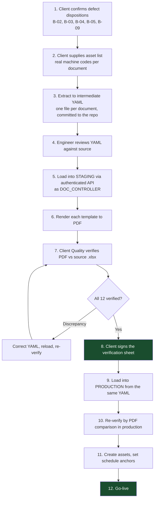

# Template Load Plan
## BamForm — Preventive Maintenance Record and Approval System

---

## Document Control

| Field | Value |
|---|---|
| Document title | Template Load Plan — BamForm |
| Document number | BAMFORM-TLP-001 |
| Revision | 0.1 |
| Status | **Draft — for client review** |
| Date issued | 24 July 2026 |
| Prepared by | Lead Engineer, BamForm project |
| Approved by | _(to be completed — Quality / Document Control)_ |
| Classification | Internal |
| Parent documents | BAMFORM-URD-001 Rev 1.0 · BAMFORM-DBD-001 Rev 0.1 |

### Revision History

| Revision | Date | Details of revision | Revised by | Approved by |
|---|---|---|---|---|
| 0.1 | 24 Jul 2026 | Initial draft | Lead Engineer | _(pending)_ |

### Why this document exists

Proposed as an additional deliverable beyond the master build prompt's list, with this
justification: **145 checklist items across 12 revision-controlled documents must be
transferred verbatim into the system that will replace them, the source files contain nine
identified defects, and AC-01 makes client verification of the loaded content a condition of
acceptance.** RK-05 rates incorrect template loading as High impact — it compromises the
archive from day one. A migration of this consequence needs a written, approvable procedure,
not an ad-hoc script.

---

## Table of Contents

1. Scope
2. Source Inventory
3. Defect Disposition
4. Mapping Rules
5. Per-Document Mapping Notes
6. Load Procedure
7. Verification Procedure
8. Sign-Off and Rollback

---

# 1. Scope

**In scope:** loading the twelve supplied `.xlsx` documents into `form_template`,
`template_revision`, `template_item` and `template_measurement` at their current revision, and
obtaining client verification that the loaded content matches the source.

**Out of scope:** loading historical *records* — completed paper forms from before go-live. The
system starts with an empty archive. Historical paper records remain filed as they are today.
If the client wants historical records digitised, that is a separate exercise with its own
plan, and it should be resisted: retrospectively creating electronic signatures for
wet-signed paper records would be a serious records-integrity error.

**PR-TLP-01** No record predating go-live shall be created in BamForm. The archive begins on
the go-live date.

---

# 2. Source Inventory

| # | Document number | Title | Rev | Items | Measurement section | Machine columns |
|---|---|---|---|---|---|---|
| 1 | CE 95 010 00 01 | BESI Die Attach Preventive Maintenance Record `ED____` | E | 18 | Inline curing oven, Pass/Fail | Status |
| 2 | CE 95 012 00 01 | Preventive Maintenance Record `EP01` (Emerald Pick and Place) | 0 | 6 | — | Status |
| 3 | CE 95 012 00 02 | Preventive Maintenance Record `PM01` (Powatec Mounting) | 0 | 4 | — | Status |
| 4 | CE 95 020 00 01 | ASM Wire Bond Preventive Maintenance Record | C | 14 | 21 calibration measurements | **AW01–AW04** |
| 5 | CE 95 020 00 02 | Besi Esec Wire Bond Preventive Maintenance Record `EW_____` | C | 15 | Calibration table | Status |
| 6 | CE 95 020 00 03 | KNS Wire Bond Preventive Maintenance Record `KW___` | B | 15 | Calibration table, Pass/Fail items | Status |
| 7 | CE 95 030 00 01 | MB Encapsulation Preventive Maintenance Record `MB_____` | D | 13 | — | Status |
| 8 | CE 95 030 00 03 | Pre-mixer machine Preventive Maintenance Record `DP_____` | 0 | 9 | Resin tank seal test, LCL/UCL | Status |
| 9 | CE 95 043 00 01 | Bump Dispensing Preventive Maintenance WI and Record | 0 | 18 | — | **BD01** |
| 10 | CE 95 050 00 01 | MB E-Test Preventive Maintenance Record | D | 10 | — | Status |
| 11 | CE 95 050 00 03 | OS Loading Preventive Maintenance Record `IMOS 0__` | 0 | 10 | — | Status |
| 12 | CE 95 055 00 01 | Preventive Maintenance Work Instruction / Record `AVS 35-____` | A | 13 | — | Status |

**Total: 145 checklist items.**

Frequency distribution across the set: 1M appears in documents 2, 9 and 12; 3M, 6M and Y appear
throughout. Documents 9 and 12 are combined Work Instruction and Record forms.

---

# 3. Defect Disposition

Nine defects were identified in the source files. Each is dealt with explicitly. **None is
silently corrected** — every correction is recorded so the client's Quality function can see
what changed and why.

| ID | Defect | Disposition | Requires client decision |
|---|---|---|---|
| **B-01** | `#REF!` in the revision-history header of doc 1; `#VALUE!` in the document number of doc 9 | Header values re-entered from the document title block, which is intact in both. Formula errors do not carry across — the system stores values, not formulas | No |
| **B-02** | Doc 1 revisions run 0, A, C, D, E — **revision B is absent** | Client answered "no need" (Q8). Loaded with `sequence_ordinal` contiguous (0,1,2,3,4) while `revision_code` retains the historical letters. **The gap is recorded in the revision history as a note**, so the discontinuity remains visible to an auditor rather than being erased | **Confirm the note wording** |
| **B-03** | Doc 12 revision history is out of chronological order — rev 0 dated later than rev A | Loaded in `sequence_ordinal` order with the dates **as printed**. A note records the anomaly. Dates are not silently reordered — that would destroy the evidence of the anomaly | **Confirm** |
| **B-04** | Doc 4, Bond Force Verification at 100 g input: specification reads `95 - 28 g` | **Cannot be loaded** — `INV-04` rejects an inverted range. Two options: (a) load as `95 – 105 g`, the evident intent, via a new template revision authored and approved through the normal workflow; (b) load with `spec_type = text` and the verbatim string, pending correction | **YES — required before load** |
| **B-05** | Approver names inconsistent — "Sara"/"Saravanan Durairaj", "Suren"/"Surendran Ganesan" | Historical revision-history entries loaded **verbatim as free text** into `change_description` context. Going forward, approvers are `app_user` foreign keys and the ambiguity cannot recur | **Confirm the mapping of short names to individuals** |
| **B-06** | Doc 6's worksheet is still named `CE 95 020 00 01`, copied from doc 4 | Cosmetic in the source; irrelevant after load, since the document number comes from the title block. Noted only | No |
| **B-07** | No data validation anywhere in any source file | Resolved by design — every loaded field acquires type, range and enumeration constraints | No |
| **B-08** | Signatures are printed blank lines | Resolved by design — electronic signatures with identity and timestamp | No |
| **B-09** | Machine identity is a handwritten blank (`ED____`, `EW_____`, `KW___`, `MB_____`, `DP_____`, `IMOS 0__`, `AVS 35-____`) | Resolved by design — the asset register. **The client must supply the real machine codes** before go-live (DP-03) | **YES — asset list required** |

**PR-TLP-02** B-04 blocks the load of document 4. It cannot be loaded with an inverted range,
and guessing the intent silently would be exactly the class of error the system exists to
prevent. The client must choose option (a) or (b) in writing.

**PR-TLP-03** Defects B-02 and B-03 are preserved as visible notes, not corrected. An auditor
who previously saw a revision gap must still see it. A system that quietly tidies historical
anomalies is less trustworthy, not more.

---

# 4. Mapping Rules

## 4.1 Excel structure to schema

| Source location | Target | Rule |
|---|---|---|
| Title block "Document Title" | `form_template.title` | Verbatim, including the machine-identifier blank |
| Title block "Document Number" | `form_template.document_number` | Verbatim, spaces preserved |
| Title block "Revision" | `template_revision.revision_code` | Verbatim |
| Frequency banner | — | Informational only; the authoritative frequencies come from the per-item `Freq.` column |
| "Special Tools Required" | `standing_content.special_tools` | Verbatim |
| "Parts Required" table | `standing_content.parts_required[]` | Empty rows dropped; the table structure is preserved even when blank |
| "PPE Required" list | `standing_content.ppe[]` | Verbatim, including "(If required)" qualifiers |
| "Safety" block | `standing_content.safety` | Verbatim |
| "Procedure" / "Note" block | `standing_content.procedure` | Verbatim |
| Checklist `No` | `template_item.item_no` | Integer |
| Checklist `Freq.` | `template_item.frequency` | `1M`→`M1`, `3M`→`M3`, `6M`→`M6`, `Y`→`Y`. Whitespace trimmed |
| Checklist `Instruction` | `template_item.instruction` | **Verbatim, including existing typographic quirks** |
| Signature block | — | Not loaded. Replaced by `approval_step` |
| "Remarks" footer | `standing_content.remarks` | Verbatim — this is where the cascade rule is stated |
| Calibration `Section` | `template_measurement.section` | Verbatim; blank inherits the section above |
| Calibration `Description` | `template_measurement.description` | Verbatim |
| Calibration `Specification` | `spec_display` + parsed limits | See §4.2 |
| Revision History sheet | `template_revision` rows | One row per historical revision |

**PR-TLP-04** Instruction text is loaded **verbatim**, including irregular spacing, the
inconsistent leading spaces in documents 4 and 6, and the spelling in the source. Tidying the
text would mean the loaded checklist is not the approved checklist. Corrections go through a
new template revision after go-live, authored and approved in the normal way.

## 4.2 Specification parsing

Specifications appear in several printed forms. Each is parsed into structured limits **and**
retained verbatim in `spec_display` (DBD §6.12), so the rendered record reproduces the source
exactly even where parsing is imperfect.

| Printed form | Example | `spec_type` | Parsed |
|---|---|---|---|
| Range with dash | `5 – 24 ohm` | `RANGE` | lower 5, upper 24, unit `ohm` |
| Tolerance | `150°C ± 5°C` | `TOLERANCE` | nominal 150, tolerance 5, unit `°C` → lower 145, upper 155 |
| Signed range | `-36500 ~ -30500 um` | `RANGE` | lower −36500, upper −30500, unit `um` |
| Symmetric tolerance only | `± 30 um` | `TOLERANCE` | nominal 0, tolerance 30 |
| Inequality | `Hmin ≤ 20 um` | `RANGE` | upper 20, lower null |
| Inequality | `>-600 mmHg` | `RANGE` | lower −600, upper null |
| Explicit LCL/UCL columns | `290` / `310` | `RANGE` | lower 290, upper 310, unit `mbar` |
| Pass/Fail only | `Pass / Fail` | `PASS_FAIL` | no numeric limits |
| Percentage | `100 – 180 %` | `RANGE` | lower 100, upper 180, unit `%` |
| Unparseable | `95 - 28 g` (B-04) | **blocked** | see §3 |

**PR-TLP-05** Any specification the parser cannot resolve into a valid range is **not guessed**.
It halts the load for that document and is escalated to the client. Silent best-effort parsing
of a tolerance band in a maintenance record is unacceptable.

## 4.3 Stable keys

**PR-TLP-06** Each item and measurement receives a `stable_key` derived from the document
number plus a normalised slug of its description — for example
`CE-95-020-00-01::heater-block-temperature-measurement`. This is what allows a reading to be
trended across future revisions (UR-070, PR-028). Keys are generated once at load and never
regenerated; a future revision that keeps an item unchanged carries its key forward.

---

# 5. Per-Document Mapping Notes

## 5.1 Document 4 — ASM Wire Bond `CE 95 020 00 01`

The most complex source file, and the reference case.

- **Four machine columns AW01–AW04 on one sheet.** These do not become four templates. They
  become **one template, four assets** (UR-018). The sheet's column structure was a paper
  convenience for recording four machines on one page; in the system each machine gets its own
  record. This is the change that resolves defect B-09.
- 14 checklist items: 8 × 3M, 4 × 6M, 2 × Y.
- 21 calibration measurements across 6 sections: Workholder, BH Setup, Heater Block Setup, Bond
  Force, Wire Clamp, Transducer (TVC).
- Contains defect B-04 — **load blocked pending client decision**.

## 5.2 Document 9 — Bump Dispensing `CE 95 043 00 01`

- Single machine column `BD01`.
- 18 items: 10 × 1M, 5 × 3M, 1 × 6M, 2 × Y.
- Contains an embedded image in the source workbook. Images are **not** loaded as template
  content in Release 1; if the diagram is instructionally necessary, it is attached to the
  template revision as a reference document. **Client to confirm whether the image is required.**
- Its Remarks state *"For 6M and Y maintenance, 1M and 6M must be performed at the same time"*,
  omitting 3M where the other eleven documents say 3M and 6M. **This is OI-08** and appears to
  be a transcription error. Loaded under the uniform cascade rule pending the client's answer;
  `cascade_override` is available if a genuine exception is confirmed.

## 5.3 Document 12 — AVS `CE 95 055 00 01`

- 13 items: 4 × 1M, 2 × 3M, 2 × 6M, 5 × Y.
- Contains an embedded image, treated as document 9.
- Revision history out of order — defect B-03.

## 5.4 Document 8 — Pre-mixer `CE 95 030 00 03`

- The only document using explicit **LCL/UCL columns** rather than inline specification text.
  One measurement: resin tank vacuum after one hour at 300 mbar, LCL 290, UCL 310.
- Its procedure block differs from the others, adding *"To request machine down time before
  carrying out machine PM"*. Loaded verbatim into `standing_content.procedure`.

## 5.5 Document 6 — KNS Wire Bond `CE 95 020 00 03`

- Calibration section mixes numeric specifications with bare `Pass / Fail` judgements
  (Clamp Calibration, Gripper Force, Ejector Force). These load as `spec_type = PASS_FAIL`.
- Carries defect B-06 (worksheet name copied from document 4) — cosmetic, noted only.

## 5.6 Documents 2, 3, 7, 10, 11 — simple checklists

No measurement section. Straightforward mapping. Documents 2 and 3 are at revision 0 with a
single revision-history entry.

---

# 6. Load Procedure

**PR-TLP-07** The load is **not** a database migration (PR-DBD-10). It runs as an authenticated
operation attributable to a named person, producing audit events, in staging first.



**PR-TLP-08** The intermediate YAML is committed to the repository. It is the reviewable,
diffable artefact between a proprietary spreadsheet and a database row. A load performed
directly from `.xlsx` to database would be unreviewable and unrepeatable.

**PR-TLP-09** Staging and production load from the **identical** YAML. Anything else means the
content the client verified is not the content that went live.

## 6.1 Intermediate format

```yaml
document_number: "CE 95 020 00 01"
title: "ASM Wire Bond Preventive Maintenance Record"
asset_type_code: "ASM_WIRE_BOND"
current_revision: "C"
source_file: "CE_95_020_00_01_ASM_Wire_Bond_Preventive_Maintenance_Record.xlsx"
source_sha256: "…"
revision_history:
  - code: "0"
    date: "2021-03-24"
    details: "New Release"
    revised_by: "Jess Lai Yoon Kiaw"
    approved_by: "Heng Cheng Kim"
  # … A, B, C
items:
  - item_no: 1
    frequency: "M3"
    instruction: "Inspection and check safety interlock / emergency stop is functional"
    stable_key: "CE-95-020-00-01::safety-interlock-emergency-stop"
measurements:
  - section: "Heater Block Setup"
    description: "Heater Block Temperature Measurement"
    spec_display: "150°C ± 5°C"
    spec_type: "TOLERANCE"
    nominal: 150
    tolerance: 5
    unit: "°C"
    stable_key: "CE-95-020-00-01::heater-block-temperature-measurement"
notes:
  - "B-04: Bond Force Verification 100g specification reads '95 - 28 g' in source. BLOCKED pending client decision."
```

**PR-TLP-10** `source_sha256` records the exact source file the YAML was derived from. If a
client later supplies an updated `.xlsx`, the mismatch is detectable.

---

# 7. Verification Procedure

Satisfies AC-01. **This is the client's verification, not the engineer's.**

**PR-TLP-11** Verification is by comparing the system's rendered PDF against the source
spreadsheet, not by reading the database or the YAML. The rendered form is what users and
auditors will see; that is what must match.

## 7.1 Per-document checklist

| # | Check | Pass |
|---|---|---|
| V-1 | Document number matches exactly, including spacing | ☐ |
| V-2 | Document title matches, including the machine-identifier blank | ☐ |
| V-3 | Revision code matches | ☐ |
| V-4 | **Item count matches** (e.g. 14 for doc 4) | ☐ |
| V-5 | Every item's number, frequency and instruction text matches verbatim | ☐ |
| V-6 | PPE list complete, including "(If required)" qualifiers | ☐ |
| V-7 | Safety statement verbatim | ☐ |
| V-8 | Procedure / Note block verbatim | ☐ |
| V-9 | Remarks footer verbatim, including the cascade statement | ☐ |
| V-10 | Measurement count matches | ☐ |
| V-11 | Every specification displays exactly as printed in the source | ☐ |
| V-12 | Parsed limits are correct for each specification | ☐ |
| V-13 | Revision history entries match, in the order dispositioned | ☐ |
| V-14 | Documented defect notes present and correctly worded | ☐ |

## 7.2 Cross-document checks

| # | Check | Pass |
|---|---|---|
| X-1 | All 12 documents present and current | ☐ |
| X-2 | **Total item count = 145** | ☐ |
| X-3 | Each asset type maps to exactly one template | ☐ |
| X-4 | Every supplied asset code exists and is correctly typed | ☐ |
| X-5 | Cascade produces the correct item set for a Y job on each document | ☐ |
| X-6 | No template has an unparsed or inverted specification | ☐ |

## 7.3 Verification sheet

| Document | Verified by | Signature | Date | Discrepancies |
|---|---|---|---|---|
| CE 95 010 00 01 | | | | |
| CE 95 012 00 01 | | | | |
| CE 95 012 00 02 | | | | |
| CE 95 020 00 01 | | | | |
| CE 95 020 00 02 | | | | |
| CE 95 020 00 03 | | | | |
| CE 95 030 00 01 | | | | |
| CE 95 030 00 03 | | | | |
| CE 95 043 00 01 | | | | |
| CE 95 050 00 01 | | | | |
| CE 95 050 00 03 | | | | |
| CE 95 055 00 01 | | | | |

---

# 8. Sign-Off and Rollback

## 8.1 Rollback

**PR-TLP-12** Because the load runs before go-live and before any record exists, rollback is
clean: void the loaded template revisions, correct the YAML, reload. **After go-live, this is no
longer possible** — once a job references a template revision, that revision is permanent
(DP-3). Correction after go-live is by a new template revision through the normal document
control workflow.

**PR-TLP-13** This asymmetry is why client verification must complete **before** go-live and
must not be treated as a formality to be caught up on afterwards.

## 8.2 Sign-off

Load into production is authorised only when all twelve documents are verified and the
following is signed.

| Role | Name | Signature | Date |
|---|---|---|---|
| Quality / Document Control | ____________________ | ____________________ | ____________ |
| Maintenance Department representative | ____________________ | ____________________ | ____________ |
| Client sign-off authority | ____________________ | ____________________ | ____________ |
| Lead Engineer, BamForm | ____________________ | ____________________ | ____________ |

**Outstanding client decisions blocking this load:**

- [ ] B-02 — wording of the revision-gap note on `CE 95 010 00 01`
- [ ] B-03 — treatment of the out-of-order revision history on `CE 95 055 00 01`
- [ ] **B-04 — the `95 - 28 g` specification on `CE 95 020 00 01`. Blocking.**
- [ ] B-05 — mapping of short approver names to individuals
- [ ] B-09 — the asset list: real machine codes for every document
- [ ] OI-08 — the 1M cascade rule on `CE 95 043 00 01`
- [ ] Whether the embedded images in documents 9 and 12 are instructionally required

---

*End of document — BAMFORM-TLP-001 Revision 0.1*
