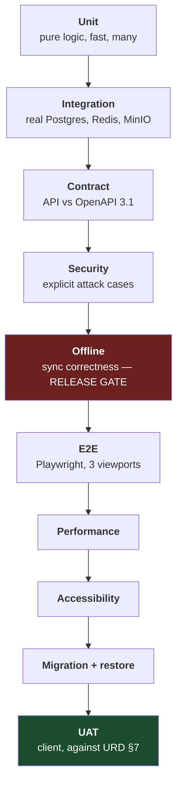

# Test Plan
## BamForm — Preventive Maintenance Record and Approval System

---

## Document Control

| Field | Value |
|---|---|
| Document title | Test Plan — BamForm |
| Document number | BAMFORM-TST-001 |
| Revision | 0.1 |
| Status | **Draft — for client review** |
| Date issued | 24 July 2026 |
| Prepared by | Lead Engineer, BamForm project |
| Approved by | _(to be completed)_ |
| Classification | Internal |
| Parent documents | BAMFORM-URD-001 Rev 1.0 · BAMFORM-PRD-001 Rev 0.2 · BAMFORM-SEC-001 Rev 0.1 |

### Revision History

| Revision | Date | Details of revision | Revised by | Approved by |
|---|---|---|---|---|
| 0.1 | 24 Jul 2026 | Initial draft | Lead Engineer | _(pending)_ |

---

## Table of Contents

1. Objectives and Scope
2. Test Levels
3. Entry and Exit Criteria
4. Coverage Targets
5. Unit Tests
6. Integration Tests
7. Contract Tests
8. Offline Suite
9. Security Tests
10. End-to-End Tests
11. Performance Tests
12. Accessibility Tests
13. Migration and Restore Tests
14. User Acceptance Testing
15. Defect Management
16. CI Pipeline Gates
17. Test Data
18. Traceability

---

# 1. Objectives and Scope

## 1.1 Objectives

| # | Objective | Why |
|---|---|---|
| **TO-1** | Prove no completed record can be lost | RK-01. A lost record is a compliance failure and permanently destroys user trust |
| **TO-2** | Prove approved records cannot be altered undetectably | SO-1. This is the system's reason for existing |
| **TO-3** | Prove no user can exceed their authority | Self-approval and privilege escalation invalidate the signature model |
| **TO-4** | Prove the system is usable on a phone by a gloved technician | RK-03. An unusable system sends people back to paper |
| **TO-5** | Prove every acceptance criterion in URD §7 | Contractual |

**PR-TST-01** A component is not "done" until its tests exist and pass. Tests are written as
each component is built, not retrofitted at the end.

## 1.2 In scope

All application code, the API contract, the database schema and its constraints, the offline
client, the deploy mechanism, backup and restore, and the twelve loaded templates.

## 1.3 Out of scope

Third-party infrastructure (Postgres, Redis, MinIO internals), the client's SMTP relay, the
host operating system, and browser engines themselves. Penetration testing by an independent
party is recommended but is not part of this plan.

---

# 2. Test Levels

**PR-TST-02** Integration tests run against **real** Postgres, Redis and MinIO service
containers, not mocks. The most valuable invariants in this system are enforced by database
constraints (DBD §7); a mocked repository proves nothing about them.

---

# 3. Entry and Exit Criteria

| Level | Entry | Exit |
|---|---|---|
| Unit | Code compiles, lint and type-check clean | ≥80% lines, ≥70% branches; all pass |
| Integration | Unit green; migrations apply to a fresh database | All pass; all DBD §7 invariants asserted |
| Contract | Integration green; API running | Zero divergence from `openapi.yaml`; Spectral clean |
| Security | Contract green | All cases pass; no HIGH/CRITICAL from audit, CodeQL or Trivy |
| **Offline** | Security green | **All pass — no exceptions, no known-issue waivers** |
| E2E | Offline green; full stack composed | All journeys pass at 375/768/1280 px; screenshots attached |
| Performance | E2E green | Targets in §11 met |
| UAT | All above green; templates loaded and client-verified | All 18 acceptance criteria signed off |

---

# 4. Coverage Targets

| Area | Line | Branch | Rationale |
|---|---|---|---|
| Overall | **80%** | **70%** | Master prompt gate |
| Scheduling engine | **95%** | **90%** | Cascade errors produce silent compliance gaps |
| Approval state machine | **95%** | **90%** | Governs record validity |
| Canonical serialisation and signing | **100%** | **95%** | A defect here invalidates every signature |
| Offline sync and outbox | **95%** | **90%** | RK-01 |
| Authorisation guards | **100%** | **95%** | TO-3 |
| Encryption and blind index | **100%** | **90%** | Irrecoverable failure mode |
| UI components | 70% | 60% | Covered more meaningfully by E2E |

**PR-TST-03** Coverage is a floor, not a goal. 100% coverage of the signing module means every
line executed, not that the serialisation is correct — that is what the golden-hash determinism
test (§5.3) is for.

---

# 5. Unit Tests

## 5.1 Frequency cascade — PR-053

| ID | Case | Expected |
|---|---|---|
| U-CAS-01 | 1M job | items: 1M |
| U-CAS-02 | 3M job | items: 1M + 3M |
| U-CAS-03 | 6M job | items: 1M + 3M + 6M |
| U-CAS-04 | Y job | items: 1M + 3M + 6M + Y |
| U-CAS-05 | Template with no 1M items, 3M job | items: 3M only, no error |
| U-CAS-06 | `cascade_override` present | override honoured, computed set ignored |
| U-CAS-07 | New frequency (2-yearly) introduced | included in Y-and-above by divisibility, no code change |
| U-CAS-08 | **Real data: `CE 95 020 00 01` Y job** | **all 14 items present** — 8×3M, 4×6M, 2×Y |
| U-CAS-09 | **Real data: `CE 95 010 00 01` 6M job** | 17 items — 14×3M + 3×6M; the Y item excluded |
| U-CAS-10 | **Real data: `CE 95 043 00 01` 6M job** | 16 items under the uniform rule; flagged pending OI-08 |

## 5.2 Schedule computation — PR-055, PR-056

| ID | Case | Expected |
|---|---|---|
| U-SCH-01 | Y job verified | `last_completed_on` updated for 1M, 3M, 6M **and** Y |
| U-SCH-02 | 3M job verified | 1M and 3M updated; 6M and Y untouched |
| U-SCH-03 | Job completed 7 days late | next due = completion + interval, **not** anchor + interval |
| U-SCH-04 | Leap year, 31 Jan anchor, monthly | 28/29 Feb handled, no invalid date |
| U-SCH-05 | Asset deactivated | no further jobs generated |
| U-SCH-06 | Manual due-date adjustment without reason | rejected |

## 5.3 Canonical serialisation and signing — PR-093, PR-SEC-13

| ID | Case | Expected |
|---|---|---|
| U-SIG-01 | **Golden hash** — fixture record serialised | hash equals committed constant |
| U-SIG-02 | Same record, keys supplied in different order | identical hash |
| U-SIG-03 | Same record, different host timezone | identical hash |
| U-SIG-04 | Reading `1.50` vs `1.5` | identical hash — fixed decimal representation |
| U-SIG-05 | Null field vs absent field | **different** hashes — not interchangeable |
| U-SIG-06 | Unicode remark, NFC vs NFD input | identical hash after normalisation |
| U-SIG-07 | One item status changed | different hash |
| U-SIG-08 | Attachment added | different hash |
| U-SIG-09 | Signature verifies against the published public key | valid |
| U-SIG-10 | Signature verified against the wrong key | invalid |

**PR-TST-04** U-SIG-01 is the most important single test in the suite. If a dependency upgrade
silently changes serialisation, `GET /records/{id}/integrity` begins reporting tampering on
every historical record — the most damaging possible false positive. The golden hash catches it
at build time.

## 5.4 State machine — PRD §5.1, §5.2

| ID | Case | Expected |
|---|---|---|
| U-STM-01 | Every legal transition | accepted |
| U-STM-02 | Every illegal transition (exhaustive matrix) | rejected with `invalid-transition` |
| U-STM-03 | Any transition out of ARCHIVED — *amended by slice 17 (owner decision 2026-07-27)* | **exactly one exists: VOID** (ADMIN-only annotation); VERIFIED/VOIDED remain exit-free |
| U-STM-04 | Overdue computed, not stored | derived from `due_on` and status |
| U-STM-05 | Void without reason ≥10 chars | rejected |
| U-STM-06 | Return without reason ≥10 chars | rejected |

### 5.4.1 Void semantics — slice 17 (owner decision 2026-07-27)

Unit tests: `job-state-machine.spec.ts`, `canonical-job-record.spec.ts`, `pdf-html-template.spec.ts`.

| ID | Case | Expected |
|---|---|---|
| U-VOID-01 | VOID from ARCHIVED | legal (the post-archive annotation transition) |
| U-VOID-02 | VOID from VOIDED | illegal — no re-void |
| U-VOID-03 | Canonical serialisation key sets pinned exactly | **no void annotation field can ever enter the signed content** |
| U-VOID-04 | Voided record's PDF | VOID watermark + banner + footer line with reason/voider/timestamp |
| U-VOID-05 | Live record's PDF | no void marking |
| U-VOID-06 | Malicious void reason in the PDF | escaped — no markup injection |

## 5.5 Encryption — PR-106 to PR-108

| ID | Case | Expected |
|---|---|---|
| U-ENC-01 | Round-trip a name | plaintext recovered |
| U-ENC-02 | Same plaintext encrypted twice | different ciphertext (unique nonce) |
| U-ENC-03 | Ciphertext moved to another row's PK | decryption **fails** — AAD binding |
| U-ENC-04 | Tampered ciphertext | GCM auth tag rejects |
| U-ENC-05 | Blind index deterministic for same email | equal |
| U-ENC-06 | Blind index differs for different email | not equal |
| U-ENC-07 | Blind index key ≠ DEK | asserted at startup |
| U-ENC-08 | Row at `dek_version=1` after rotation to 2 | still decrypts |
| U-ENC-09 | Argon2 parameters match configuration | asserted |

## 5.6 Multi-factor authentication — SEC §5.1, slice 13-MFA

`api/src/auth/mfa/*.spec.ts`. U-MFA-01/02 are **published test vectors, not our own
expectations** — RFC 4648 §10 and RFC 6238 Appendix B respectively. That distinction is the
point: for a protocol an authenticator app must independently agree with, "our tests pass" is
not evidence of correctness.

| ID | Case | Expected |
|---|---|---|
| U-MFA-01 | RFC 4648 §10 base32 vectors, encode and decode | exact match, unpadded; a character outside the alphabet is rejected |
| U-MFA-02 | RFC 6238 Appendix B vectors (HMAC-SHA1, T = 59 / 1111111109 / 1111111111 / 1234567890 / 2000000000 / 20000000000) | exact match at 8 digits, and the low 6 digits at 6 |
| U-MFA-03 | Code from step t-1 / t / t+1 vs t-2 / t+2 | accepted / accepted / accepted vs rejected / rejected — the window is ±1, no wider |
| U-MFA-04 | `generateTotpSecret` | 160-bit, non-deterministic |
| U-MFA-05 | `generateRecoveryCodes` | 10 distinct codes, ≥128 bits each, hyphen-grouped |
| U-MFA-06 | Recovery code normalisation (case, spacing, NFC) and its keyed blind index | a hand-retyped code produces the same 32-byte index; a different code or a different key does not |
| U-MFA-07 | `MFA_ENABLED` absent, `"false"`, `"0"`, `""`, `"1"`, `"yes"` | **all OFF** — only the literal `"true"` enables enforcement; an ADMIN is not challenged while off |
| U-MFA-08 | `MFA_REQUIRED_ROLES` default and CSV override | defaults to the five privileged roles; `MAINTAINER` alone exempt, `MAINTAINER`+`TEAM_LEADER` subject; a blank override falls back to the default rather than exempting everyone |
| U-MFA-09 | Rate-limit defaults | verify 10/min, recovery 5/min, password change 10/min, **enrol 10/min** (M-4) |
| U-MFA-10 | `FORCE_PASSWORD_CHANGE_ENABLED` absent, `"false"`, `"0"`, `""`, `"1"`, `"yes"`, `"true "` | **all OFF** — only the literal `"true"` enables the forcing; parsed by the same `isEnvFlagEnabled` helper as `MFA_ENABLED`, asserted equal to it value by value |

## 5.7 Web unit families — `web/src/**/*.test.{ts,tsx}` (Vitest, CI job 3)

Registered here per the 13-UI-A review's m11 (the families existed unlisted).
Coverage floors: `src/offline|lib|auth` at 95 % lines / 90 % branches;
screens are covered by the E2E/a11y suites per §4's stated policy.

| Family | Where | Covers |
|---|---|---|
| U-QR-01…10 | `src/lib/qrcode.test.ts` | zero-dependency QR encoder vs the ISO/IEC 18004 tables; the 213-byte v10-M ceiling and its fallback |
| U-AUTH-* | `src/auth/auth-client.test.ts` | login discriminator, refresh, bearer-carrying logout (C-1), MFA calls, password change |
| U-CHAL-* | `src/auth/challenge-store.test.ts` | challenge token latch, expiry, never persisted |
| U-PWGATE-01/02 | `src/auth/password-change-gate.test.ts` | problem-type match — `endsWith`, not `includes` (m4) — and the latch |
| U-USER-* | `src/auth/current-user-store.test.ts` | principal cache + change notification |
| U-RECOV-* | `src/auth/recovery-codes-store.test.ts` | one-time recovery-codes latch across the auth transition |
| U-TRANS-01 | `src/api/http-transport.test.ts` | 403 password-change-required latched centrally in `authorizedFetch` |
| U-ADMIN-* | `src/api/admin-client.test.ts` | slice 13-UI-B: admin request shapes (users/roles/areas/asset-types/assets/area-scopes), Problem pass-through (the last-admin 409 reaches the screen), status-0 offline mapping, gate latch inheritance |

---

# 6. Integration Tests

Against real service containers. Each asserts a database-enforced invariant.

| ID | Invariant | Case | Expected |
|---|---|---|---|
| I-INV-01 | INV-01 | Two current revisions for one template | **database** rejects (partial unique index) |
| I-INV-02 | INV-02 | Revision sequence gap | rejected — defect B-02 prevented |
| I-INV-03 | INV-03 | Author approves own revision | rejected |
| I-INV-04 | INV-04 | `lower_limit > upper_limit` | rejected — **defect B-04 prevented** |
| I-INV-05 | INV-05 | Submitter verifies own record | rejected |
| I-INV-06 | INV-06 | Duplicate asset code | rejected — defect B-09 prevented |
| I-INV-07 | INV-09 | `UPDATE` on an archived job | trigger raises |
| I-INV-08 | INV-10 | `UPDATE` on `audit_event` as `bamform_app` | **permission denied** |
| I-INV-09 | INV-11 | `DELETE` on `approval_step` as `bamform_app` | **permission denied** |
| I-INV-10 | INV-16 | `DELETE` on any record table as `bamform_app` | **permission denied** |
| I-INV-11 | PR-098 | Audit write fails mid-transaction | the change rolls back too |
| I-INV-12 | PR-097 | Tamper with a hash, run chain verification | break detected at the right sequence |
| I-INV-13 | PR-042 | Verification | VERIFIED and ARCHIVED in one transaction |
| I-INV-14 | PR-052 | Scheduler run twice | no duplicate jobs |
| I-INV-15 | PR-051 | Two concurrent scheduler runs | lock serialises them |
| I-INV-16 | PR-062 | Same idempotency key replayed | original response returned |
| I-INV-17 | PR-062 | Same key, different body | 422 mismatch |
| I-INV-18 | PR-048 | New revision issued | previous superseded, existing jobs unaffected |
| I-INV-19 | PR-011 | Attachment fetched by an unauthorised user | 403, object not served |
| I-INV-20 | PR-076 | Expired delegation | queue excludes the delegator's records on the next request |

## 6.0 Area-scope write path — slice 13-UI-B (SYS-10)

`user-area-scopes.spec.ts` — `PUT /users/{userId}/area-scopes`, the endpoint
that makes PR-API-10's read-side enforcement reachable.

| ID | Case | Expected |
|---|---|---|
| I-SCOPE-01 | Unauthenticated / non-ADMIN / unknown user / unknown areaId / malformed body | 401 / 403 `/errors/forbidden` / 404 / 422 / 422 |
| I-SCOPE-02 | ADMIN sets scopes | 200; `User.areaIds` on the PUT response, `GET /users/{id}` and `GET /users` all reflect the set |
| I-SCOPE-03 | Replace with a smaller set | dropped row KEPT with `active=false` (INV-16 soft-remove, `user_role.active` convention); re-grant flips the SAME row back — never a duplicate |
| I-SCOPE-04 | `PUT []` | every scope revoked without deletion; user back to unrestricted |
| I-SCOPE-05 | Audit | `permission_change` in the SAME transaction, `{areaIds}` before/after only — no person-fields (CR-5); an unchanged PUT records nothing |
| I-SCOPE-06 | `/auth/me` | reports only ACTIVE scopes |
| I-SCOPE-07 | **Scoping bites** | a TL scoped via the API to area B stops seeing area A's queue; re-scoped to A it returns; `GET /assets` filters the same way |
| I-SCOPE-08 | Scoping into a DEACTIVATED area (review B-4) | 422 naming the area; a scope already standing on a later-deactivated area is untouched (standing semantics = owner decision) |

Adjacent (review B-1, in `assets.spec.ts` "B-1"): `PATCH /assets/{id}` with an
EXPLICIT `areaId: null` clears the area assignment (omission still means "no
change"), removes the asset from scoped visibility, reassigns cleanly, and the
clear is audited — `AssetUpdate.areaId` is nullable in Zod and openapi alike.

## 6.1 Void semantics — slice 17 (owner decision 2026-07-27, SYS-19/W-2 resolution)

`approval-void-post-archive.spec.ts` (I-VOID-01..10, 12), `records-pdf.spec.ts` (I-VOID-11).

| ID | Case | Expected |
|---|---|---|
| I-VOID-01 | ADMIN voids an ARCHIVED job | 200; annotation (`void_reason`/`voided_by`/`voided_at`) persisted, `archived_at` untouched; signed `approval_step` appended; audited in-txn; idempotency replays |
| I-VOID-02 | **The heart of the slice**: record content before vs after a post-archive void | job row, every child row, every prior step's `content_hash`/`signature` BYTE-IDENTICAL; **every stored Ed25519 signature still verifies**; `/integrity` reports `intact: true` AND `voided: true` |
| I-VOID-03 | TEAM_LEADER/ENGINEER void an ARCHIVED job | 403, record untouched — post-archive void is ADMIN-only |
| I-VOID-04 | Any mutation of a voided-archived job (items/parts/submit/assign/verify/return/recall/re-void, plus direct SQL UPDATE) | every endpoint 409; DB trigger raises "voided and immutable" |
| I-VOID-05 | Direct SQL `archived → voided` UPDATE that also alters content, or omits annotation fields | trigger raises — only the pure annotation is permitted |
| I-VOID-06 | Archive surfaces after a post-archive void | `GET /records` finds it by default (filterable `voided=true/false`); `GET /records/{id}` serves it; compliance EXCLUDES the voided row entirely (review V-1 — never completed, never a permanent notCompleted) |
| I-VOID-07 | **Flagship e2e**: complete → schedule advanced → ADMIN voids → next tick | `next_due_on` recomputed to the voided job's own due date (no valid prior), recompute audited, **replacement job generated for the same period** |
| I-VOID-08 | Post-archive void with an earlier still-valid completion | schedule falls back exactly to the state derived from that completion |
| I-VOID-09 | Pre-archive void of a generated job | next tick regenerates the period (voided rows no longer occupy the partial unique key) |
| I-VOID-10 | Escalation timers at post-archive void | none exist at archive; void leaves none — proven no-op |
| I-VOID-11 | PDF of a voided-archived record | renders VOID watermark/banner/footer with reason + voider name over the untouched content |
| I-VOID-12 | Complete → void → regenerate → complete the replacement (review V-1 / probe P5) | compliance reads ONE period, completed — never `due=2, completed=1, notCompleted=1` |

---

# 7. Contract Tests

| ID | Case | Expected |
|---|---|---|
| C-01 | Every response validated against its OpenAPI schema | conformant |
| C-02 | Every documented error status reachable and correct | conformant |
| C-03 | Spectral lint | zero errors |
| C-04 | `oasdiff` against previous release | no unannounced breaking change |
| C-05 | Every route has an `operationId` | asserted |
| C-06 | Every error response uses RFC 9457 | asserted |
| C-07 | **Every route enumerated from the router is authenticated** unless allowlisted | asserted — PR-API-28 |
| C-08 | **Every collection endpoint applies area scoping** | asserted |
| C-09 | Every outbox-reachable endpoint accepts `Idempotency-Key` | asserted |

**PR-TST-05** C-07 and C-08 enumerate routes from the application's own router, not a
maintained list. A newly added endpoint is covered automatically — this is the control for
threat E-6.

---

# 8. Offline Suite — RELEASE GATE

**PR-TST-06** This suite is a release gate in its own right (PR-121). A green pipeline without
it passing is not a releasable build. It exists because RK-01 — losing a technician's completed
record — is the highest-impact risk in the project.

| ID | Scenario | Expected |
|---|---|---|
| **O-01** | Complete a full 14-item record entirely offline, then reconnect | record arrives complete, exactly once |
| **O-02** | Kill the network mid-outbox-drain, reconnect | no duplicates, no loss |
| **O-03** | Kill the browser tab mid-drain, reopen | outbox intact in IndexedDB, resumes |
| **O-04** | Airplane mode for 8 hours, 3 jobs completed | all 3 arrive on reconnect |
| **O-05** | Replay an entire outbox batch (simulated double-send) | idempotency keys prevent double-apply |
| **O-06** | Submit while attachments still uploading | record submits; attachments flagged pending |
| **O-07** | Record not verifiable while attachments pending | verify blocked until received |
| **O-08** | Server returns 409 on one mutation | that mutation retained, batch continues, conflict surfaced |
| **O-09** | Device clock 2 hours fast | skew detected at bootstrap and flagged; both timestamps stored |
| **O-10** | Template revision issued while a job is cached offline | cached job keeps its frozen revision |
| **O-11** | Device storage quota exceeded | graceful degradation, technician warned, **no silent data loss** |
| **O-12** | Service worker updated mid-session | cache versioned, no mismatched code against a newer API |
| **O-13** | Same job opened on two devices by the same user | conflict detected on second sync, resolution prompted |
| **O-14** | Job reassigned server-side while cached on the original device | original device informed on sync, cannot submit |
| **O-15** | Outbox cleared only after server acknowledgement | forced-failure test proves no premature clear |
| **O-16** | 200-mutation batch (cap) | accepted; 201 rejected with a clear error |
| **O-17** | Shared tablet: user A's unsent work, user B signs in | B neither sees nor transmits A's rows; A's return drains them under A, exactly once |
| **O-18** | App upgrade over a live single-user (pre-partition) store holding unsent results | additive Dexie v1→v2 migration preserves every row; first server-confirmed principal claims them |
| **O-19** | Sign out while unsent entries are held | explicit warning (count + consequences); proceeding keeps the work stored, never clears it |
| **O-20** | Device wedged by 409 conflicts (SYS-5) | visible recovery UI: keep-mine resends with ifMatch refreshed from the server's current draftVersion (fresh ids); accept-server discards and refetches; Submit works again |
| **O-21** | Attachment capture (online-only v1) | capture/preview/remove-before-submit; upload with real progress + honest failure/retry; offline attempt refused with clear message and NOTHING queued; checklist capture unaffected |
| **O-22** | Storage persistence (SYS-15) | `navigator.storage.persist()` requested at sign-in; a refusal is surfaced in the sync status area, a grant stays silent |

**PR-TST-07** O-15 is tested by injecting a failure between the server's commit and the
client's receipt of the response. The client must retain the outbox entry and retry, producing
exactly one applied mutation.

**Slice-16 status note (O-06/O-07):** attachment upload shipped **online-only by design**
(slice-16 decision, defended in `.superpowers/sdd/slice-16-webharden-report.md`): photos are
never queued in the offline outbox, an upload either completes or visibly fails before Submit
(staged/uploading photos block Submit), so the "attachments still uploading at submit" and
"attachments pending at verify" states O-06/O-07 describe are **unreachable under v1's design**.
Their intent — a record can never silently ride ahead of its evidence — is covered by O-21's
passing specs (`web/e2e/offline/o21-attachments.spec.ts`). O-06/O-07 remain reserved: they
become real test targets if and when offline-queued attachments are built (PR-069 quota work).

---

# 9. Security Tests

Each maps to a threat in BAMFORM-SEC-001 §4.

| ID | Threat | Case | Expected |
|---|---|---|---|
| S-01 | S-1 | Token with `alg: none` | rejected |
| S-02 | S-1 | Token signed `HS256` with the public key as secret | rejected |
| S-03 | S-1 | Token signed with the wrong key | rejected |
| S-04 | S-1 | Expired token | rejected |
| S-05 | S-1 | Token with tampered `roles` claim | rejected (signature invalid) |
| S-06 | S-2 | Refresh token replayed after rotation | **entire family revoked**, security audit event written |
| S-07 | S-4 | Verify with step-up window lapsed | 403 `step-up-required` |
| S-08 | S-4 | Verify after successful step-up | permitted |
| S-09 | S-5 | 6 failed logins | account locked, backoff applied |
| S-10 | T-1 | Alter an archived record directly in the database, run integrity check | **reported as mismatch** |
| S-11 | T-2 | Alter an audit event hash, run chain verification | **break detected** |
| S-12 | T-4 | Malformed body bypassing client validation | server rejects |
| S-13 | T-5 | Ciphertext relocated between rows | decryption fails |
| S-14 | T-7 | SQL injection payloads across all string inputs | no injection; parameterised |
| S-15 | I-3 | Login with a known password | **password absent from all log output** |
| S-16 | I-4 | Decode an access token | contains no name or email |
| S-17 | I-5 | Inspect Redis after a notification | payload contains identifiers only |
| S-18 | I-6 | User scoped to Area A requests an Area B record | 403 `out-of-scope` |
| S-19 | I-7 | Attachment URL requested by an unauthorised user | 403 |
| S-20 | I-9 | Trigger a 500 | no stack trace, SQL or hostname in the response |
| S-21 | E-1 | Client role manipulated to ADMIN | server refuses every admin action |
| S-22 | E-2 | Submitter verifies own record | 409 `self-approval` |
| S-23 | E-3 | Author approves own revision | 409 |
| S-24 | E-4 | AUDITOR attempts any write | rejected; connection is read-only |
| S-25 | E-5 | Act under an expired delegation | not permitted |
| S-26 | E-8 | Simulated app compromise attempts audit `UPDATE` | permission denied at the database |
| S-27 | §10.2 | Response headers | CSP, HSTS, nosniff, referrer, permissions all present |
| S-28 | §10.2 | CSP contains `unsafe-inline` or `unsafe-eval` | **build fails** |
| S-29 | §10.3 | Refresh cookie attributes | `HttpOnly`, `Secure`, `SameSite=Strict` |
| S-30 | §10.1 | Upload a renamed executable as `.jpg` | rejected by magic-byte check |
| S-31 | §10.1 | Remark containing markup, rendered to PDF | escaped, no injection |
| S-32 | D-2 | Attachment over 10 MB | rejected |
| S-33 | — | `npm audit`, CodeQL, Trivy | no HIGH/CRITICAL |
| S-34 | — | Gitleaks over full history | no findings |
| S-35 | S-1 | MFA challenge token presented as an access token (and an access token presented as a challenge) | both rejected 401 — distinct audience and `typ`; `alg: none`/HS256/wrong-key/expired forgeries of the challenge also rejected |
| S-36 | S-1 | The same TOTP code presented twice inside its own 30 s window | second rejected 401 — RFC 6238 §5.2 replay guard (`mfa_last_used_step`) |
| S-37 | S-1 | Two wrong passwords then three wrong TOTP codes | account locked at the fifth failure, 429 + `Retry-After` — MFA failures feed the **same** counter |
| S-38 | — | `MFA_ENABLED=false`: an MFA-enrolled ADMIN logs in | one step, `AuthResult` with exactly `accessToken`/`expiresIn`/`user` and a refresh cookie — **no regression to the live login path** (the deployment-safety property) |
| S-39 | — | `MFA_ENABLED=true`: a `MAINTAINER` logs in | one step, no challenge (SEC RS-3 / SO-3). A `MAINTAINER`+`TEAM_LEADER` **is** challenged |
| S-40 | S-1 | A recovery code redeemed twice | second rejected 401; the row is marked `used_at`, never deleted (INV-07/INV-16) |
| S-41 | E-1 | Another user's recovery code presented against this account | rejected 401, and the victim's code remains unused |
| S-42 | E-1 | `POST /users/{id}/mfa-reset` by a non-ADMIN, and anonymously | 403 / 401; by an ADMIN it clears enrolment, marks unused codes used and writes an `mfa_reset` audit event naming actor and subject |
| S-43 | E-1 | A `must_change_password` user calls any endpoint other than `/auth/me`, `/auth/password`, `/auth/logout` — reads and a record-mutating write | 403 `/errors/password-change-required`, deny-by-default; nothing is written |
| S-44 | S-2 | Password changed while three sessions are live | the other two refresh families are revoked (`password_changed`); the caller's own survives |
| S-45 | S-1 | An MFA challenge token replayed after the login it completed | rejected 401 — `jti` denylisted for its remaining life |
| S-46 | S-1 | **Concurrent** redemption of one single-use MFA credential: 3 simultaneous `/auth/mfa/verify` with the same challenge token and the same code; 2 with codes from *different* steps; 3 simultaneous `/auth/mfa/enrol/confirm`; 2 simultaneous `/auth/mfa/recovery` | exactly **one** 200 in each case, the rest 401 — one refresh-token family, one `login` audit event, ten recovery codes not thirty. The replay guard and the challenge single-use hold under concurrency, not only in sequence (review finding I-2) |
| S-47 | — | `FORCE_PASSWORD_CHANGE_ENABLED=false`: an admin-created user logs in and calls a normal endpoint | `must_change_password` is **not** set and `GET /jobs`/`GET /assets` return 200 — the second deployment-safety property (review finding I-3). With the flag on, the same user gets 403 `/errors/password-change-required` until they change it; the guard itself is never gated, so a pre-set row is still blocked with the switch off |

**PR-TST-08** S-10 and S-11 are performed by writing directly to the database with elevated
credentials, bypassing the application. They prove the detection mechanism works against an
attacker who has already reached the data, which is the scenario the controls exist for.

---

# 10. End-to-End Tests

Playwright, at 375 px, 768 px and 1280 px. Each maps to a URD §5 journey. Screenshots attached
to the pipeline run.

| ID | Journey | Covers |
|---|---|---|
| E-01 | URD 5.1 — Maintainer completes a scheduled PM | UR-031 to UR-039 |
| E-02 | URD 5.2 — Verifier approves | UR-044 to UR-046, UR-048 |
| E-03 | URD 5.3 — Verifier returns; technician corrects; resubmits | UR-047 |
| E-04 | URD 5.4 — Delegated approver covers an absence | UR-052 |
| E-05 | URD 5.5 — Engineer revises a template; controller approves | UR-010 to UR-014 |
| E-06 | URD 5.6 — Administrator adds a machine; jobs generate | UR-004, UR-022 |
| E-07 | URD 5.7 — Auditor reviews evidence and integrity | UR-069, UR-077, UR-105 |
| E-08 | Recall a submitted record | UR-051 |
| E-09 | Void a job with reason; remains visible | UR-054 |
| E-10 | Overdue job triggers notification and escalation | UR-030, UR-050 |
| E-11 | Render a record to PDF and verify layout matches the controlled form | UR-056, UR-057 |
| E-12 | Export a record set for DMS filing | UR-059 |
| E-13 | Measurement trend chart for one asset across revisions | UR-070 |
| E-14 | Compliance report reconciles against job records | UR-067 |

## 10.0 Implemented journey specs (status, slice 13-UI-B)

The Playwright journey files in `web/e2e/journeys/` carry their own `e0N-`
file numbering, which is NOT the URD table above (the 13-UI-A auth journeys
took e05–e07 before the URD 5.5–5.7 journeys were buildable). Mapping as of
slice 13-UI-B, each run at 375/768/1280 (CI job 8 matrix):

| Spec file | Registers |
|---|---|
| `e02-verifier-sign.spec.ts` | E-02 |
| `e03-return-resubmit.spec.ts` | E-03 |
| `e04-delegated-approver.spec.ts` | E-04 |
| `e05-mfa-sign-in.spec.ts` | MFA sign-in (slice 13-UI-A §5) |
| `e06-mfa-enrolment.spec.ts` | MFA enrolment + recovery codes, incl. the Copy/Download save paths (13-UI-A review m5) |
| `e07-forced-password-change.spec.ts` | Forced password change + admin MFA reset |
| `e08-returned-record-visibility.spec.ts` | E-03 addendum (returned-record visibility) |
| `e09-admin-users-scoping.spec.ts` | **E-06 (admin half)** — create user → role → area scope through the UI → the scoped user's queue shows only their area (SYS-10 write path + PR-API-10 read side); last-admin 409 surfaced; deactivate/reactivate bites at sign-in |
| `e10-admin-machines.spec.ts` | **E-06 (machines half)** — add machine → backend-suggested provisional code rendered RED → confirm with the real code → normal; duplicate-code 409 surfaced; area assign → explicit-null clear → reassign round trip (review B-1); a retyped provisional code is honestly refused, never a false "confirmed" (review B-2) |

E-06's "jobs generate" clause is server-side scheduling, proven in
`api/test/integration/scheduling.spec.ts` — the browser journey covers the
administration surface. E-01/E-05/E-07/E-09..E-14 client journeys remain
future work where the screens do not exist yet (template editor, auditor
views, trend charts).

## 10.1 Responsiveness assertions — every page, every viewport

| ID | Assertion |
|---|---|
| E-RSP-01 | No horizontal scroll at 375 px — `scrollWidth <= clientWidth` |
| E-RSP-02 | All interactive elements ≥ 44 × 44 px |
| E-RSP-03 | Navigation collapses to a mobile menu below `md` |
| E-RSP-04 | Multi-column grids stack to one column at 375 px |
| E-RSP-05 | Tables become card lists or gain a contained scroll region with a visible affordance |
| E-RSP-06 | Form fields full-width; labels remain visible |
| E-RSP-07 | **Approval action bar reachable without scrolling past long form content** |
| E-RSP-08 | Screenshots captured at all three widths for every page |

---

# 11. Performance Tests

| ID | Target | Requirement |
|---|---|---|
| P-01 | Page load < 2 s on site network | UR-087 |
| P-02 | Page load < 5 s on throttled 4G | UR-087 |
| P-03 | 50 concurrent users, no degradation | UR-089 |
| P-04 | Outbox drain (30 mutations) < 60 s from reconnect | UR-088 |
| P-05 | **14-item record completed in < 5 min of interaction** | UR-082 |
| P-06 | Archive search over 10,000 records < 1 s | — |
| P-07 | Measurement trend query, 8 quarters | < 500 ms |
| P-08 | PDF render < 5 s | — |
| P-09 | Bulk export of 100 records | completes; **memory stays within container limit** |
| P-10 | Scheduler sweep over 500 assets | < 60 s |

**PR-TST-09** P-05 is measured with a real technician during UAT, not simulated. It is the
mitigation for RK-03 and the only test in this plan whose result determines whether people
actually use the system.

**PR-TST-10** P-09 asserts the container memory limit is respected. On a shared host, a bulk
export that exhausts memory is a threat to other applications (D-3, D-5, RK-08).

---

# 12. Accessibility Tests

| ID | Case | Standard |
|---|---|---|
| A-01 | axe-core on every page, all viewports | WCAG 2.1 AA, zero violations |
| A-02 | Keyboard-only completion of a full record | operable |
| A-03 | Screen reader labels on all form controls | conformant |
| A-04 | Colour contrast ≥ 4.5:1 body, 3:1 large | UR-084 |
| A-05 | Status not conveyed by colour alone | Pass/Fail carries text or icon |
| A-06 | Focus visible throughout | conformant |
| A-07 | Error messages announced to assistive technology | conformant |

**PR-TST-11** A-05 matters practically here, not only for compliance: shop-floor lighting and
sunlight through a window defeat colour-only status indication.

## 12.1 A-01..A-07 registration (slice 13-UI-B — the release's a11y pass)

All in `web/e2e/a11y/pages.spec.ts` (CI job 9, `npm run test:a11y`) unless
noted. Every axe sweep runs at **all three widths** (375/768/1280 — the
13-UI-A review's m9 closed) via the shared `expectNoViolations` helper.

| ID | How registered | Status |
|---|---|---|
| A-01 | axe (wcag2a+wcag2aa+wcag21aa) per screen × 3 widths: SignIn, JobList, RecordCapture (+conflict panel, photo staged), TOTP step, recovery-code step, enrolment, recovery codes, change password (voluntary + forced), Menu (+unsent-work dialog), standalone MFA reset, verifier queue, record review, delegations, admin landing, user list, create user, user detail (+both destructive confirms), machine list, add machine, machine detail (provisional), areas (+inline edit) | zero violations |
| A-02 | keyboard-only item recording (RecordCapture) + keyboard-only area creation (admin) | pass |
| A-03 | explicit label assertions: sign-in, MFA/password fields, all new admin form fields (plus axe's label rule in every A-01 sweep) | pass |
| A-04 | token contrast table measured in `web/DESIGN.md` §5 (unchanged by this slice — the admin screens introduce **no new colours**, tokens/components only); axe's `color-contrast` rule re-checks every rendered screen in each A-01 sweep | pass |
| A-05 | sync chip icon+text assertion; provisional machine code = tone + ⚠ icon + the word PROVISIONAL + the `PROV-` code shape itself | pass |
| A-06 | keyboard-focused admin control shows a computed, non-none outline (the tokens' focus ring) | pass |
| A-07 | server refusals surface as `role="alert"` — duplicate-email create refusal asserted in a11y; last-admin 409 and duplicate-code 409 asserted in e09/e10 | pass |

---

# 13. Migration and Restore Tests

| ID | Case | Expected |
|---|---|---|
| M-01 | Migrations apply to an empty database | success |
| M-02 | Migrations apply to a copy of the previous release's populated schema | success |
| M-03 | Migrations re-run (idempotency) | success |
| M-04 | Every migration has a documented reversal in its header | asserted by lint |
| M-05 | Data migration touching records writes audit events | asserted |
| M-06 | Index creation on a large table uses `CONCURRENTLY` | asserted |
| R-01 to R-07 | **Full restore verification battery** — ENV §7.4 | all pass |

**PR-TST-12** The restore battery (RV-1 to RV-7) is executed at least quarterly and before
acceptance, not once. Particular emphasis on RV-2 (decryption), RV-4 (chain) and RV-5
(signatures) — a restore that produces correct row counts but unreadable personal data or a
broken chain has restored nothing of evidentiary value.

---

# 14. User Acceptance Testing

## 14.1 Participants

| Role | Who | Tests |
|---|---|---|
| Maintenance technician (×3 minimum) | Client | E-01, P-05, usability |
| Workshop Team Leader | Client | E-02, E-03 |
| Maintenance Engineer | Client | E-04, E-05 |
| Document Controller / Quality | Client | E-05, E-07, AC-09 |
| Administrator | Client | E-06 |
| Sign-off authority | Client | All acceptance criteria |

**PR-TST-13** At least three technicians must participate, in the cleanroom, on their own
devices, wearing the gloves they normally wear. UAT conducted only at a desk will not surface
the failures that matter.

## 14.2 Acceptance criteria coverage

Every criterion in URD §7 is demonstrated to the sign-off authority.

| AC | Criterion | Demonstrated by |
|---|---|---|
| AC-01 | 12 templates loaded, content verified | Template load verification (BAMFORM-TLP-001) |
| AC-02 | New asset type, template and asset created without a developer | E-06 |
| AC-03 | Yearly wire bond job presents the union of 3M, 6M, Y | U-CAS-08, E-01 |
| AC-04 | Record completed in aeroplane mode, transmits on reconnect | O-01, E-01 |
| AC-05 | Technician cannot verify own record | S-22 |
| AC-06 | Return, correct, resubmit; sequence visible | E-03 |
| AC-07 | Approved record cannot be edited or deleted by anyone | I-INV-07, I-INV-10, S-24 |
| AC-08 | Record rendered in controlled form layout with named signatures | E-11 |
| AC-09 | Template revised; existing record still shows its own revision | E-05, O-10 |
| AC-10 | Auditor produces 2-year asset history, read-only | E-07, S-24 |
| AC-11 | Audit trail displayed and shown tamper-evident | S-11, E-07 |
| AC-12 | No horizontal scroll at three widths | E-RSP-01, E-RSP-08 |
| AC-13 | Overdue and pending notifications escalate | E-10 |
| AC-14 | Backup restored to a separate environment, integrity confirmed | R-01 to R-07 |
| AC-15 | Personal data ciphertext in the database, readable through the API | S-10 evidence + RV-2 |
| AC-16 | Live at `form.bevorasg.com`; all pre-existing services still running | Deploy verification, RUN §3.3 |
| AC-17 | Deploy takes effect automatically, no data loss, others unaffected | RUN §5, live deploy test |
| AC-18 | Compliance report reconciles | E-14 |

## 14.3 Exit

**PR-TST-14** UAT exits when all 18 criteria are signed off, no severity-1 or severity-2
defects remain open, and the client's Quality function has confirmed the twelve templates match
their source documents.

---

# 15. Defect Management

| Severity | Definition | Response | Blocks release? |
|---|---|---|---|
| **S1** | Record loss, integrity failure, authorisation bypass, data breach | Immediate | **Yes** |
| **S2** | Core workflow broken; no workaround | 1 business day | **Yes** |
| **S3** | Function impaired; workaround exists | 5 business days | No — deferred with agreement |
| **S4** | Cosmetic, minor usability | Next release | No |

**PR-TST-15** Any defect involving a lost or altered record is **automatically S1**, regardless
of how rare the trigger. Frequency does not reduce severity when the consequence is a
compliance failure.

**PR-TST-16** A defect fixed without a regression test that fails before the fix and passes
after is not closed.

---

# 16. CI Pipeline Gates

Each stage gates the next. Master prompt §5.

| # | Stage | Fails on |
|---|---|---|
| 1 | Static analysis — ESLint, Prettier, `tsc --strict` | any warning |
| 2 | Secret scan — Gitleaks (full history first run) | any finding |
| 3 | Unit | < 80% lines / 70% branches, or any failure |
| 4 | Integration — real Postgres, Redis, MinIO | any failure |
| 5 | Contract — API vs OpenAPI, Spectral, `oasdiff` | divergence or lint error |
| 6 | Security — `npm audit`, CodeQL, Trivy, §9 cases | HIGH/CRITICAL or any case failure |
| 7 | **Offline suite** | **any failure — release gate** |
| 8 | E2E — Playwright, 3 viewports | any failure |
| 9 | Accessibility — axe-core | any violation |
| 10 | Build — `docker compose build`, tag with SHA | build failure |
| 11 | Migration check — fresh + previous schema | either fails |

Branch protection on `main`: no direct push, PR required, all checks green, no force push,
conventional commits, Dependabot enabled.

---

# 17. Test Data

**PR-TST-17** No production data is used in any test environment, ever (PR-ENV-25). A copy of
the live archive outside production is a PDPA incident.

| Data | Source |
|---|---|
| Templates | The twelve real documents, loaded into staging by the documented load process — real content is essential for U-CAS-08 to U-CAS-10 |
| Assets | Synthetic, following the real code conventions (`AW01`, `BD01`, `IMOS 01`) |
| Users | Synthetic, with generated names and non-routable email addresses |
| Records | Generated by the test suite |
| Measurements | Generated across and outside specification bands to exercise display |

**PR-TST-18** Template content is the exception to "synthetic only" because the cascade tests
must run against the real 14-item ASM Wire Bond checklist and the real 18-item Besi Die Attach
checklist. Template content is `CON`, not `PER` — it contains no personal data.

---

# 18. Traceability

| Requirement group | Test coverage |
|---|---|
| UR-001 to UR-008 Asset register | I-INV-06, E-06, AC-02 |
| UR-009 to UR-021 Templates and revisions | I-INV-01 to I-INV-04, I-INV-18, E-05, AC-01, AC-09 |
| UR-022 to UR-030 Scheduling | U-CAS-01 to U-CAS-10, U-SCH-01 to U-SCH-06, I-INV-14, I-INV-15, E-10, P-10 |
| UR-031 to UR-042 Record capture | O-01 to O-16, E-01, P-05 |
| UR-043 to UR-054 Approval | U-STM-01 to U-STM-06, S-22, E-02, E-03, E-04, E-08, E-09 |
| UR-055 to UR-060 Archive | I-INV-07, I-INV-10, S-10, E-11, E-12 |
| UR-061 to UR-066 Notification | E-10, S-17 |
| UR-067 to UR-071 Reporting | E-13, E-14, P-06, P-07 |
| UR-072 to UR-078 Admin and audit | S-11, S-21, S-24, S-26, S-42, S-43, E-07 |
| UR-079 to UR-085 Usability | E-RSP-01 to E-RSP-08, A-01 to A-07, P-05 |
| UR-086 to UR-090 Performance | P-01 to P-10 |
| UR-091 to UR-101 Security | S-01 to S-47, U-MFA-01 to U-MFA-10 |
| UR-102 to UR-106 Compliance | E-05, E-07, S-10, S-11, AC-09, AC-11 |
| UR-107 to UR-112 Retention and backup | M-01 to M-06, R-01 to R-07 |
| UR-113 to UR-116 Operational | AC-16, AC-17, RUN §3.3 |

**Coverage: all 116 user requirements have at least one test.**

---

*End of document — BAMFORM-TST-001 Revision 0.1*
