# Workflow Diagram Document
## BamForm — Preventive Maintenance Record and Approval System

---

## Document Control

| Field | Value |
|---|---|
| Document title | Workflow Diagram Document — BamForm |
| Document number | BAMFORM-WFD-001 |
| Revision | 0.1 |
| Status | **Draft — for client review** |
| Date issued | 24 July 2026 |
| Prepared by | Lead Engineer, BamForm project |
| Approved by | _(to be completed)_ |
| Classification | Internal |
| Parent documents | BAMFORM-URD-001 Rev 1.0 · BAMFORM-PRD-001 Rev 0.2 |

### Revision History

| Revision | Date | Details of revision | Revised by | Approved by |
|---|---|---|---|---|
| 0.1 | 24 Jul 2026 | Initial draft | Lead Engineer | _(pending)_ |

**Diagram source.** All diagrams are Mermaid, held in this markdown file and rendered by the
repository viewer. There is no binary diagram artefact to fall out of date.

---

## Table of Contents

1. End-to-End Overview
2. Schedule Evaluation and Job Generation
3. Frequency Cascade
4. Assignment
5. Record Capture — Online
6. Record Capture — Offline and Sync
7. Submission
8. Verification and Approval
9. Multi-Stage Approval
10. Rejection and Rework Loop
11. Recall and Withdraw
12. Delegation
13. Escalation and Timeout
14. Void
15. Template Revision Control
16. Audit Trail Generation
17. Notification Dispatch
18. Archive, Export and Integrity Verification
19. Cross-Reference

---

# 1. End-to-End Overview

The complete path a maintenance record takes, from a date arriving to an auditor reading it.

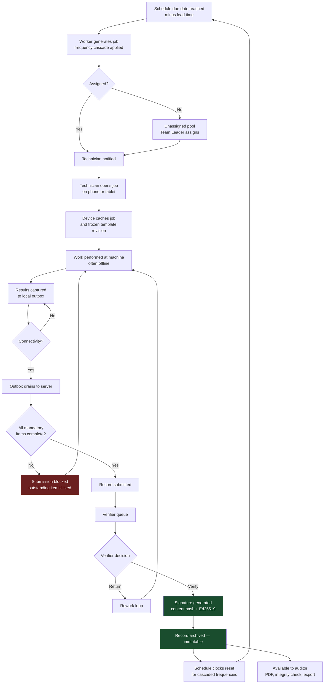
```mermaid
flowchart TD
    A["Schedule due date reached<br/>minus lead time"] --> B["Worker generates job<br/>frequency cascade applied"]
    B --> C{"Assigned?"}
    C -->|No| D["Unassigned pool<br/>Team Leader assigns"]
    C -->|Yes| E["Technician notified"]
    D --> E
    E --> F["Technician opens job<br/>on phone or tablet"]
    F --> G["Device caches job<br/>and frozen template revision"]
    G --> H["Work performed at machine<br/>often offline"]
    H --> I["Results captured<br/>to local outbox"]
    I --> J{"Connectivity?"}
    J -->|No| I
    J -->|Yes| K["Outbox drains to server"]
    K --> L{"All mandatory<br/>items complete?"}
    L -->|No| M["Submission blocked<br/>outstanding items listed"]
    M --> H
    L -->|Yes| N["Record submitted"]
    N --> O["Verifier queue"]
    O --> P{"Verifier decision"}
    P -->|Return| Q["Rework loop"]
    Q --> H
    P -->|Verify| R["Signature generated<br/>content hash + Ed25519"]
    R --> S["Record archived — immutable"]
    S --> T["Schedule clocks reset<br/>for cascaded frequencies"]
    T --> A
    S --> U["Available to auditor<br/>PDF, integrity check, export"]

    style S fill:#1a4d2e,color:#fff
    style R fill:#1a4d2e,color:#fff
    style M fill:#6b2020,color:#fff
```

---

# 2. Schedule Evaluation and Job Generation

Runs hourly in the `worker` service. Implements UR-022, PR-050 to PR-052.

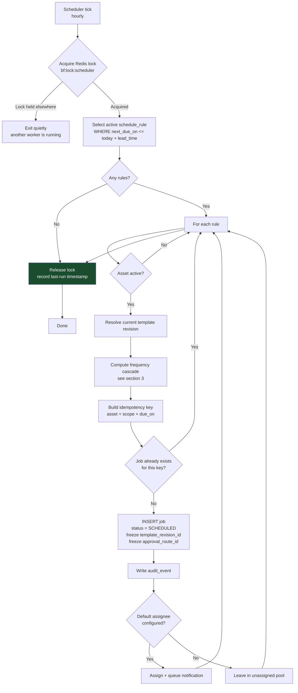
```mermaid
flowchart TD
    A["Scheduler tick<br/>hourly"] --> B{"Acquire Redis lock<br/>bf:lock:scheduler"}
    B -->|Lock held elsewhere| Z["Exit quietly<br/>another worker is running"]
    B -->|Acquired| C["Select active schedule_rule<br/>WHERE next_due_on <= today + lead_time"]
    C --> D{"Any rules?"}
    D -->|No| Y["Release lock<br/>record last-run timestamp"]
    D -->|Yes| E["For each rule"]
    E --> F{"Asset active?"}
    F -->|No| E
    F -->|Yes| G["Resolve current template revision"]
    G --> H["Compute frequency cascade<br/>see section 3"]
    H --> I["Build idempotency key<br/>asset + scope + due_on"]
    I --> J{"Job already exists<br/>for this key?"}
    J -->|Yes| E
    J -->|No| K["INSERT job<br/>status = SCHEDULED<br/>freeze template_revision_id<br/>freeze approval_route_id"]
    K --> L["Write audit_event"]
    L --> M{"Default assignee<br/>configured?"}
    M -->|Yes| N["Assign + queue notification"]
    M -->|No| O["Leave in unassigned pool"]
    N --> E
    O --> E
    E --> Y
    Y --> Z2["Done"]

    style Y fill:#1a4d2e,color:#fff
```

**Why the lock matters.** Without it, two worker instances — or one worker restarted mid-run —
generate duplicate jobs. Duplicate PM records in an ISO archive are worse than missing ones:
they invite the question of which one is real.

**Why the idempotency check matters.** The lock protects against concurrency. The idempotency
key protects against a worker crashing after insert but before commit of the surrounding
bookkeeping, and against the sweep simply running twice.

---

# 3. Frequency Cascade

Implements UR-024 and PR-053. Every source document states a version of *"For Y maintenance,
3M and 6M must be performed at the same time."*

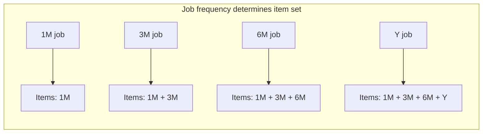
```mermaid
flowchart LR
    subgraph job["Job frequency determines item set"]
        direction TB
        M1["1M job"] --> S1["Items: 1M"]
        M3["3M job"] --> S3["Items: 1M + 3M"]
        M6["6M job"] --> S6["Items: 1M + 3M + 6M"]
        YY["Y job"] --> SY["Items: 1M + 3M + 6M + Y"]
    end
```

The rule is implemented as divisibility, not as a lookup table:

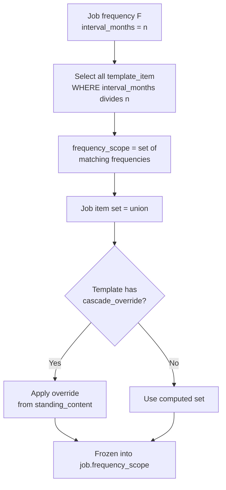
```mermaid
flowchart TD
    A["Job frequency F<br/>interval_months = n"] --> B["Select all template_item<br/>WHERE interval_months divides n"]
    B --> C["frequency_scope = set of<br/>matching frequencies"]
    C --> D["Job item set = union"]
    D --> E{"Template has<br/>cascade_override?"}
    E -->|Yes| F["Apply override<br/>from standing_content"]
    E -->|No| G["Use computed set"]
    F --> H["Frozen into job.frequency_scope"]
    G --> H
```

**PR-WFD-01** The divisibility formulation means introducing a new frequency — a two-yearly
inspection, say — requires no code change. A hardcoded table would.

## 3.1 Completion cascade — the reverse direction

Completing an annual PM must also reset the 3M and 6M clocks (PR-055), or the system will
raise a 3M job the week after the annual was done.

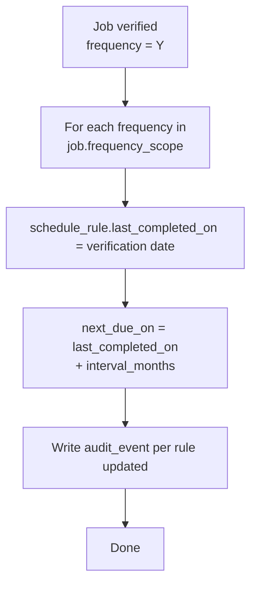
```mermaid
flowchart TD
    A["Job verified<br/>frequency = Y"] --> B["For each frequency in<br/>job.frequency_scope"]
    B --> C["schedule_rule.last_completed_on = verification date"]
    C --> D["next_due_on = last_completed_on<br/>+ interval_months"]
    D --> E["Write audit_event per rule updated"]
    E --> F["Done"]
```

**PR-WFD-02** `next_due_on` is computed from `last_completed_on`, not from the original anchor
(PR-056). A job completed a week late does not immediately generate its successor.

---

# 4. Assignment

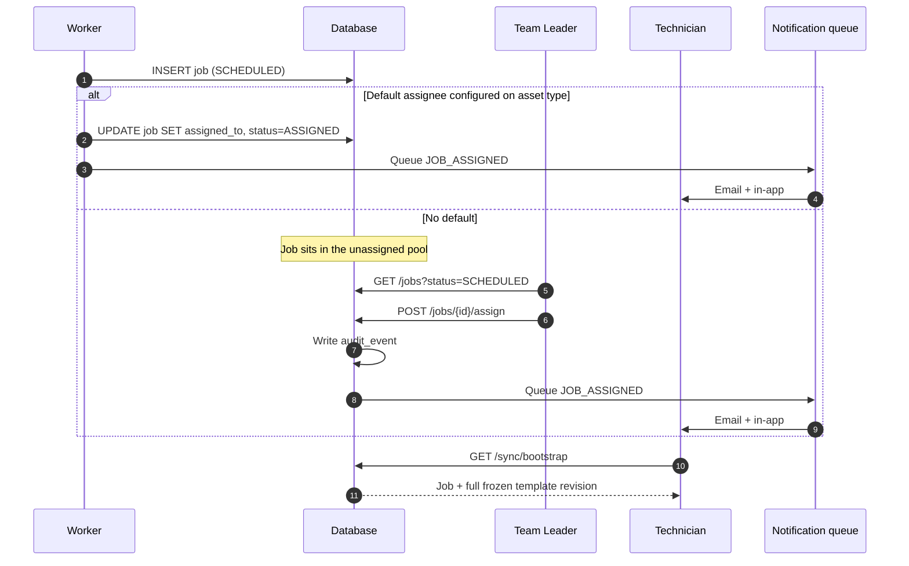
```mermaid
sequenceDiagram
    autonumber
    participant W as Worker
    participant DB as Database
    participant TL as Team Leader
    participant T as Technician
    participant N as Notification queue

    W->>DB: INSERT job (SCHEDULED)
    alt Default assignee configured on asset type
        W->>DB: UPDATE job SET assigned_to, status=ASSIGNED
        W->>N: Queue JOB_ASSIGNED
        N->>T: Email + in-app
    else No default
        Note over DB: Job sits in the unassigned pool
        TL->>DB: GET /jobs?status=SCHEDULED
        TL->>DB: POST /jobs/{id}/assign
        DB->>DB: Write audit_event
        DB->>N: Queue JOB_ASSIGNED
        N->>T: Email + in-app
    end
    T->>DB: GET /sync/bootstrap
    DB-->>T: Job + full frozen template revision
```

---

# 5. Record Capture — Online

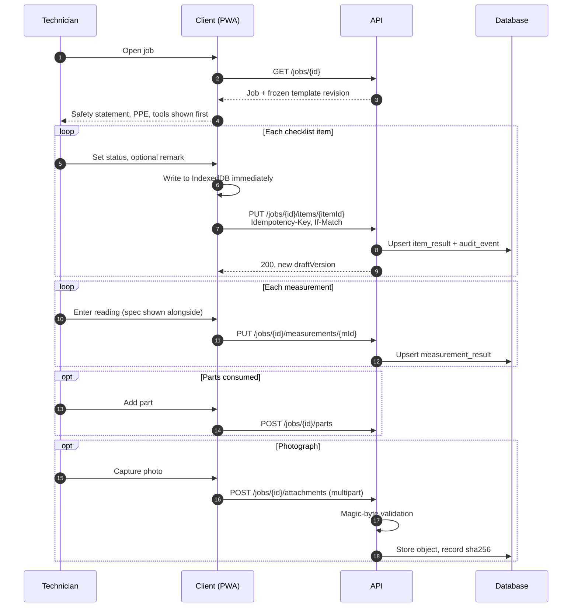
```mermaid
sequenceDiagram
    autonumber
    participant T as Technician
    participant C as Client (PWA)
    participant API as API
    participant DB as Database

    T->>C: Open job
    C->>API: GET /jobs/{id}
    API-->>C: Job + frozen template revision
    C-->>T: Safety statement, PPE, tools shown first

    loop Each checklist item
        T->>C: Set status, optional remark
        C->>C: Write to IndexedDB immediately
        C->>API: PUT /jobs/{id}/items/{itemId}<br/>Idempotency-Key, If-Match
        API->>DB: Upsert item_result + audit_event
        API-->>C: 200, new draftVersion
    end

    loop Each measurement
        T->>C: Enter reading (spec shown alongside)
        C->>API: PUT /jobs/{id}/measurements/{mId}
        API->>DB: Upsert measurement_result
    end

    opt Parts consumed
        T->>C: Add part
        C->>API: POST /jobs/{id}/parts
    end

    opt Photograph
        T->>C: Capture photo
        C->>API: POST /jobs/{id}/attachments (multipart)
        API->>API: Magic-byte validation
        API->>DB: Store object, record sha256
    end
```

**PR-WFD-03** Even online, the client writes to IndexedDB first (PR-060). The online path is
the offline path with a fast drain — there is no second code path to keep correct.

---

# 6. Record Capture — Offline and Sync

The highest-risk flow in the system (RK-01). Implements PR-059 to PR-069.

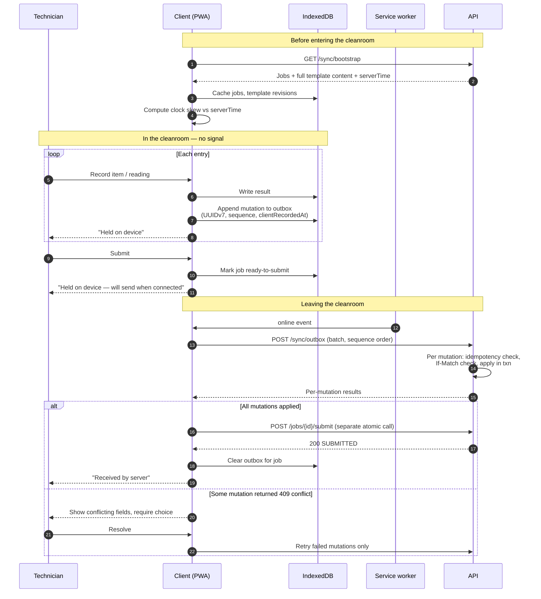
```mermaid
sequenceDiagram
    autonumber
    participant T as Technician
    participant C as Client (PWA)
    participant IDB as IndexedDB
    participant SW as Service worker
    participant API as API

    Note over C,API: Before entering the cleanroom
    C->>API: GET /sync/bootstrap
    API-->>C: Jobs + full template content + serverTime
    C->>IDB: Cache jobs, template revisions
    C->>C: Compute clock skew vs serverTime

    Note over T,IDB: In the cleanroom — no signal
    loop Each entry
        T->>C: Record item / reading
        C->>IDB: Write result
        C->>IDB: Append mutation to outbox<br/>(UUIDv7, sequence, clientRecordedAt)
        C-->>T: "Held on device"
    end

    T->>C: Submit
    C->>IDB: Mark job ready-to-submit
    C-->>T: "Held on device — will send when connected"

    Note over C,API: Leaving the cleanroom
    SW->>C: online event
    C->>API: POST /sync/outbox (batch, sequence order)
    API->>API: Per mutation: idempotency check,<br/>If-Match check, apply in txn
    API-->>C: Per-mutation results

    alt All mutations applied
        C->>API: POST /jobs/{id}/submit (separate atomic call)
        API-->>C: 200 SUBMITTED
        C->>IDB: Clear outbox for job
        C-->>T: "Received by server"
    else Some mutation returned 409 conflict
        C-->>T: Show conflicting fields, require choice
        T->>C: Resolve
        C->>API: Retry failed mutations only
    end
```

## 6.1 Sync state machine on the device

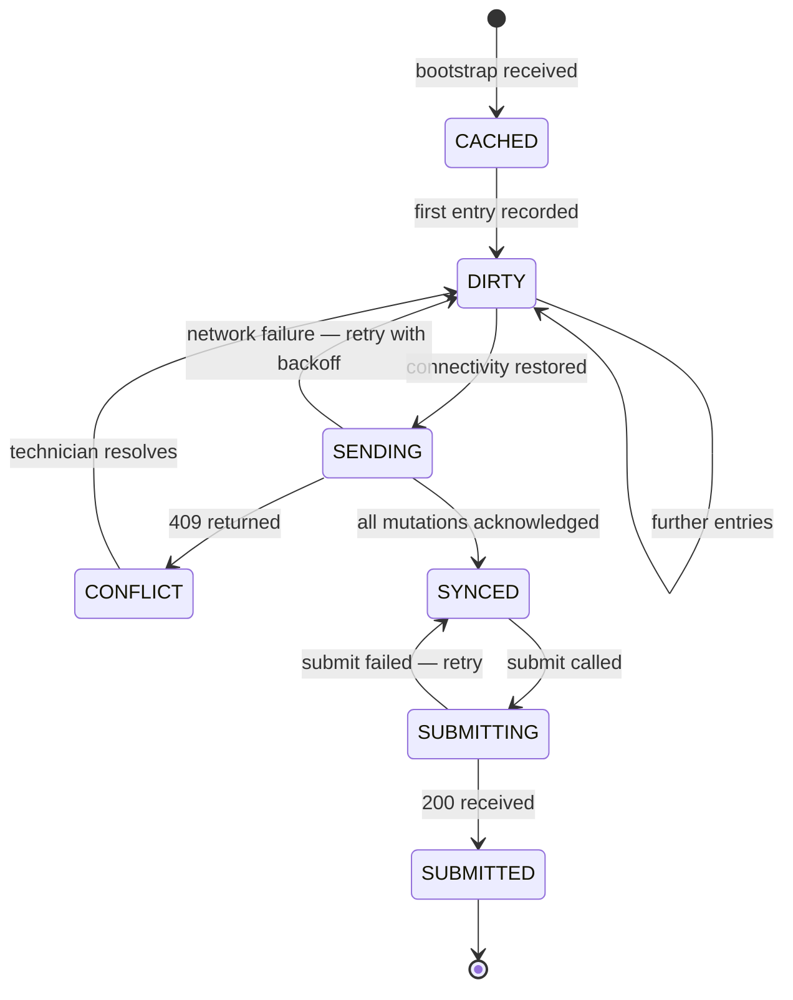
```mermaid
stateDiagram-v2
    [*] --> CACHED : bootstrap received
    CACHED --> DIRTY : first entry recorded
    DIRTY --> DIRTY : further entries
    DIRTY --> SENDING : connectivity restored
    SENDING --> DIRTY : network failure — retry with backoff
    SENDING --> CONFLICT : 409 returned
    CONFLICT --> DIRTY : technician resolves
    SENDING --> SYNCED : all mutations acknowledged
    SYNCED --> SUBMITTING : submit called
    SUBMITTING --> SUBMITTED : 200 received
    SUBMITTING --> SYNCED : submit failed — retry
    SUBMITTED --> [*]
```

**PR-WFD-04** These five states map to exactly three labels shown to the technician — *held on
device*, *sending*, *received by server* (PR-066). Ambiguity here destroys trust in the system
faster than any other defect, so the internal complexity is deliberately not exposed.

**PR-WFD-05** The outbox entry for a job is cleared **only** after the server acknowledges. A
client that clears optimistically and then fails loses a technician's work irrecoverably.

---

# 7. Submission

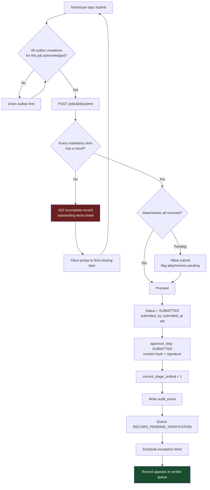
```mermaid
flowchart TD
    A["Technician taps Submit"] --> B{"All outbox mutations<br/>for this job acknowledged?"}
    B -->|No| C["Drain outbox first"]
    C --> B
    B -->|Yes| D["POST /jobs/{id}/submit"]
    D --> E{"Every mandatory item<br/>has a result?"}
    E -->|No| F["422 incomplete-record<br/>outstanding items listed"]
    F --> G["Client jumps to first missing item"]
    G --> A
    E -->|Yes| H{"Attachments all received?"}
    H -->|Pending| I["Allow submit<br/>flag attachments pending"]
    H -->|Yes| J["Proceed"]
    I --> J
    J --> K["Status = SUBMITTED<br/>submitted_by, submitted_at set"]
    K --> L["approval_step: SUBMITTED<br/>content hash + signature"]
    L --> M["current_stage_ordinal = 1"]
    M --> N["Write audit_event"]
    N --> O["Queue RECORD_PENDING_VERIFICATION"]
    O --> P["Schedule escalation timer"]
    P --> Q["Record appears in verifier queue"]

    style F fill:#6b2020,color:#fff
    style Q fill:#1a4d2e,color:#fff
```

**PR-WFD-06** Submission itself produces a signed `approval_step` (action `SUBMITTED`), not
merely a status change. This is the "Maintenance Performed by" signature on the paper form, and
it must be as attributable as the verification signature.

---

# 8. Verification and Approval

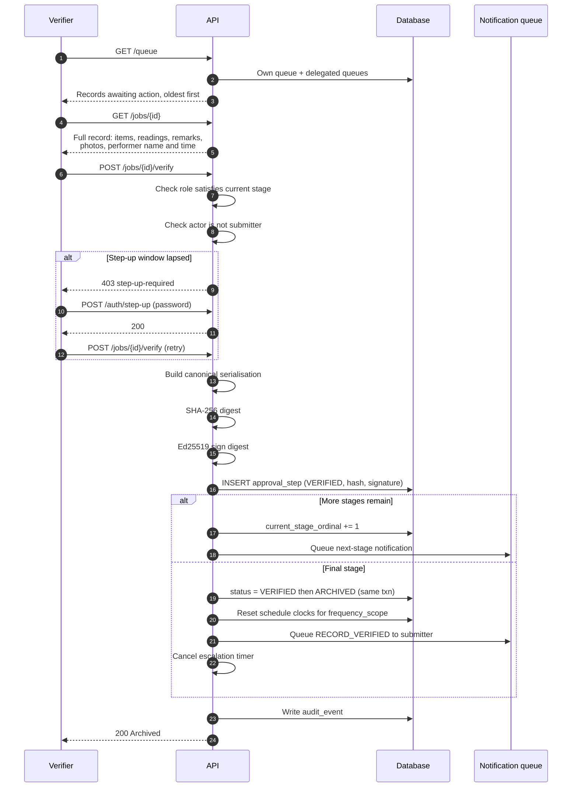
```mermaid
sequenceDiagram
    autonumber
    participant V as Verifier
    participant API as API
    participant DB as Database
    participant N as Notification queue

    V->>API: GET /queue
    API->>DB: Own queue + delegated queues
    API-->>V: Records awaiting action, oldest first

    V->>API: GET /jobs/{id}
    API-->>V: Full record: items, readings, remarks,<br/>photos, performer name and time

    V->>API: POST /jobs/{id}/verify
    API->>API: Check role satisfies current stage
    API->>API: Check actor is not submitter

    alt Step-up window lapsed
        API-->>V: 403 step-up-required
        V->>API: POST /auth/step-up (password)
        API-->>V: 200
        V->>API: POST /jobs/{id}/verify (retry)
    end

    API->>API: Build canonical serialisation
    API->>API: SHA-256 digest
    API->>API: Ed25519 sign digest
    API->>DB: INSERT approval_step (VERIFIED, hash, signature)

    alt More stages remain
        API->>DB: current_stage_ordinal += 1
        API->>N: Queue next-stage notification
    else Final stage
        API->>DB: status = VERIFIED then ARCHIVED (same txn)
        API->>DB: Reset schedule clocks for frequency_scope
        API->>N: Queue RECORD_VERIFIED to submitter
        API->>API: Cancel escalation timer
    end

    API->>DB: Write audit_event
    API-->>V: 200 Archived
```

**PR-WFD-07** `VERIFIED → ARCHIVED` happens inside the same transaction (PR-042). No record can
rest in a verified-but-unarchived state where it might be edited.

---

# 9. Multi-Stage Approval

Delivered configuration is one stage (PR-071). The engine supports N stages so that OI-04 —
reinstating the second signature shown on all twelve source documents — is a data change.

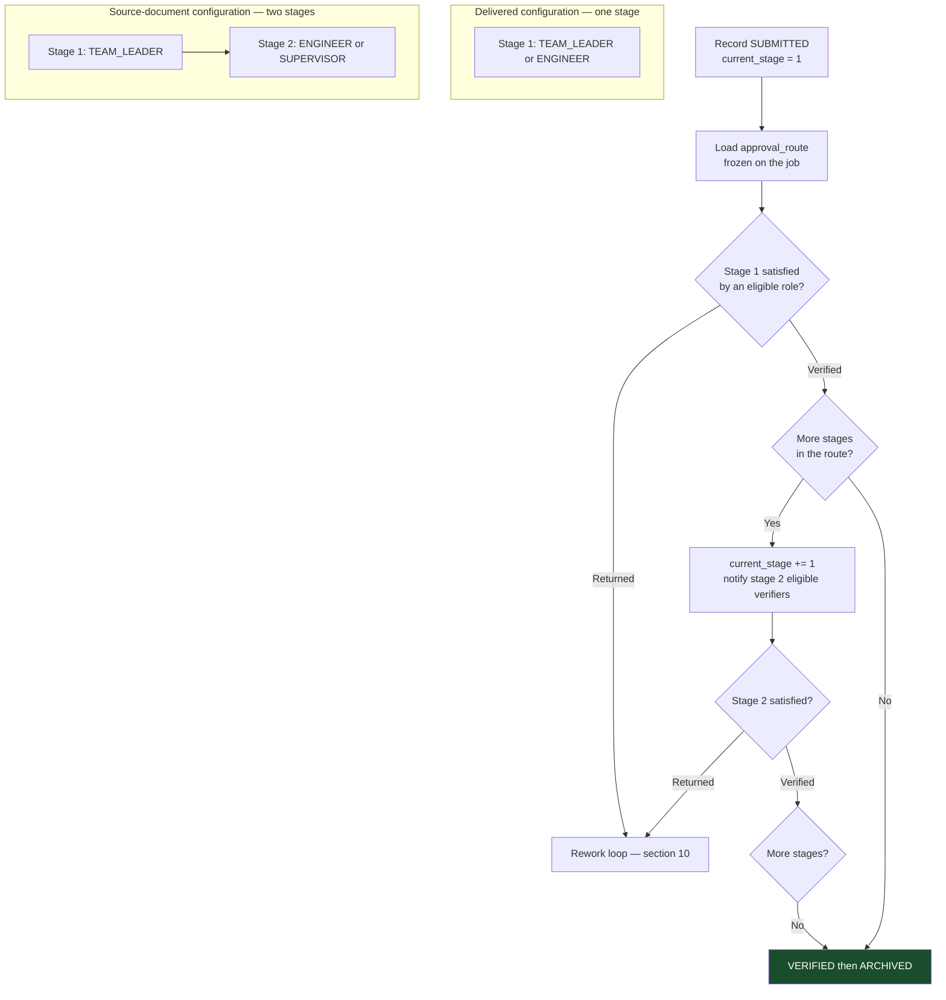
```mermaid
flowchart TD
    A["Record SUBMITTED<br/>current_stage = 1"] --> B["Load approval_route<br/>frozen on the job"]
    B --> C{"Stage 1 satisfied<br/>by an eligible role?"}
    C -->|Verified| D{"More stages<br/>in the route?"}
    C -->|Returned| R["Rework loop — section 10"]
    D -->|Yes| E["current_stage += 1<br/>notify stage 2 eligible verifiers"]
    E --> F{"Stage 2 satisfied?"}
    F -->|Verified| G{"More stages?"}
    F -->|Returned| R
    G -->|No| H["VERIFIED then ARCHIVED"]
    D -->|No| H

    subgraph delivered["Delivered configuration — one stage"]
        I["Stage 1: TEAM_LEADER or ENGINEER"]
    end

    subgraph available["Source-document configuration — two stages"]
        J["Stage 1: TEAM_LEADER"]
        K["Stage 2: ENGINEER or SUPERVISOR"]
        J --> K
    end

    style H fill:#1a4d2e,color:#fff
```

**PR-WFD-08** Switching between the two configurations shown above is two `INSERT` statements
and one `UPDATE` to `asset_type.approval_route_id`. No migration, no code change, no
redeployment. This is what makes OI-04 a low-impact open issue.

---

# 10. Rejection and Rework Loop

Implements UR-047, PR-074.

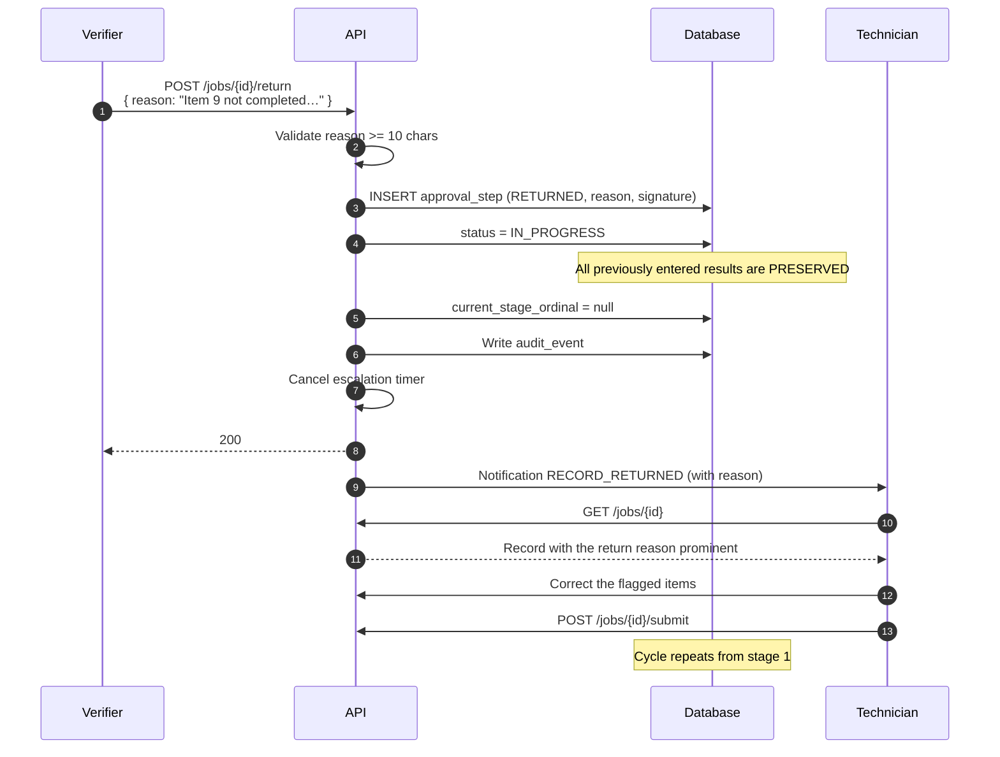
```mermaid
sequenceDiagram
    autonumber
    participant V as Verifier
    participant API as API
    participant DB as Database
    participant T as Technician

    V->>API: POST /jobs/{id}/return<br/>{ reason: "Item 9 not completed…" }
    API->>API: Validate reason >= 10 chars
    API->>DB: INSERT approval_step (RETURNED, reason, signature)
    API->>DB: status = IN_PROGRESS
    Note over DB: All previously entered results are PRESERVED
    API->>DB: current_stage_ordinal = null
    API->>DB: Write audit_event
    API->>API: Cancel escalation timer
    API-->>V: 200

    API->>T: Notification RECORD_RETURNED (with reason)
    T->>API: GET /jobs/{id}
    API-->>T: Record with the return reason prominent
    T->>API: Correct the flagged items
    T->>API: POST /jobs/{id}/submit
    Note over DB: Cycle repeats from stage 1
```

The full sequence is visible in the archive afterwards:

```mermaid
timeline
    title Approval history as it appears to an auditor
    2026-07-20 09:14 : Submitted by A. Technician
    2026-07-21 14:02 : Returned by B. TeamLeader — "Item 9 not completed; item 4 remark inconsistent"
    2026-07-22 08:30 : Resubmitted by A. Technician
    2026-07-22 16:45 : Verified by B. TeamLeader
    2026-07-22 16:45 : Archived
```

**PR-WFD-09** A returned record retains its results. Clearing them would punish the technician
for a single missing field and guarantee the system is resented.

---

# 11. Recall and Withdraw

Implements UR-051, PR-075.

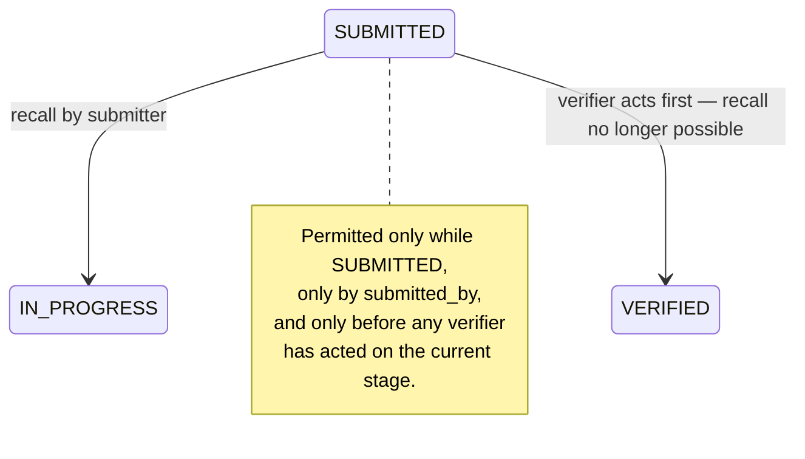
```mermaid
stateDiagram-v2
    SUBMITTED --> IN_PROGRESS : recall by submitter
    note right of SUBMITTED
        Permitted only while SUBMITTED,
        only by submitted_by,
        and only before any verifier
        has acted on the current stage.
    end note
    SUBMITTED --> VERIFIED : verifier acts first — recall no longer possible
```

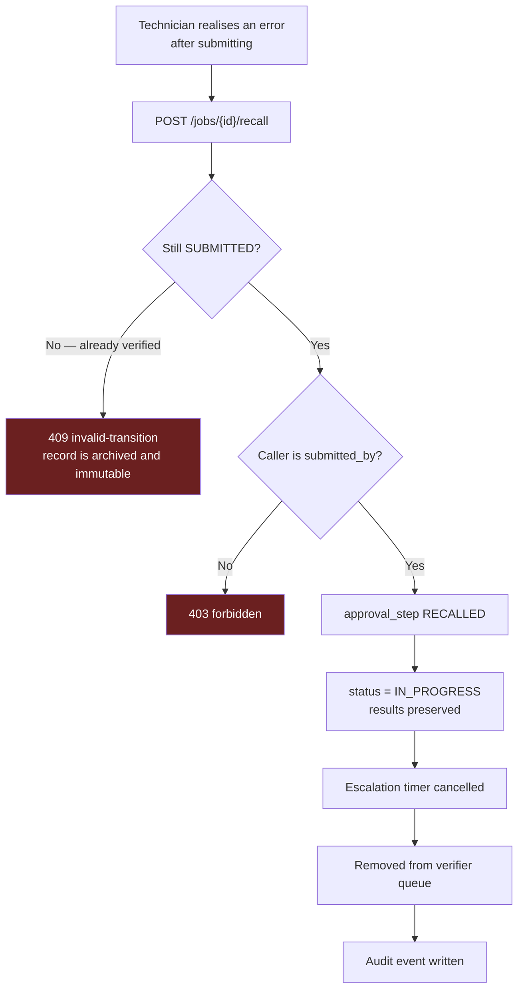
```mermaid
flowchart TD
    A["Technician realises an error<br/>after submitting"] --> B["POST /jobs/{id}/recall"]
    B --> C{"Still SUBMITTED?"}
    C -->|No — already verified| D["409 invalid-transition<br/>record is archived and immutable"]
    C -->|Yes| E{"Caller is submitted_by?"}
    E -->|No| F["403 forbidden"]
    E -->|Yes| G["approval_step RECALLED"]
    G --> H["status = IN_PROGRESS<br/>results preserved"]
    H --> I["Escalation timer cancelled"]
    I --> J["Removed from verifier queue"]
    J --> K["Audit event written"]

    style D fill:#6b2020,color:#fff
    style F fill:#6b2020,color:#fff
```

**PR-WFD-10** Recall after archiving is impossible by design. The correction path for an
archived record is to void it with a reason and raise a replacement — the original stays
visible. This is what "immutable archive" means in practice.

---

# 12. Delegation

Implements UR-052, PR-076.

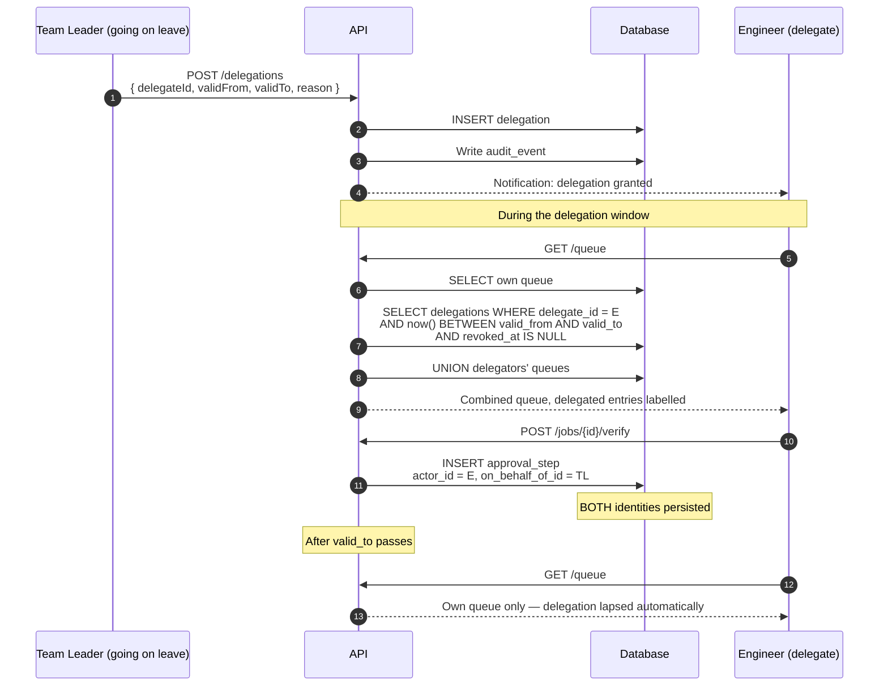
```mermaid
sequenceDiagram
    autonumber
    participant TL as Team Leader (going on leave)
    participant API as API
    participant DB as Database
    participant E as Engineer (delegate)

    TL->>API: POST /delegations<br/>{ delegateId, validFrom, validTo, reason }
    API->>DB: INSERT delegation
    API->>DB: Write audit_event
    API-->>E: Notification: delegation granted

    Note over E,API: During the delegation window
    E->>API: GET /queue
    API->>DB: SELECT own queue
    API->>DB: SELECT delegations WHERE delegate_id = E<br/>AND now() BETWEEN valid_from AND valid_to<br/>AND revoked_at IS NULL
    API->>DB: UNION delegators' queues
    API-->>E: Combined queue, delegated entries labelled

    E->>API: POST /jobs/{id}/verify
    API->>DB: INSERT approval_step<br/>actor_id = E, on_behalf_of_id = TL
    Note over DB: BOTH identities persisted

    Note over API: After valid_to passes
    E->>API: GET /queue
    API-->>E: Own queue only — delegation lapsed automatically
```

**PR-WFD-11** Delegation is evaluated at request time, never pre-materialised into the queue.
A revoked or expired delegation therefore takes effect on the very next request, with no
cleanup job to fail.

**PR-WFD-12** Both identities appear on the rendered record: *"Verified by E. Engineer, acting
as delegate for B. TeamLeader"*. An auditor must be able to see that the named approver was
absent and who covered.

---

# 13. Escalation and Timeout

Implements UR-050, PR-077.

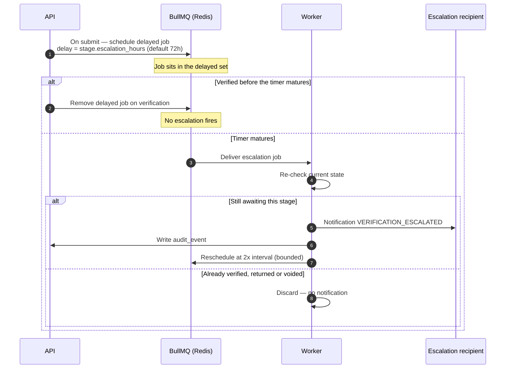
```mermaid
sequenceDiagram
    autonumber
    participant API as API
    participant Q as BullMQ (Redis)
    participant W as Worker
    participant R as Escalation recipient

    API->>Q: On submit — schedule delayed job<br/>delay = stage.escalation_hours (default 72h)
    Note over Q: Job sits in the delayed set

    alt Verified before the timer matures
        API->>Q: Remove delayed job on verification
        Note over Q: No escalation fires
    else Timer matures
        Q->>W: Deliver escalation job
        W->>W: Re-check current state
        alt Still awaiting this stage
            W->>R: Notification VERIFICATION_ESCALATED
            W->>API: Write audit_event
            W->>Q: Reschedule at 2x interval (bounded)
        else Already verified, returned or voided
            W->>W: Discard — no notification
        end
    end
```

**PR-WFD-13** The worker **re-checks state** before notifying. A delayed job that fires after
the record was already verified must not produce a false escalation — cancellation and
delivery can race.

## 13.1 Overdue jobs — a separate mechanism

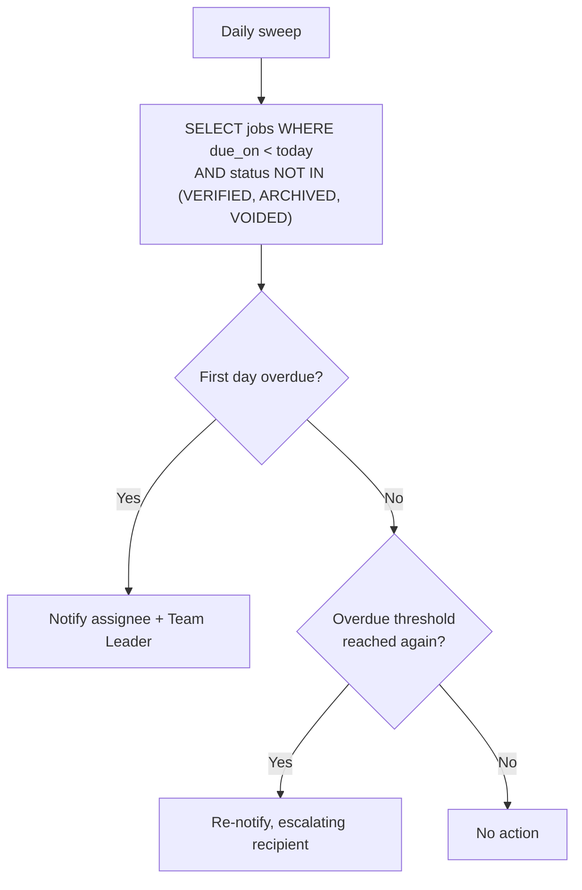
```mermaid
flowchart TD
    A["Daily sweep"] --> B["SELECT jobs WHERE due_on < today<br/>AND status NOT IN (VERIFIED, ARCHIVED, VOIDED)"]
    B --> C{"First day overdue?"}
    C -->|Yes| D["Notify assignee + Team Leader"]
    C -->|No| E{"Overdue threshold<br/>reached again?"}
    E -->|Yes| F["Re-notify, escalating recipient"]
    E -->|No| G["No action"]
```

**PR-WFD-14** Overdue is a derived condition, not a stored state (PR-043). A job does not change
state through the passage of time; only a person or the workflow changes state.

---

# 14. Void

Implements UR-054, PR-046. This is the only removal mechanism in the system.

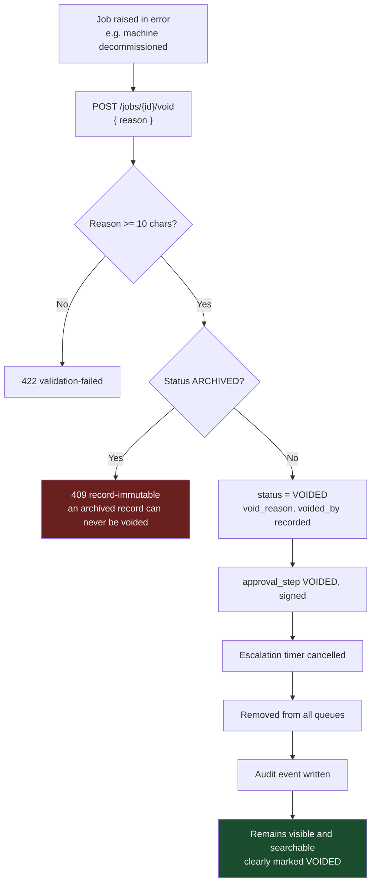
```mermaid
flowchart TD
    A["Job raised in error<br/>e.g. machine decommissioned"] --> B["POST /jobs/{id}/void<br/>{ reason }"]
    B --> C{"Reason >= 10 chars?"}
    C -->|No| D["422 validation-failed"]
    C -->|Yes| E{"Status ARCHIVED?"}
    E -->|Yes| F["409 record-immutable<br/>an archived record can never be voided"]
    E -->|No| G["status = VOIDED<br/>void_reason, voided_by recorded"]
    G --> H["approval_step VOIDED, signed"]
    H --> I["Escalation timer cancelled"]
    I --> J["Removed from all queues"]
    J --> K["Audit event written"]
    K --> L["Remains visible and searchable<br/>clearly marked VOIDED"]

    style F fill:#6b2020,color:#fff
    style L fill:#1a4d2e,color:#fff
```

**PR-WFD-15** A voided job is never hidden. It appears in the archive marked void, with its
reason. Hiding it would create exactly the gap in the record that voiding is meant to make
transparent.

---

# 15. Template Revision Control

Implements UR-010 to UR-014. This is the document-control workflow, distinct from the record
approval workflow.

```mermaid
sequenceDiagram
    autonumber
    participant E as Engineer (author)
    participant API as API
    participant DB as Database
    participant DC as Document Controller

    E->>API: POST /templates/{id}/revisions<br/>{ revisionCode: "F", changeDescription }
    API->>DB: Check sequence contiguity
    Note over DB: Rejects a gap — prevents defect B-02
    API->>DB: INSERT template_revision (DRAFT, sequence = max+1)
    API->>DB: Copy items and measurements from current revision

    E->>API: PUT /revisions/{id}/items
    E->>API: PUT /revisions/{id}/measurements
    API->>DB: CHECK lower_limit <= upper_limit
    Note over DB: Prevents defect B-04 — "95 - 28 g"

    E->>API: POST /revisions/{id}/submit
    API->>DB: status = PENDING_APPROVAL
    API->>DC: Notification: revision awaiting approval

    DC->>API: GET /revisions/{id}
    API-->>DC: Draft content + diff against current revision

    alt Approved
        DC->>API: POST /revisions/{id}/approve
        API->>API: Reject if approver == author
        API->>API: Step-up authentication check
        API->>DB: BEGIN
        API->>DB: new revision status = CURRENT, effective_from = now
        API->>DB: previous revision status = SUPERSEDED
        API->>DB: COMMIT
        Note over DB: Existing jobs keep their frozen revision — unaffected
        API->>DB: Write audit_event
    else Rejected
        DC->>API: POST /revisions/{id}/reject { reason }
        API->>DB: status = DRAFT, rejected_reason set
        API->>E: Notification: revision returned
    end
```

## 15.1 Revision binding over time

```mermaid
gantt
    title What an auditor sees — record binding across revisions
    dateFormat YYYY-MM-DD
    axisFormat %b %Y

    section Template CE 95 010 00 01
    Revision D current      :done, d, 2024-03-01, 2026-03-15
    Revision E current      :active, e, 2026-03-15, 2026-09-01

    section Records
    Record raised Feb 2026 — shows revision D   :crit, r1, 2026-02-10, 14d
    Record raised Jun 2026 — shows revision E   :crit, r2, 2026-06-10, 14d
```

**PR-WFD-16** A record raised in February 2026 displays revision D's checklist forever, even
after revision E is issued. This is UR-105 and it is the single most important document-control
property of the system.

---

# 16. Audit Trail Generation

Implements UR-076, UR-077, PR-097 to PR-099.

```mermaid
flowchart TD
    A["Any mutating operation"] --> B["BEGIN TRANSACTION"]
    B --> C["Apply the change"]
    C --> D["Build audit event:<br/>actor, action, entity, before, after,<br/>source IP, request ID"]
    D --> E["Redact personal fields<br/>to identifiers or ciphertext digests"]
    E --> F["Read prev_hash =<br/>hash of highest sequence"]
    F --> G["hash = SHA-256(canonical event ‖ prev_hash)"]
    G --> H["INSERT audit_event"]
    H --> I{"Both succeeded?"}
    I -->|Yes| J["COMMIT"]
    I -->|No| K["ROLLBACK<br/>the change is undone too"]

    style K fill:#6b2020,color:#fff
    style J fill:#1a4d2e,color:#fff
```

**PR-WFD-17** The audit write is in the same transaction as the change (PR-098). An action that
cannot be audited does not happen. There is no code path that mutates a record and separately
best-efforts an audit entry.

## 16.1 The chain

```mermaid
flowchart LR
    G["Genesis<br/>seq 1<br/>prev_hash = null"] --> E2["seq 2<br/>prev_hash = H(1)"]
    E2 --> E3["seq 3<br/>prev_hash = H(2)"]
    E3 --> E4["seq 4<br/>prev_hash = H(3)"]
    E4 --> EN["seq n<br/>prev_hash = H(n-1)"]

    style G fill:#1a4d2e,color:#fff
```

```mermaid
flowchart TD
    A["Daily chain verification job"] --> B["Walk sequence 1..n"]
    B --> C["Recompute hash for each event"]
    C --> D{"Matches stored hash<br/>and links to prev?"}
    D -->|Yes, all| E["Chain intact — record result"]
    D -->|No| F["ALERT — highest severity<br/>report first break sequence"]
    F --> G["Incident response:<br/>tamper or corruption"]

    style F fill:#6b2020,color:#fff
    style E fill:#1a4d2e,color:#fff
```

**PR-WFD-18** Altering one historical event requires recomputing every subsequent hash. Since
the application database role holds no `UPDATE` or `DELETE` on `audit_event` (PR-099), an
application-layer compromise cannot do this at all.

---

# 17. Notification Dispatch

Implements UR-061 to UR-065.

```mermaid
sequenceDiagram
    autonumber
    participant API as API
    participant DB as Database
    participant Q as BullMQ
    participant W as Worker
    participant S as SMTP relay
    participant U as Recipient

    API->>DB: INSERT notification (state = QUEUED)
    API->>Q: Enqueue dispatch job
    Note over API: Same transaction as the triggering change

    Q->>W: Deliver job
    W->>DB: Load notification + resolve recipient
    W->>W: Decrypt recipient email (in memory only)
    W->>W: Render template — identifiers only, no personal data in payload
    W->>S: Send

    alt Delivered
        W->>DB: state = SENT, sent_at
    else Transient failure
        W->>DB: attempts += 1
        W->>Q: Retry with exponential backoff
    else Permanent failure after max attempts
        W->>DB: state = FAILED, failed_reason
        W->>DB: Write audit_event
        Note over W: In-app notification remains — the user still sees it
    end

    U->>API: GET /notifications (in-app)
    API-->>U: Unread list
```

**PR-WFD-19** Email is a delivery channel, not the record. Every notification exists as an
in-app item regardless of SMTP outcome. A failed relay must not mean a technician never learns
a job was assigned.

**PR-WFD-20** `notification.payload` holds identifiers, never names or email addresses. The
recipient's address is decrypted in memory at dispatch time and never persisted into the queue
— otherwise Redis becomes an unencrypted store of personal data.

## 17.1 Notification catalogue

| Code | Trigger | Recipient | UR |
|---|---|---|---|
| `JOB_ASSIGNED` | Job assigned or reassigned | Assignee | UR-061 |
| `JOB_DUE_SOON` | `due_on` within warning window | Assignee | UR-062 |
| `JOB_OVERDUE` | `due_on` passed | Assignee + Team Leader | UR-062 |
| `RECORD_PENDING_VERIFICATION` | Record submitted | Eligible verifiers for the stage | UR-063 |
| `RECORD_VERIFIED` | Final stage verified | Submitter | UR-064 |
| `RECORD_RETURNED` | Verifier returns | Submitter | UR-064 |
| `VERIFICATION_ESCALATED` | Escalation timer matured | Configured escalation recipient | UR-050 |
| `REVISION_PENDING_APPROVAL` | Template revision submitted | Document Controller | UR-014 |
| `REVISION_REJECTED` | Template revision rejected | Author | UR-014 |
| `DELEGATION_GRANTED` | Delegation created | Delegate | UR-052 |

---

# 18. Archive, Export and Integrity Verification

```mermaid
flowchart TD
    A["Record archived"] --> B["Immutable — no UPDATE path exists"]
    B --> C{"Consumer"}

    C -->|Auditor asks for history| D["GET /assets/{id}/history"]
    C -->|Auditor asks for the form| E["GET /records/{id}/pdf"]
    C -->|Auditor asks 'has this changed?'| F["GET /records/{id}/integrity"]
    C -->|Filing into the DMS| G["POST /records/export"]

    E --> E1["Server-side Chromium render<br/>controlled form layout<br/>signatures with name, role, timestamp<br/>integrity digest in footer"]

    F --> F1["Rebuild canonical serialisation<br/>from current data"]
    F1 --> F2["Recompute SHA-256"]
    F2 --> F3{"Matches stored content_hash?"}
    F3 -->|No| F4["FAIL — report mismatch detail"]
    F3 -->|Yes| F5["Verify Ed25519 signature<br/>against published key"]
    F5 --> F6{"Valid?"}
    F6 -->|No| F4
    F6 -->|Yes| F7["PASS — record unchanged since signing"]

    G --> G1["Async job — ZIP of PDFs<br/>+ CSV manifest"]
    G1 --> G2["Export audit event written"]

    style F7 fill:#1a4d2e,color:#fff
    style F4 fill:#6b2020,color:#fff
```

**PR-WFD-21** The integrity check recomputes from **current** data. It does not compare a stored
copy to another stored copy — that would prove only that two copies agree. It proves the live
record still hashes to what was signed.

**PR-WFD-22** Export writes an audit event (UR-101). Who took a copy of the archive, and when,
is itself part of the record.

---

# 19. Cross-Reference

| Workflow | Section | User requirements | Product requirements | URD journey |
|---|---|---|---|---|
| Job generation | 2 | UR-022, UR-023, UR-027 | PR-050 to PR-052, PR-057 | 5.6 |
| Frequency cascade | 3 | UR-024 | PR-053 to PR-056 | — |
| Assignment | 4 | UR-029, UR-061 | PR-030, PR-077 | 5.6 |
| Online capture | 5 | UR-031 to UR-037 | PR-031 to PR-034 | 5.1 |
| Offline capture and sync | 6 | UR-038, UR-042, UR-088 | PR-059 to PR-069 | 5.1 |
| Submission | 7 | UR-039, UR-043 | PR-045, PR-065 | 5.1 |
| Verification | 8 | UR-044 to UR-046, UR-048 | PR-042, PR-044, PR-093 to PR-096 | 5.2 |
| Multi-stage approval | 9 | UR-053 | PR-070 to PR-073 | — |
| Rejection and rework | 10 | UR-047 | PR-074 | 5.3 |
| Recall | 11 | UR-051 | PR-075 | — |
| Delegation | 12 | UR-052 | PR-076 | 5.4 |
| Escalation | 13 | UR-030, UR-050 | PR-043, PR-077 | — |
| Void | 14 | UR-054 | PR-046 | — |
| Template revision control | 15 | UR-010 to UR-014, UR-105 | PR-022 to PR-024, PR-047 to PR-049 | 5.5 |
| Audit trail | 16 | UR-076, UR-077 | PR-097 to PR-099 | 5.7 |
| Notification | 17 | UR-061 to UR-065 | PR-077 | — |
| Archive and integrity | 18 | UR-055 to UR-059, UR-104 | PR-041, PR-095, PR-116 to PR-119 | 5.7 |

---

*End of document — BAMFORM-WFD-001 Revision 0.1*
